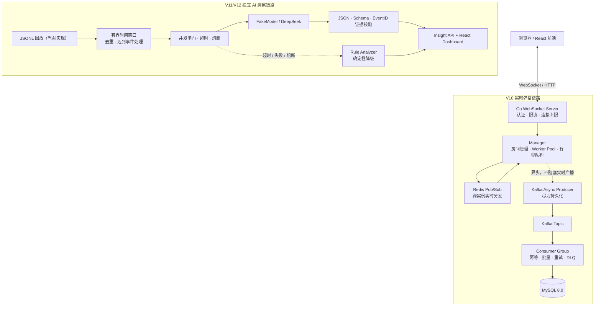
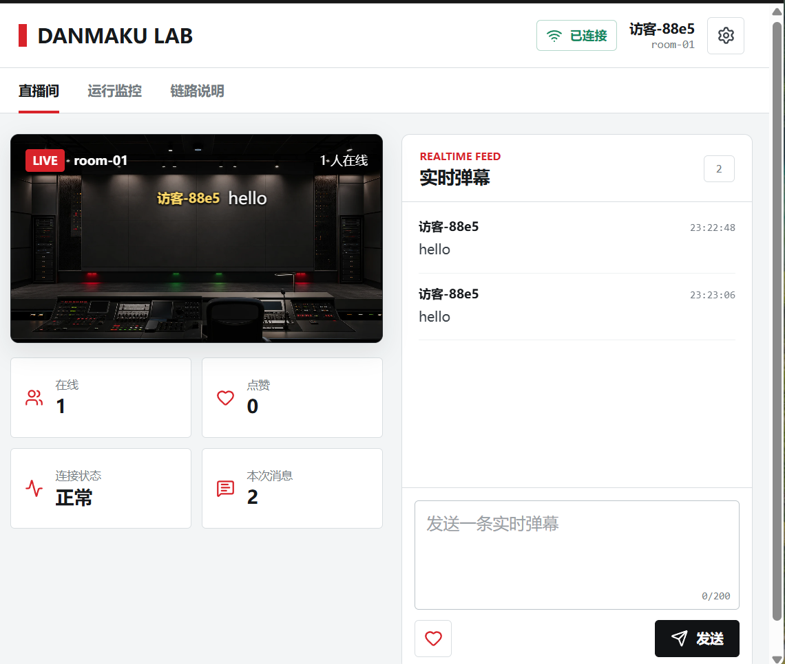
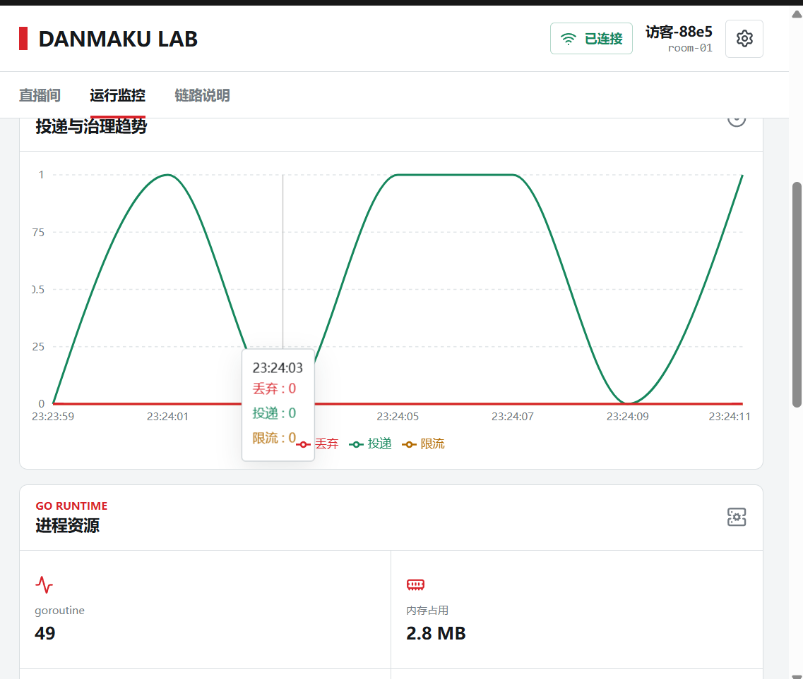
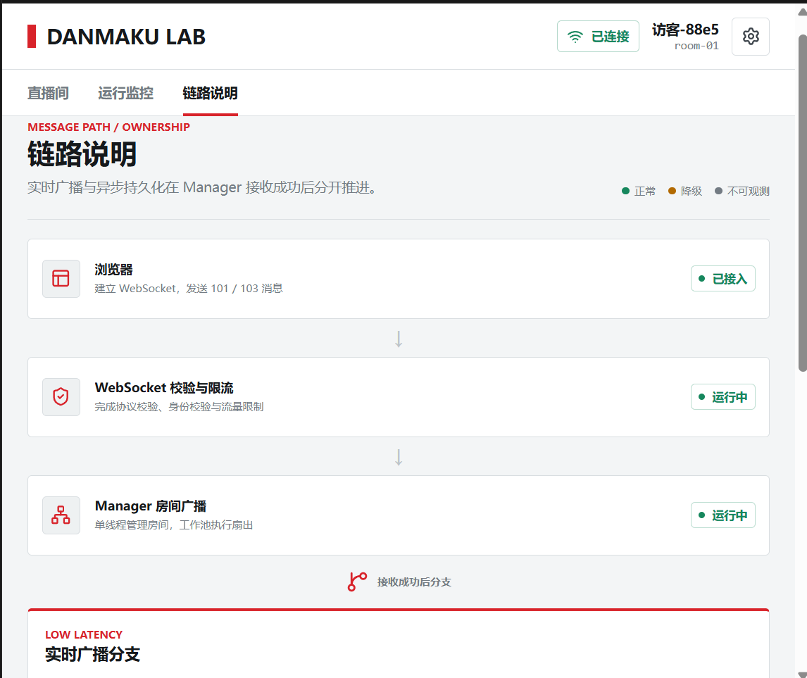
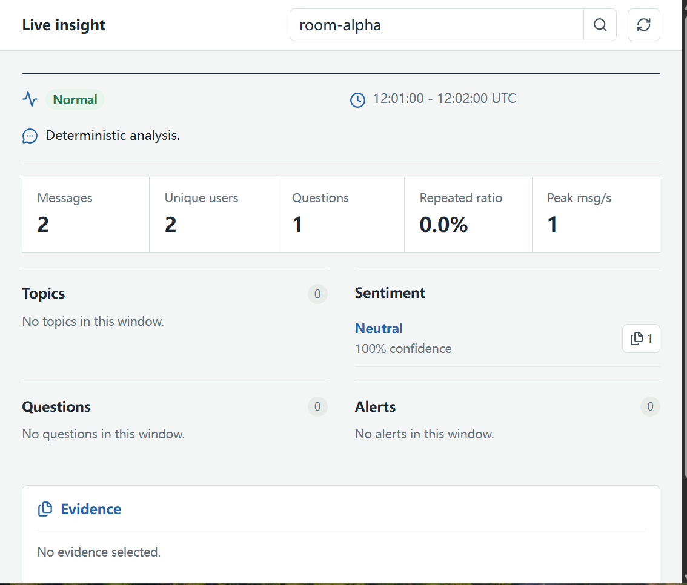

# DANMAKU LAB

> 一个面向高并发实时弹幕、异步持久化与独立 AI 洞察的 Go 全栈学习项目。

[](https://go.dev/)
[](https://react.dev/)
[](https://redis.io/)
[](https://kafka.apache.org/)
[](https://www.mysql.com/)
[](LICENSE)

## 项目简介

DANMAKU LAB 把系统拆成两条边界清晰的链路：

- **V10 实时链路**：浏览器通过 WebSocket 收发弹幕；Redis 负责跨实例实时分发；Kafka 负责异步持久化；Consumer 批量写入 MySQL。
- **V11/V12 AI 洞察链路**：弹幕按时间窗口聚合后进入独立分析进程；模型输出必须通过 JSON、枚举和证据 EventID 校验；失败时降级为确定性规则统计。

实时广播优先于持久化完整性：Kafka 背压不会阻塞 WebSocket 和 Redis 广播。在持续过载时允许记录并观测少量 Kafka 入队丢弃，而不是拖垮在线连接。

项目由 **smallwhite-a1** 设计、实现与维护。

## 实测性能

以下数据来自 2026-08-10 的本机全链路测试，不是理论值，也不代表跨机器或生产集群容量。

### V10 三实例、6000 连接实测

测试条件：同一台 Windows 主机上运行三个 V10 Server（`18081`、`18082`、`18083`），每个实例 2000 个 WebSocket 客户端、2000 个房间、20% 活跃客户端、平均 500 ms 发言间隔，压测持续 30 秒。Redis、Kafka、MySQL 和 Consumer 均开启；AI 功能不在本次压力范围内。

| 指标 | 实测结果 |
| --- | ---: |
| WebSocket 并发连接 | **6000** |
| 上行弹幕总数 | **65,462** |
| 上行吞吐 | **2,182 QPS** |
| 客户端可见下行投递 | **196,380** |
| 下行投递速率 | **6,546 deliveries/s** |
| 端到端 P50 | 约 **1.50–1.51 ms** |
| 端到端 P95 | 约 **2.44–2.45 ms** |
| 端到端最高 P99 | **4.24 ms** |
| 客户端错误 / 限流 / Server 过载 | **0 / 0 / 0** |
| WebSocket 入站与广播队列丢弃 | **0** |
| Redis 发布错误与队列积压 | **0** |
| Kafka Producer 协议错误 | **0** |
| Kafka Producer 入队丢弃 | **3,938（约 6.0%）** |

Kafka 的约 6% 丢弃发生在应用层有界、非阻塞 Producer 入队路径：系统选择保护实时链路而非在持续过载时阻塞发送端。Kafka Broker 仍保持 `healthy`，已成功入队的消息也全部获得 ACK。

完整口径、每实例数据与限制见：[6000 连接全链路报告](docs/performance/v10-6000-connections-full-chain.md)。

### V12 AI 洞察压测

AI 洞察模块以独立进程运行。FakeModel 场景使用 16 个 Processor Worker 和最大 16 路模型并发，对 100 / 300 / 500 个到期窗口进行 HTTP 逐房间核验。

| 场景 | 窗口数 | 正常 / 降级 / 失败 | P99（模型调用） | 全链路耗时 |
| --- | ---: | --- | ---: | ---: |
| 正常 FakeModel | 500 | 500 / 0 / 0 | 20.72 ms | 616.17 ms |
| 混合异常 | 500 | 445 / 55 / 0 | 51.04 ms | 845.36 ms |
| 超时保护 | 500 | 0 / 500 / 0 | 51.29 ms | 74.78 ms |

这里的 AI P99 是 FakeModel 的单次调用耗时，不是 V10 WebSocket 的端到端延迟。真实 DeepSeek 在单窗口场景可用；10 房间并发真实调用曾全部走规则降级，因此当前不把真实模型并发稳定性或语义准确率写成已达成结论。

详见：[V12 AI 洞察压测报告](docs/benchmark/v12-ai-insight-load-report-2026-08-05.md)。

## 系统架构



### 已实现边界

| 模块 | 当前实现 | 关键说明 |
| --- | --- | --- |
| 实时通信 | Go + Gorilla WebSocket | 每连接独立读写循环、连接和单 IP 上限、用户/房间限流 |
| 本机广播 | Manager + Worker Pool | 有界广播队列、慢客户端隔离、对象池减少 GC |
| 多实例实时分发 | Redis Pub/Sub | Server 之间发布订阅；Redis 故障时保留本机广播降级路径 |
| 异步持久化 | Kafka + Consumer Group + MySQL | 幂等写入、批量落库、重试、DLQ、分区级暂停恢复 |
| 运行状态 | JSON `/metrics` + 前端监控页 | 当前不是 Prometheus 格式，未接入 Grafana |
| AI 洞察 | 独立 `v11/insight` 模块 | 当前用 JSONL 事件源、内存窗口与内存结果仓库，不影响实时热路径 |
| 模型保护 | 15 s 默认超时、16 路并发、5 次失败熔断、30 s 打开窗口 | 模型失败写入 `degraded` 规则结果，而非返回空白 |

### 尚未接入的生产化能力

- Prometheus / Grafana / Alertmanager；
- Kafka、Redis、MySQL 到 AI 模块的正式适配器；
- AI 洞察持久化、趋势分析和风险运营 Case；
- 带标注集的情绪、话题与风险质量评测；
- 多机器负载均衡、服务发现和容器编排。

后续规划见：[V13 AI 洞察演进方案](docs/roadmap/v13-ai-insight-quality-and-operations-roadmap.md)。

## 前端页面

### 直播间：实时弹幕与互动

浏览器直连 V10 WebSocket 服务。页面展示房间弹幕、在线数、点赞数和连接状态；发送弹幕后，Manager 同时推进低延迟广播分支和异步持久化分支。



### 运行监控：服务端 JSON 指标可视化

前端轮询 V10 `/metrics`，展示投递/治理趋势、Go runtime 资源、Redis/Kafka 状态与队列数据。图表用于本地调试和学习；生产级聚合监控将在 Prometheus 阶段接入。



### 链路说明：实时广播与异步持久化的分叉

页面把 Manager 接收弹幕后发生的所有权转移、队列、Redis、Kafka、Consumer 与 MySQL 展开。绿色表示当前可观测的正常状态，降级状态不会被伪装成完全成功。



### AI 洞察：规则统计、语义结果与证据

独立 AI 页面展示一个已完成时间窗口的状态、消息数、独立用户、问句、重复率、峰值消息速率、话题、情绪、问题、风险和 EventID 证据。当前截图由确定性 FakeModel 生成，用于稳定演示与测试；真实模型失败时页面会明确标记为 `Degraded`。



## 快速开始

### 环境要求

- Windows 11 + WSL2（本项目本机验证环境）；
- Go 1.25+；
- Node.js 25+ 与 npm；
- Docker Desktop（Linux containers）；
- Git。

> PowerShell 可能因执行策略阻止 `npm.ps1`。遇到该情况请使用 `npm.cmd`，不要为了运行本项目全局放宽执行策略。

### 1. 克隆并准备 V10 依赖

```powershell
git clone https://github.com/smallwhite-a1/live-stream-danmaku-learning.git
cd live-stream-danmaku-learning
docker compose -f v10/docker-compose.redis-kafka-mysql.yaml up -d
docker compose -f v10/docker-compose.redis-kafka-mysql.yaml ps
```

本机测试端口：Redis `6384`、Kafka `9099`、MySQL `3313`。

> 如果 Docker Desktop 未启动，先启动 Docker Desktop 并等待 Engine 变为 Running。若 Kafka 镜像拉取失败，请保留完整日志并检查 compose 文件中当前配置的镜像；不要静默替换为其他 Kafka 版本。

### 2. 初始化数据库并构建 V10 前端

```powershell
D:\workspace\go-sdk\go\bin\go.exe run ./v10/cmd/migrate
cd v10\web
npm.cmd install
npm.cmd run build
cd ..\..
```

迁移会创建本地演示账号：`demo / demo123`。若 Go 已在系统 PATH 中，可将上述绝对路径替换为 `go`。

### 3. 启动 Consumer

新开一个 PowerShell：

```powershell
cd D:\workspace\live-stream-danmaku-learning
D:\workspace\go-sdk\go\bin\go.exe run ./v10/cmd/consumer
```

### 4. 启动 V10 Server 与前端

再新开一个 PowerShell：

```powershell
cd D:\workspace\live-stream-danmaku-learning
$env:V10_WEB_DIR = 'D:\workspace\live-stream-danmaku-learning\v10\web\dist'
D:\workspace\go-sdk\go\bin\go.exe run ./v10/cmd/server `
  -port=18081 `
  -redis=true `
  -kafka=true `
  -max-connections=12000 `
  -max-connections-per-ip=12000
```

打开：

- `http://127.0.0.1:18081/`：直播间；
- `http://127.0.0.1:18081/monitor`：运行监控；
- `http://127.0.0.1:18081/chain`：链路说明；
- `http://127.0.0.1:18081/metrics`：原始 JSON 指标；
- `http://127.0.0.1:18081/health`：健康检查。

### 5. 启动 V11 AI 洞察页面

另开一个 PowerShell：

```powershell
cd D:\workspace\live-stream-danmaku-learning\v11\insight\web
npm.cmd install
npm.cmd run build
$env:GOPROXY = 'https://goproxy.cn,direct' # 仅当 proxy.golang.org 无法访问时需要
cmd.exe /d /s /c "D:\workspace\go-sdk\go\bin\go.exe run ../cmd/insightd -input=../testdata/fixtures/demo.jsonl -web-dir=./dist"
```

打开：

- `http://127.0.0.1:18120/`：AI 洞察页面；
- `http://127.0.0.1:18120/health`：健康检查；
- `http://127.0.0.1:18120/api/v1/rooms/room-alpha/insights/latest`：最新洞察 API；
- `http://127.0.0.1:18120/api/v1/rooms/room-alpha/insights/history`：历史洞察 API。

默认使用 `FakeModel`，不读取 API Key，适合可重复演示。需要接入 DeepSeek 时，设置 `DEEPSEEK_API_KEY`，并使用 `-model=deepseek` 启动；真实模型的费用、限流和稳定性应单独观测。

## 监控、故障与压测

V10 使用 `GET /metrics` 返回 JSON，包含当前连接、接受/拒绝连接、消息收发与限流、广播队列、Redis 熔断器、Kafka enqueued/acked/dropped/errors、goroutine、内存和 GC。V11 的结果状态为：

- `normal`：主分析器输出通过 JSON、枚举和证据校验；
- `degraded`：模型超时、失败、熔断或输出不合法后，由 Rule Analyzer 保存的确定性规则统计；
- `failed`：主分析与规则降级都未能完成，属于需排查状态。

```powershell
# V10 Go 测试
D:\workspace\go-sdk\go\bin\go.exe test ./v10/...

# 单实例、多房间 WebSocket 压测示例
D:\workspace\go-sdk\go\bin\go.exe run ./v10/cmd/benchmark `
  -port=18081 -clients=1000 -rooms=1000 -active=0.2 `
  -interval=500ms -duration=45s -ramp=2ms

# V11/V12 AI 测试
cd v11\insight
D:\workspace\go-sdk\go\bin\go.exe test -count=1 ./...
D:\workspace\go-sdk\go\bin\go.exe test -race -count=1 ./...
D:\workspace\go-sdk\go\bin\go.exe vet ./...
```

6000 连接实测通过三个独立压测进程分别指定 `18081`、`18082` 和 `18083` 完成；这不是负载均衡自动分配测试。压测工具统计连接、收发消息、限流、过载与客户端错误；服务端 `/metrics` 提供队列、Redis、Kafka 和 runtime 指标快照。

## 版本结构

```text
.
├── v1 ... v9/                  # 渐进式学习版本
├── v10/                        # 实时链路：前后端、Redis、Kafka、MySQL、Consumer
│   ├── cmd/server/             # WebSocket + HTTP Server
│   ├── cmd/consumer/           # Kafka Consumer 与批量落库
│   ├── cmd/benchmark/          # WebSocket 多房间压测
│   ├── internal/               # auth、infra、queue、resilience、ws 等
│   ├── web/                    # React 直播间、监控、链路说明
│   └── docker-compose.redis-kafka-mysql.yaml
├── v11/insight/                # 独立 AI 洞察模块
│   ├── cmd/insightd/           # HTTP 服务与 JSONL 回放
│   ├── cmd/insightbench/       # AI 洞察负载测试
│   ├── internal/               # domain、app、adapter、httpapi、benchmark
│   └── web/                    # React 洞察 Dashboard
├── docs/
│   ├── benchmark/              # V10 / V11 / V12 实测报告
│   ├── performance/            # 6000 连接全链路报告
│   ├── roadmap/                # V13 AI 演进方案
│   └── assets/readme/          # README 实际页面截图
└── README.md
```

## 设计原则与路线图

1. **实时链路不等待 AI**：模型超时不能影响 WebSocket 广播。
2. **所有队列都有上限**：在连接、房间、广播、Redis 发布、Kafka Producer 与 AI 任务边界控制内存。
3. **降级必须可见**：Redis、Kafka 和 AI 的失败不能伪装成成功。
4. **实测数据与理论分开**：README 只写可追溯的本机测试结果，并链接原始报告。
5. **先定义质量再扩展 AI**：在加入复杂模型、RAG 或自动化运营前，先建立标注集、准确率与规则降级对照。

下一阶段：

```text
离线评测集与 insighteval
-> 热点窗口触发与模型限流
-> 跨窗口趋势
-> 风险人工复核闭环
-> Prometheus / Grafana / Alertmanager
```

完整设计见：[V13 AI 洞察：质量评测、热点触发、趋势分析与运营闭环方案](docs/roadmap/v13-ai-insight-quality-and-operations-roadmap.md)。

## License

本项目采用 [MIT License](LICENSE)。
