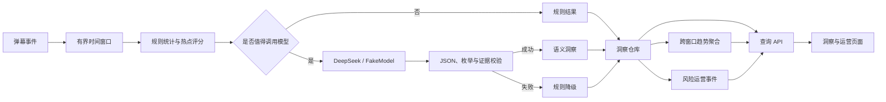

# V13 弹幕 AI 洞察：质量评测、热点触发、趋势分析与运营闭环方案

> 状态：设计草案，待评审后实施  
> 基线：`main` 已合并 V11 AI 洞察最小闭环与 V12 AI 运行时加固  
> 目标：把“小型弹幕智能分析演示”升级为可评测、可控成本、可解释、可运营的完整功能，同时保持 AI 与实时 WebSocket 热路径隔离

## 1. 背景与判断

当前项目已经具备两条相对独立的能力链路：

```text
实时弹幕链路：WebSocket -> Redis -> Kafka -> Consumer -> MySQL

AI 洞察链路：弹幕事件 -> 时间窗口 -> AI Analyzer
           -> 证据校验 -> 结果仓库 -> HTTP API -> 洞察页面
           -> 失败时 Rule Analyzer 降级
```

V11/V12 已经证明：

- AI 分析不会阻塞实时广播；
- 模型调用具备 15 秒默认超时、16 路并发闸门、连续 5 次失败熔断和 30 秒熔断窗口；
- 模型错误、超时、非法 JSON 或证据不合法时可以生成可查询的降级结果；
- FakeModel 的 100、300、500 房间场景可以稳定处理；
- DeepSeek 单窗口调用闭环可用；
- 真实弹幕 10 房间并发调用仍存在全部降级的稳定性问题。

当前最明显的缺口不是“再增加一个模型”，而是：

1. 不知道话题、情绪和风险结果究竟有多准确；
2. 每个窗口都调用模型，缺少热点筛选与成本控制；
3. 页面只展示单窗口，无法回答趋势和突发变化；
4. 风险结论只能查看，不能形成运营处置闭环；
5. 降级结果虽然可靠，但没有量化语义能力损失；
6. 真实模型并发失败原因缺少结构化统计和可复现实验。

V13 应优先补齐这些缺口，而不是扩大模型或基础设施范围。

## 2. 产品目标

V13 的核心目标是回答四个问题：

1. **准不准**：话题、情绪和风险检测有可复现的离线评测指标；
2. **什么时候值得调用模型**：普通窗口走规则，热点或异常窗口调用模型；
3. **房间正在发生什么变化**：支持跨窗口热度、情绪、话题和风险趋势；
4. **发现风险后怎么办**：告警能够确认、忽略、标记误报并记录处置备注。

完成后的产品链路：



## 3. 非目标

V13 暂不实施：

- 训练或微调专用大模型；
- 向量数据库、复杂 RAG 或知识库问答；
- 多 Agent 编排；
- 每条弹幕同步调用模型；
- 模型直接自动封禁用户；
- 将 AI 放回 WebSocket 接收和 Redis 广播热路径；
- 一次性引入完整 Prometheus、Grafana、Alertmanager 平台；
- 将内存仓库立即替换成完整生产数据库架构。

这些能力可以后续演进，但不应稀释本阶段的质量和业务闭环目标。

## 4. 工作流一：离线质量评测集

### 4.1 数据集规模

第一版建议构建 200 个窗口：

- 每个窗口 50～500 条弹幕；
- 至少覆盖 20 个逻辑房间；
- 包含平稳聊天、热点爆发、刷屏、广告、争吵、辱骂、疑似诈骗和无风险噪声；
- 训练和评测不混用；当前项目只建立评测集，不进行训练。

建议分布：

| 场景 | 窗口数 | 目的 |
| --- | ---: | --- |
| 普通聊天 | 50 | 验证低误报 |
| 热点事件 | 40 | 验证话题与热度变化 |
| 正负情绪明显 | 40 | 验证情绪分类 |
| 风险内容 | 40 | 验证风险召回与证据 |
| 刷屏/重复/广告 | 20 | 验证规则统计与风险 |
| 边界和混合场景 | 10 | 验证 mixed、低置信度和降级 |

### 4.2 标注格式

新增：

```text
v11/insight/eval/
├── README.md
├── schema.json
├── dataset/
│   ├── windows.jsonl
│   └── labels.jsonl
└── testdata/
    └── tiny-eval.jsonl
```

每条标签记录建议为：

```json
{
  "window_id": "room-001@2026-08-01T12:00:00Z",
  "room_id": "room-001",
  "topics": ["比赛结果", "裁判争议"],
  "sentiment": "negative",
  "risks": ["abuse"],
  "risk_severity": "medium",
  "evidence_event_ids": ["evt-101", "evt-108"],
  "annotators": ["annotator-a", "annotator-b"],
  "adjudicated": true
}
```

敏感数据要求：

- 不提交原始用户名、手机号、URL 或可识别身份信息；
- `user_id` 使用不可逆匿名 ID；
- 无权公开的数据保留在 Git 忽略目录；
- 仓库只提交允许公开的派生窗口、标签和数据来源说明；
- 每个风险结论必须引用窗口内存在的 EventID。

### 4.3 标注流程

1. 两名标注者独立标注同一窗口；
2. 情绪和风险标签出现分歧时由第三人裁决；
3. 话题名称先做归一化，例如“裁判问题”和“裁判争议”映射到同一主题；
4. 记录标注指南版本，避免标签标准变化后无法复现；
5. 对情绪和风险计算 Cohen's Kappa，Kappa 过低时先修订指南，不急于评模型。

### 4.4 评测指标

新增命令：

```text
v11/insight/cmd/insighteval/main.go
v11/insight/internal/evaluation/
```

运行方式：

```bash
go run ./v11/insight/cmd/insighteval \
  -events=./v11/insight/eval/dataset/windows.jsonl \
  -labels=./v11/insight/eval/dataset/labels.jsonl \
  -model=fake-or-deepseek \
  -output=./results/v13-eval/report.json
```

指标定义：

| 能力 | 主要指标 | 补充指标 |
| --- | --- | --- |
| 情绪分类 | Accuracy、Macro-F1 | 混淆矩阵、各类别 Recall |
| 风险检测 | Precision、Recall、F1 | 高风险漏报率、误报率 |
| 风险等级 | Macro-F1 | 等级偏差分布 |
| 话题识别 | 归一化 Topic-F1 | 人工相关性评分 |
| 证据引用 | Evidence Precision/Recall | 越界 EventID 数量 |
| 输出稳定性 | JSON 合法率、Schema 通过率 | 降级率、修复次数 |
| 性能与成本 | P50/P95/P99、Token/窗口 | 单窗口估算成本 |

话题不是固定单标签分类，第一版采用归一化后的集合匹配：

```text
Topic Precision = 命中的预测话题数 / 预测话题总数
Topic Recall    = 命中的预测话题数 / 标注话题总数
Topic F1        = 2PR / (P + R)
```

同义词映射必须版本化，不能为了提高分数临时修改。

### 4.5 模型与规则同窗口对照

评测命令对每个窗口固定运行两条路径：

```text
A：规则分析器
B：语义模型分析器
```

输出差异至少包含：

- 规则能否正确识别消息量、问句、重复率和峰值；
- 模型是否补充了话题、情绪、风险和证据；
- 模型失败时规则保留了哪些能力；
- 降级后话题覆盖率、情绪 F1、风险 Recall 分别下降多少；
- 模型结果与标注冲突但规则信号明显时，记录为专项误差样本。

在没有评测结果之前，文档和页面不得声明具体准确率。

## 5. 工作流二：热点窗口触发与模型成本控制

### 5.1 为什么需要热点触发

弹幕系统的大多数窗口可能平稳且低风险。每个窗口都调用大模型会带来：

- 不必要的 Token 成本；
- 供应商并发限制和 429；
- 高峰时大面积超时和熔断；
- 普通窗口挤占真正热点窗口的分析资源。

V12 的 10 房间真实模型并发全部降级，已经说明需要调用治理，而不是简单增加 Worker。

### 5.2 新增领域结构

建议在 `internal/domain` 增加：

```go
type TriggerDecision struct {
    Mode       string   `json:"mode"` // rule_only | semantic
    Score      float64  `json:"score"`
    Reasons    []string `json:"reasons"`
    Policy     string   `json:"policy_version"`
}
```

并在 `RoomInsight` 中增加：

```go
Trigger TriggerDecision `json:"trigger"`
```

### 5.3 热点评分

新增：

```text
v11/insight/internal/app/trigger.go
v11/insight/internal/app/trigger_test.go
```

第一版只使用确定性特征：

```text
score = 0.30 * messageBurst
      + 0.20 * uniqueUserBurst
      + 0.20 * repeatedRatio
      + 0.15 * questionRatio
      + 0.15 * riskKeywordRatio
```

所有特征归一化到 `[0,1]`。默认策略：

- `score < 0.45`：只保存规则结果；
- `0.45 <= score < 0.70`：进入普通语义队列；
- `score >= 0.70`：进入高优先级语义队列；
- 命中强风险词时，无论总分如何都进入语义分析；
- 熔断开启时统一规则降级，但保留原始 TriggerDecision。

阈值必须通过离线评测集调节，不能直接把上述建议当成最终生产参数。

### 5.4 调度方式

Processor 不再对所有到期窗口直接调用 Primary Analyzer：

```go
rules := ruleAnalyzer.Analyze(ctx, window)
decision := trigger.Decide(window, rules)
if decision.Mode == "rule_only" {
    return saveRuleOnly(...)
}
return analyzeSemanticWithFallback(...)
```

建议增加两个有界队列：

- `semantic_high`：高风险或突发热点；
- `semantic_normal`：一般热点窗口。

Worker 每处理 3 个高优先级任务后至少处理 1 个普通任务，避免普通房间永久饥饿。

### 5.5 验收指标

- 相比“全窗口调用”，模型调用量下降至少 50%；
- 风险窗口 Recall 下降不超过 5 个百分点；
- 高风险窗口进入模型队列的比例达到 95% 以上；
- 普通窗口规则结果 100% 可查询；
- 熔断、超时和队列满时不丢失窗口状态；
- 每条结果可解释为什么调用或没有调用模型。

## 6. 工作流三：跨窗口趋势分析

### 6.1 目标

单窗口回答“这一分钟发生了什么”，趋势分析回答：

- 热度是否正在快速上升；
- 负面情绪是否连续恶化；
- 主要话题是否发生迁移；
- 风险是否持续存在或突然爆发；
- 当前窗口相对前 5 个窗口有什么变化。

### 6.2 数据模型

新增：

```go
type TrendPoint struct {
    WindowStart       time.Time `json:"window_start"`
    MessageCount      int       `json:"message_count"`
    UniqueUsers       int       `json:"unique_users"`
    PeakMPS           int       `json:"peak_messages_per_second"`
    Sentiment         string    `json:"sentiment"`
    SentimentScore    float64   `json:"sentiment_score"`
    RiskCount         int       `json:"risk_count"`
    MaxRiskSeverity   string    `json:"max_risk_severity"`
    Degraded          bool      `json:"degraded"`
}

type RoomTrend struct {
    RoomID            string       `json:"room_id"`
    Points            []TrendPoint `json:"points"`
    HeatChange        float64      `json:"heat_change"`
    NegativeStreak    int          `json:"negative_streak"`
    DominantTopics    []string     `json:"dominant_topics"`
    TopicShift        bool         `json:"topic_shift"`
    RiskStreak        int          `json:"risk_streak"`
    GeneratedAt       time.Time    `json:"generated_at"`
}
```

### 6.3 计算规则

- 默认读取最近 10 个完成窗口；
- 热度变化使用最近 3 个窗口均值与之前 3 个窗口均值比较；
- 情绪映射仅用于趋势：`positive=1`、`neutral=0`、`mixed=-0.25`、`negative=-1`；
- 降级窗口的情绪不能直接当作真实 neutral，应标记缺失，避免降级导致趋势被错误拉平；
- 话题迁移使用相邻窗口 Topic 集合的 Jaccard 相似度，低于阈值时标记变化；
- 风险连续窗口数独立计算，不因单次模型降级自动归零。

### 6.4 API

新增：

```text
GET /api/v1/rooms/{room_id}/insights/trend?windows=10
GET /api/v1/rooms/{room_id}/insights/compare?from=...&to=...
```

API 参数约束：

- `windows` 默认 10，范围 2～100；
- 时间统一使用 UTC RFC3339；
- 缺少足够历史时仍返回已有点，并增加 `partial=true`；
- 不允许通过房间 ID 注入路径或绕过 URL 解码校验。

### 6.5 前端

在现有 Insight 页面增加：

- 最近窗口热度折线；
- 情绪趋势；
- 风险时间轴；
- 正常/降级窗口标记；
- 话题迁移提示；
- 点击趋势点查看该窗口证据。

前端不重新推断趋势，只展示后端返回的版本化结果。

## 7. 工作流四：风险运营闭环

### 7.1 运营事件

模型返回风险不等于自动执行处罚。新增人工可复核的运营事件：

```go
type ReviewStatus string

const (
    ReviewPending   ReviewStatus = "pending"
    ReviewConfirmed ReviewStatus = "confirmed"
    ReviewFalsePositive ReviewStatus = "false_positive"
    ReviewIgnored   ReviewStatus = "ignored"
)

type RiskCase struct {
    CaseID           string       `json:"case_id"`
    RoomID           string       `json:"room_id"`
    InsightID        string       `json:"insight_id"`
    AlertType        string       `json:"alert_type"`
    Severity         string       `json:"severity"`
    EvidenceEventIDs []string     `json:"evidence_event_ids"`
    SuggestedAction  string       `json:"suggested_action"`
    Status           ReviewStatus `json:"status"`
    Reviewer         string       `json:"reviewer,omitempty"`
    Note             string       `json:"note,omitempty"`
    CreatedAt        time.Time    `json:"created_at"`
    UpdatedAt        time.Time    `json:"updated_at"`
    Version          int64        `json:"version"`
}
```

### 7.2 创建规则

- 只为 `medium` 和 `high` 告警自动创建 Case；
- `CaseID` 基于 `InsightID + AlertType + EvidenceIDs` 生成，保证幂等；
- 同一窗口重复处理不能重复创建 Case；
- 降级窗口不伪造语义风险 Case；
- 如果规则层有明确的强风险命中，可创建 `source=rule` 的待复核 Case。

### 7.3 API

```text
GET   /api/v1/risk-cases?status=pending&severity=high&limit=50
GET   /api/v1/risk-cases/{case_id}
PATCH /api/v1/risk-cases/{case_id}
```

PATCH 示例：

```json
{
  "status": "confirmed",
  "reviewer": "operator-001",
  "note": "已人工确认，建议房管介入",
  "expected_version": 3
}
```

使用 `expected_version` 做乐观并发控制，避免两名运营人员相互覆盖。

### 7.4 页面

新增 `/risk-cases`：

- 按状态、等级、房间过滤；
- 展示告警原因和证据弹幕；
- 支持确认、误报、忽略和备注；
- 显示模型版本、Prompt 版本、触发策略版本和降级状态；
- 不提供自动封禁按钮，防止模型结论直接产生不可逆动作。

### 7.5 运营反馈回流

`confirmed` 和 `false_positive` 是未来评测集的重要来源，但不能直接自动作为真值：

1. 定期导出已复核 Case；
2. 去除身份信息；
3. 二次抽检；
4. 合并进下一版本评测集；
5. 对比模型版本前后风险 Precision/Recall。

## 8. 真实模型稳定性修复

在扩大功能前，必须先解释“10 房间真实模型并发全部降级”。建议新增结构化失败分类：

```text
timeout
rate_limited
provider_5xx
network
invalid_json
schema_invalid
evidence_invalid
circuit_open
queue_full
unknown
```

每次模型调用记录：

- provider、model、prompt_version；
- window_id、事件数、输入字符数；
- 开始时间和耗时；
- 输入/输出 Token；
- HTTP 状态分类；
- 是否修复 JSON；
- 是否降级及原因分类；
- 不记录 API Key 和完整敏感弹幕正文。

建议调用策略：

- 保留最大并发 16 的硬上限，但真实 DeepSeek 默认先设为 4；
- 增加每秒请求令牌桶，例如默认 2 RPS、突发 4；
- 对 429 和明确的 5xx 使用带抖动退避，最多重试 2 次；
- 超时、证据失败和非法 Schema 不做无条件重复调用；
- Prompt 输入超过预算时做分层采样，而不是直接截取前 500 条；
- 熔断状态下不继续消耗普通窗口调用名额。

分层采样建议：

- 30% 高频重复与热点内容；
- 25% 风险关键词候选；
- 20% 问句；
- 15% 时间均匀样本；
- 10% 随机保留，避免只看到规则认为重要的内容。

采样结果必须保留原始 EventID，保证模型证据仍能回指窗口事件。

## 9. 存储与接口演进

V13 第一阶段可以继续使用接口加内存适配器开发，但领域层不得绑定内存实现。

建议扩充 ports：

```go
type InsightRepository interface {
    Save(context.Context, domain.RoomInsight) (bool, error)
    Latest(context.Context, string) (domain.RoomInsight, bool, error)
    History(context.Context, string, int) ([]domain.RoomInsight, error)
}

type RiskCaseRepository interface {
    Save(context.Context, domain.RiskCase) (bool, error)
    Get(context.Context, string) (domain.RiskCase, bool, error)
    List(context.Context, domain.RiskCaseFilter) ([]domain.RiskCase, error)
    Update(context.Context, domain.RiskCaseUpdate) (domain.RiskCase, error)
}

type EvaluationReporter interface {
    Write(context.Context, domain.EvaluationReport) error
}
```

后续持久化建议：

- 洞察和风险 Case：MySQL；
- 最新趋势缓存：Redis；
- AI 输入来源：Kafka 独立 Consumer Group；
- 大体积离线评测报告：JSON 文件或对象存储；
- 不与 V10 落库 Consumer 共用消费组。

## 10. 测试策略

### 10.1 单元测试

- 热点评分边界和策略版本；
- 强风险绕过普通阈值；
- 降级窗口不生成虚假情绪趋势；
- Topic Jaccard 与迁移判断；
- RiskCase 幂等和状态机；
- 乐观锁冲突；
- 失败原因分类；
- 分层采样保持 EventID 合法；
- 评测指标和混淆矩阵计算。

### 10.2 集成测试

- FakeModel 正常、超时、不可用、非法 JSON、非法证据；
- 同一窗口重复处理不重复保存洞察或 Case；
- 模型熔断后普通窗口快速规则降级；
- 高优先级队列不会让普通队列永久饥饿；
- API latest/history/trend/risk-cases 完整闭环；
- 真实 HTTP 模型适配器的 429、5xx 和超时分类。

### 10.3 质量回归

每次修改 Prompt、模型、采样或规则策略都执行：

```bash
go run ./v11/insight/cmd/insighteval ...
```

CI 保存报告并比较基线：

- 情绪 Macro-F1 不得下降超过 2 个百分点；
- 风险 Recall 不得下降超过 3 个百分点；
- 高风险 Recall 不得低于约定门槛；
- Evidence Precision 必须为 100%，即不得引用窗口外 EventID；
- JSON/Schema 合法率低于 99% 时阻止发布；
- 若模型调用量显著增加，必须同时说明质量收益。

门槛的最终数值应在首版标注集完成后确定，上述数值是回归策略建议，不是当前已达到的结果。

### 10.4 负载测试

分开报告两类性能，避免混淆：

1. FakeModel 并发能力：100/300/500/1000 窗口；
2. 真实模型受控验证：1/2/4/8 并发，小规模窗口。

记录：

- normal/degraded/failed；
- 触发率、模型调用节省率；
- 队列等待 P50/P95/P99；
- 模型调用 P50/P95/P99；
- 全链路窗口完成时间；
- 429、超时、熔断和各类降级数量；
- Token 和估算成本；
- HTTP 查询核验比例。

不使用真实付费模型进行 500/1000 窗口无上限压测。

## 11. 可观测性与 Prometheus 的接入时机

V13 优先完成业务指标定义，然后再接 Prometheus。这样 Grafana 展示的是稳定业务语义，而不是先搭平台再决定看什么。

代码内部先定义统一 Metrics 接口，至少包含：

```text
insight_windows_total{status,model,trigger_mode}
insight_trigger_total{decision,reason}
insight_model_requests_total{provider,result}
insight_model_duration_seconds{provider,model}
insight_model_queue_wait_seconds{priority}
insight_model_tokens_total{provider,direction}
insight_model_circuit_state{provider}
insight_evidence_validation_failures_total
insight_risk_cases_total{severity,status,source}
insight_evaluation_score{task,metric,dataset_version,model_version}
```

禁止将以下内容作为 Prometheus Label：

- room_id；
- user_id；
- event_id；
- insight_id；
- 消息正文；
- 完整错误文本。

这些字段会造成高基数或隐私风险。房间级查询继续走业务 API。

完成 V13 核心功能后，再实施：

```text
Prometheus endpoint
-> 多实例 scrape
-> Grafana AI Dashboard
-> Alertmanager
```

第一批告警建议：

- 模型降级率连续 10 分钟超过阈值；
- 429 或超时率持续升高；
- 熔断器开启；
- 高优先级语义队列持续积压；
- Evidence 校验失败；
- 风险 Case 长时间无人处理。

## 12. 安全与隐私

- API Key 只通过环境变量或密钥管理注入；
- 日志禁止输出 Authorization Header；
- Prompt 日志默认不记录完整正文；
- EventID 可追踪，但对外页面需要权限控制；
- 风险 Case 的 Reviewer 采用内部身份，不接受客户端任意伪造；
- PATCH 风险 Case 需要鉴权、审计和乐观锁；
- 自动化输出只能建议人工复核，不直接执行封禁；
- 评测数据必须记录授权和脱敏方式。

## 13. 推荐目录变更

```text
v11/insight/
├── cmd/
│   ├── insightd/
│   ├── insightbench/
│   └── insighteval/                 # 新增
├── eval/                            # 新增
│   ├── README.md
│   ├── schema.json
│   └── testdata/
├── internal/
│   ├── app/
│   │   ├── processor.go
│   │   ├── trigger.go               # 新增
│   │   ├── trend.go                 # 新增
│   │   └── riskcase.go              # 新增
│   ├── domain/
│   │   ├── insight.go
│   │   ├── evaluation.go            # 新增
│   │   ├── trend.go                 # 新增
│   │   └── riskcase.go              # 新增
│   ├── evaluation/                  # 新增
│   ├── adapters/
│   │   ├── analyzer/
│   │   ├── repository/
│   │   └── ratelimit/               # 新增模型 RPS 限制
│   └── httpapi/
└── web/
    └── src/
        ├── pages/
        │   ├── InsightPage.tsx
        │   └── RiskCasesPage.tsx    # 新增
        └── components/
            ├── TrendChart.tsx       # 新增
            └── RiskCasePanel.tsx    # 新增
```

## 14. 分阶段实施计划

### Phase 1：质量基线

交付：

- 标注规范和评测 Schema；
- `insighteval`；
- 情绪、风险、话题和证据指标；
- 模型/规则同窗口对比报告；
- 首版 200 窗口数据集或可公开的最小子集。

验收：所有指标可通过单命令复现，报告不得手工填写核心数字。

### Phase 2：热点触发与真实模型稳定性

交付：

- TriggerDecision；
- 热点评分和高低优先级队列；
- RPS 令牌桶、失败分类和有限重试；
- 分层采样；
- 真实 DeepSeek 1/2/4/8 并发报告。

验收：模型调用量明显下降，同时风险 Recall 保持在约定范围。

### Phase 3：趋势分析

交付：

- RoomTrend；
- trend/compare API；
- 热度、情绪、风险和话题迁移页面；
- 降级窗口正确显示为缺失或降级，不伪装成 neutral。

验收：固定 fixture 的趋势结果完全确定，可重复运行。

### Phase 4：风险运营闭环

交付：

- RiskCase 状态机和仓库；
- 查询与 PATCH API；
- 运营页面；
- 审计、幂等和乐观锁测试；
- 运营反馈导出。

验收：从风险窗口到人工确认/误报形成完整可测试闭环。

### Phase 5：Prometheus/Grafana

交付：

- Prometheus 文本 endpoint；
- AI、Server、Consumer 多实例 scrape；
- Grafana 全链路与 AI Dashboard；
- Alertmanager 基础规则。

验收：可以从 Dashboard 观察一次真实压测从接入、Kafka 到 AI 降级的完整变化。

## 15. 建议的版本成功标准

V13 不以“增加多少 AI 页面”作为成功标准，而以以下证据为准：

- 有版本化、可复现的离线评测集；
- 能回答模型在话题、情绪、风险和证据上的质量；
- 能量化规则降级损失，而不是笼统声称规则更差；
- 普通窗口减少模型调用，热点和风险窗口优先分析；
- 连续窗口能够展示真实趋势，降级不会伪造中性结论；
- 风险输出进入人工可复核的运营状态机；
- 真实模型并发失败有结构化原因和复测结果；
- 所有关键数字由命令生成并保留原始报告；
- AI 失败仍不影响 V10 实时弹幕链路。

## 16. 最小可行实施建议

如果开发时间有限，优先完成：

```text
离线评测集 + insighteval
-> 热点窗口触发
-> DeepSeek RPS 限流与失败分类
```

这三项能最快提升项目说服力：既证明 AI 质量，也证明模型成本和并发风险受到控制。

如果时间允许，再完成：

```text
跨窗口趋势
-> 风险运营闭环
-> Prometheus/Grafana
```

这个顺序能让 Prometheus 最终承载已经稳定定义的业务指标，而不是只展示 CPU、内存和请求次数。
