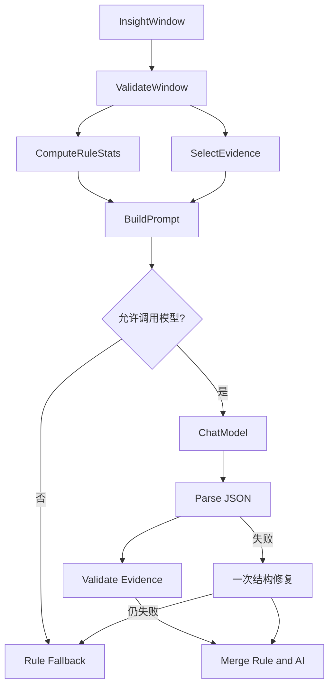

# V11 可插拔 AI 直播运营洞察设计

> 状态：已确认，待实施
>
> 日期：2026-08-04
> 形态：独立模块，可选择接入现有弹幕项目

## 1. 设计原则

V11 不复制或侵入 V10 的业务实现，而是新增一个可以独立启动、独立测试和独立部署的运营洞察模块。现有弹幕系统只是它的一种数据来源。

核心原则：

1. 领域层不导入 Kafka、Redis、MySQL、Eino、DeepSeek 或原项目的包。
2. 所有外部能力都通过小接口注入，具体中间件放在适配器层。
3. 模块可以使用 JSONL 和内存适配器独立运行，验证时不强制依赖原项目。
4. 接入现有项目时只通过 Kafka 事件和 HTTP API 通信，不修改 WebSocket 广播热路径。
5. 模型不可用时返回规则降级结果，不能拖垮消息消费和查询 API。
6. 所有队列、窗口、并发数和输入规模都有上限。
7. AI 结论必须携带原消息证据，避免不可复核的生成结果。

## 2. 目标和非目标

### 2.1 V11 目标

每隔 60 秒为活跃房间生成一份结构化运营洞察：

- 房间摘要：说明窗口内主要讨论内容；
- 热点话题：最多五个主题，并关联原消息编号；
- 情绪判断：正向、中性或负向、置信度和证据；
- 观众问题：提取主播或运营值得回应的问题；
- 运营信号：互动突增、重复刷屏、集中投诉和话题突变；
- 规则统计：消息量、活跃用户数、峰值速率、问句数和重复率。

### 2.2 V11 非目标

首版不包含：

- 发送前同步 AI 审核；
- 自动封禁、删除、禁言或回复；
- 用户画像和推荐系统；
- 多 Agent 协作；
- 自行训练或微调模型；
- Flink 等新的流处理基础设施；
- 对原 WebSocket Manager、`safeSend` 或落库 Consumer 进行改造。

## 3. 可插拔架构

V11 使用端口与适配器结构：

```mermaid
flowchart LR
    subgraph Inputs["输入适配器"]
        JSONL["JSONL Replay"]
        Kafka["Kafka Source"]
        MemorySource["Memory Source"]
    end

    subgraph Core["独立洞察核心"]
        Ingest["Ingest Service"]
        Window["Window Service"]
        Scheduler["Scheduler"]
        Analyzer["Insight Analyzer"]
        App["Insight Application"]
    end

    subgraph Stores["存储适配器"]
        MemoryWindow["Memory Window Store"]
        RedisWindow["Redis Window Store"]
        MemoryRepo["Memory Insight Repo"]
        MySQLRepo["MySQL Insight Repo"]
    end

    subgraph Models["模型适配器"]
        FakeModel["Deterministic Fake"]
        RuleModel["Rule Fallback"]
        DeepSeek["Eino + DeepSeek V4 Pro"]
    end

    subgraph Delivery["输出适配器"]
        HTTP["Standalone HTTP API"]
        Web["Standalone Insight UI"]
    end

    Inputs --> Ingest --> Window --> Scheduler --> App
    App --> Analyzer
    Window <--> Stores
    App <--> Stores
    Analyzer <--> Models
    Stores --> HTTP --> Web
```



### 3.1 核心端口

核心层只依赖以下语义接口，接口方法使用领域对象，不暴露中间件类型：

```go
type EventSource interface {
    Run(ctx context.Context, handle func(context.Context, MessageEvent) error) error
}

type WindowStore interface {
    Add(ctx context.Context, event MessageEvent) (AddResult, error)
    ClaimDue(ctx context.Context, now time.Time, limit int) ([]WindowRef, error)
    Load(ctx context.Context, ref WindowRef) (InsightWindow, error)
    Complete(ctx context.Context, ref WindowRef) error
    Release(ctx context.Context, ref WindowRef, retryAt time.Time) error
}

type InsightAnalyzer interface {
    Analyze(ctx context.Context, window InsightWindow) (SemanticInsight, error)
}

type InsightRepository interface {
    Save(ctx context.Context, insight RoomInsight) (SaveResult, error)
    Latest(ctx context.Context, roomID string) (RoomInsight, error)
    List(ctx context.Context, query InsightQuery) (InsightPage, error)
}

type RunRecorder interface {
    Record(ctx context.Context, run InsightRun) error
}
```

Kafka、Redis、MySQL 和 Eino 只实现这些接口。业务服务不能通过类型断言绕过端口访问适配器内部能力。

### 3.2 三种运行组合

| 模式 | 输入 | 窗口 | 分析 | 结果 | 用途 |
|---|---|---|---|---|---|
| 单元测试 | 内存 | 内存 | Fake | 内存 | 快速、确定性测试 |
| 独立演示 | JSONL | 内存 | DeepSeek 或 Fake | 内存或 MySQL | 不启动原弹幕系统 |
| 项目接入 | Kafka | Redis | DeepSeek | MySQL | 完整异步链路 |

依赖通过启动配置组装，不在核心代码中编写 `if kafkaEnabled` 或 `if redisEnabled`。不支持的组合在启动阶段直接报错。

## 4. 独立领域模型

V11 定义自己的稳定输入契约，不导入 V10 的 `model.Danmaku`：

```go
type MessageEvent struct {
    EventID       string
    RoomID        string
    UserID        string
    Username      string
    Content       string
    OccurredAt    time.Time
    SchemaVersion string
    Source        string
}
```

约束：

- `EventID`、`RoomID`、`UserID` 和 `OccurredAt` 必填；
- `Content` 按 Unicode 字符数限制；
- 所有时间进入核心前统一为 UTC；
- 输入适配器负责把外部 DTO 转换为 `MessageEvent`；
- 当前弹幕项目的 Kafka Packet 解析逻辑只存在于 Kafka 适配器；
- 后续接入其他直播平台时新增适配器，不修改领域对象和分析服务。

标准 JSONL 格式：

```json
{
  "event_id": "msg-000001",
  "room_id": "room-001",
  "user_id": "user-001",
  "username": "viewer-001",
  "content": "主播这里是不是卡了",
  "occurred_at": "2026-08-04T12:00:01.120Z",
  "schema_version": "insight.message.v1",
  "source": "synthetic"
}
```

## 5. 时间窗口

### 5.1 窗口语义

首版使用基于 `OccurredAt` 的 60 秒固定窗口：

```text
window_start = occurred_at.Truncate(60s)
window_end   = window_start + 60s
due_at       = window_end + 10s
```

超过 10 秒到达的消息不重新打开已经发布的在线结果，只增加迟到计数。补偿任务可以根据配置生成新的分析版本，不能覆盖旧结果而不保留审计记录。

### 5.2 有界数据

窗口存储必须实现同一组上限：

- 每个窗口最多保留 500 条代表消息；
- 规则计数在采样满后继续累计；
- 最终模型输入最多 8000 个 Unicode 字符；
- 少于 10 条有效消息时不调用真实模型；
- 每次最多领取 32 个到期窗口；
- 到期窗口任务队列默认容量 128。

样本选择必须确定性：

1. 保留高频内容代表样本和出现次数；
2. 保留问句；
3. 将窗口分为六个十秒段均匀抽样；
4. 剩余容量按 `EventID` 稳定哈希选择。

### 5.3 Redis 适配器

Redis 不是核心层要求，只是项目接入模式的窗口实现。键设计：

```text
insight:window:{room_id}:<start>:messages  Hash，event_id -> JSON
insight:window:{room_id}:<start>:order     ZSet，score=occurred_at
insight:window:{room_id}:<start>:meta      Hash，计数和状态
insight:window:{room_id}:<start>:lock      String，领取锁
insight:windows:due                        ZSet，score=due_at
```

写入通过 Lua 原子完成，不使用 `KEYS` 扫描。窗口默认保留两小时。Redis 适配器可以被内存实现或其他状态存储替换。

## 6. 输入与恢复语义

### 6.1 Kafka 适配器

Kafka 适配器使用独立 Consumer Group：

```text
danmaku-ai-insight-v11
```

它只负责：

1. 解析原项目 Kafka Packet；
2. 转换为 `MessageEvent`；
3. 调用核心 `Ingest`；
4. 在窗口存储成功后标记位点。

至少一次语义：

```text
Kafka 消息 -> WindowStore.Add 成功 -> MarkMessage
```

适配器崩溃后 Kafka 可以重放，WindowStore 根据 `EventID` 去重。AI Consumer Group 的积压不影响原落库 Consumer Group。

### 6.2 JSONL 适配器

JSONL 输入支持两种速度：

- `as-fast-as-possible`：验证分析吞吐；
- `realtime`：按照事件时间和倍率回放，演示窗口关闭过程。

它用于最小闭环和数据集评测，不需要 Kafka、Redis 或原项目启动。

### 6.3 补偿接口

核心层定义可选 `WindowBackfillSource`。MySQL 原弹幕表适配器可以扫描“有消息但没有洞察”的已关闭窗口并重新提交，但该能力不是最小闭环的强制依赖。

## 7. Eino 与模型插件

### 7.1 Eino 的边界

Eino 只存在于 `InsightAnalyzer` 的一个实现中：

```text
InsightAnalyzer
├── RuleAnalyzer
├── FakeAnalyzer
└── EinoAnalyzer
    └── ChatModelProvider
        ├── DeepSeekProvider
        └── 未来其他 Provider
```

核心应用层只调用 `InsightAnalyzer.Analyze`。替换 Eino、DeepSeek 或模型版本不会影响窗口、调度、API 和仓库。

### 7.2 为什么使用 Workflow 而不是 Agent

运营洞察是固定、可审计的数据流程，不需要模型自主规划或选择工具。首版采用 Eino Workflow 或 Graph：



后续若增加“运营问答 Agent”，可以把洞察查询封装成 Tool，但 Agent 不能取代本次确定性分析流程。

### 7.3 DeepSeek V4 Pro

首选真实模型：

```text
provider: deepseek
base_url: https://api.deepseek.com
model: deepseek-v4-pro
```

DeepSeek V4 Pro 通过 OpenAI 兼容 Chat Completions 接口接入。模型适配器请求 JSON Output，并在提示词中包含 JSON 字样和结构示例。即使供应商保证 JSON 模式，服务端仍执行完整反序列化和业务校验，因为响应可能为空、被截断或字段不符合约束。

配置仅从环境读取：

```text
INSIGHT_MODEL_PROVIDER=deepseek
INSIGHT_MODEL_NAME=deepseek-v4-pro
INSIGHT_MODEL_BASE_URL=https://api.deepseek.com
DEEPSEEK_API_KEY=<local-secret>
```

仓库只提交 `.env.example` 中的占位符。真实密钥不得进入代码、文档、测试 Fixture、日志、Git 历史或 Docker Compose。测试默认使用 FakeAnalyzer；真实模型测试需要显式开启。

首版默认关闭不必要的工具调用。若模型适配器支持关闭思考模式，则运营摘要使用非思考模式降低延迟和费用；该能力作为 Provider 配置，不进入核心接口。

### 7.4 结构化输出

`SemanticInsight`：

```json
{
  "summary": "观众集中讨论画面卡顿，并询问抽奖时间。",
  "topics": [
    {
      "name": "直播卡顿",
      "confidence": 0.91,
      "evidence_event_ids": ["msg-1", "msg-8"]
    }
  ],
  "sentiment": {
    "label": "negative",
    "confidence": 0.78,
    "evidence_event_ids": ["msg-1"]
  },
  "questions": [
    {
      "text": "抽奖什么时候开始？",
      "evidence_event_ids": ["msg-12"]
    }
  ],
  "alerts": [
    {
      "type": "repeated_complaint",
      "severity": "medium",
      "description": "短时间内多次出现卡顿反馈",
      "evidence_event_ids": ["msg-1", "msg-8"]
    }
  ]
}
```

校验规则：

- 枚举值必须在允许范围内；
- 置信度必须位于 `[0, 1]`；
- 数组长度和字符串长度有上限；
- 每个证据编号必须存在于当前窗口；
- 模型不得返回用户处置或系统控制命令；
- 非法字段不会直接写入结果仓库。

### 7.5 提示词安全

弹幕是外部不可信数据。系统提示明确声明弹幕中的“忽略规则”“调用工具”等文字都只是待分析内容。模型不获得写操作 Tool。

默认只持久化 `input_hash`、模型名、提示词版本、Workflow 版本、Token、延迟和错误类型，不保存完整提示词和整批弹幕。

## 8. 应用服务和并发

独立进程：

```text
v11/insight/cmd/insightd
```

内部并发结构：

```text
EventSource goroutine
    -> WindowStore

一个 Scheduler goroutine
    -> analysisJobs 有界 channel

固定数量 AnalysisWorker goroutine
    -> InsightAnalyzer
    -> InsightRepository

一个可选 Reconciler goroutine
    -> WindowBackfillSource
    -> analysisJobs
```

约束：

- 模型 worker 默认 2 个，配置必须设置上限；
- `analysisJobs` 默认容量 128；
- 队列满时 WindowStore 保留窗口，调度器稍后重试；
- 不为每个窗口无限创建 goroutine；
- 网络调用期间不持有本地 mutex；
- 所有外部调用接受 `context.Context`；
- 关闭时先停止输入，再停止调度，等待执行中 worker，最后关闭适配器；
- 适配器实现自己的线程安全，核心服务不依赖全局单例。

## 9. 幂等、重试、熔断和降级

### 9.1 结果幂等键

```text
(room_id, window_start, window_end, prompt_version)
```

相同窗口和提示词版本只能产生一份当前结果。人工重算或模型升级必须增加版本，旧结果保留用于对比。

### 9.2 默认故障策略

| 场景 | 行为 |
|---|---|
| 模型超时或临时网络错误 | 指数退避加抖动，最多重试 2 次 |
| 模型返回 429 | 优先遵循 Retry-After，否则退避 |
| 模型连续失败 | 熔断 30 秒，阈值可配置 |
| JSON 为空或非法 | 一次结构修复，仍失败则降级 |
| WindowStore 失败 | 输入不确认，交给输入适配器重放 |
| InsightRepository 失败 | 窗口不完成，稍后重试 |
| 分析队列满 | 窗口保留，稍后重新领取 |

规则降级结果至少包含消息数、活跃用户数、峰值速率、问句数、重复率和高频文本。语义字段明确标记不可用，不能伪装成模型成功。

## 10. 存储插件

### 10.1 内存仓库

最小闭环默认使用内存仓库，便于不启动任何中间件完成：

```text
JSONL -> MemoryWindowStore -> Eino/Fake -> MemoryInsightRepository -> HTTP
```

### 10.2 MySQL 仓库

项目接入模式使用独立表，不依赖原项目 GORM Model：

```text
ai_room_insights
ai_insight_runs
```

`ai_room_insights` 保存房间、窗口、状态、摘要、主题、情绪、问题、运营信号、规则统计、输入量、采样量、迟到量、输入哈希、模型与提示词版本、Token、延迟和降级原因。

`ai_insight_runs` 保存每次调用、重试、降级和重算的状态、错误类别、TraceID、Token 和耗时，不保存密钥或完整输入。

仓库接口允许未来替换为 PostgreSQL 或文档数据库，核心服务不感知 GORM。

## 11. 独立 HTTP API 和前端

`insightd` 自己提供 API：

```text
GET  /health
GET  /metrics
GET  /api/v1/rooms/{room_id}/insights/latest
GET  /api/v1/rooms/{room_id}/insights?from=&to=&cursor=&limit=
GET  /api/v1/rooms/{room_id}/insights/{insight_id}
POST /api/v1/admin/insights/{insight_id}/reprocess
```

最小闭环先实现读取接口和独立 `/insights` 页面。当前弹幕前端若需要展示，只通过配置 `VITE_INSIGHT_API_BASE_URL` 调用该 API，或者由网关转发；不导入 AI 服务内部包。

管理员重算接口在完整接入阶段启用，需要独立鉴权适配器。核心层只接受 `Actor` 和权限判断结果，不依赖原 JWT 实现。

页面展示：

- 房间和时间筛选；
- 最新摘要与正常/降级状态；
- 确定性统计；
- 热点话题、情绪、问题和运营信号；
- 点击结论查看证据消息；
- 模型、提示词版本、窗口时间、Token 和降级原因。

规则统计和 AI 估计必须使用不同标签，不能把情绪置信度包装成精确业务统计。

## 12. 可观测性

AI 模块独立暴露：

```text
insight_events_consumed_total
insight_events_duplicate_total
insight_events_late_total
insight_windows_open
insight_windows_ready_total
insight_job_queue_len / insight_job_queue_cap
insight_windows_completed_total
insight_windows_degraded_total
insight_window_end_to_end_milliseconds
insight_model_requests_total
insight_model_errors_total
insight_model_latency_milliseconds
insight_model_input_tokens_total / insight_model_output_tokens_total
insight_model_breaker_state
insight_reconcile_windows_total
```

Eino Callback 记录节点开始、结束和错误。`trace_id`、`room_id`、窗口时间和 `insight_id` 贯穿日志。模块不要求原 Server 聚合这些指标，监控系统可以分别采集。

## 13. 数据和质量评测

使用三类数据：

1. 可提交的小型场景 Fixture：用于单元和端到端测试；
2. 场景化合成数据：包含房间、时间、主题切换、互动突增和投诉；
3. 真实弹幕与人工金标准窗口：用于模型质量评测，不提交许可证不明确的原始数据。

质量指标：

- 主题召回率；
- 摘要事实一致性；
- 情绪判断准确率；
- 问题提取召回率；
- 证据编号有效率；
- JSON 结构成功率；
- 正常和降级结果比例；
- 每窗口 Token 和模型耗时。

## 14. 测试方案

### 14.1 单元测试

- 窗口边界、UTC 转换和迟到时间；
- 重复 EventID；
- 有界采样和稳定重放；
- Fake、Rule 和 Eino Analyzer 的统一契约；
- 正常 JSON、空响应、截断、非法证据和超时；
- 结果幂等；
- API 分页和参数校验；
- worker pool 关闭和队列满行为。

### 14.2 最小闭环测试

不启动 Kafka、Redis、MySQL 或原弹幕项目：

```text
JSONL Fixture
-> MemoryWindowStore
-> Eino Workflow + FakeAnalyzer
-> MemoryInsightRepository
-> HTTP API
-> 独立洞察页面
```

随后通过显式环境变量开启 DeepSeek V4 Pro，对固定金标准窗口运行真实模型测试。

### 14.3 适配器集成测试

分别测试，不把所有故障混成一条难以定位的链路：

- Kafka Source + MemoryWindowStore；
- JSONL Source + RedisWindowStore；
- MemoryWindowStore + MySQL Repository；
- Kafka + Redis + MySQL 完整适配器组合；
- 原系统停机、AI 模块独立运行；
- AI 模块停机、原系统广播与落库不受影响。

### 14.4 性能和故障隔离

FakeAnalyzer 用于压工程链路；DeepSeek 用于测模型延迟、Token 和质量，两类结果分开报告。

观测：

- 输入吞吐和 Kafka Lag；
- 同时到期窗口数和队列长度；
- 窗口结束到结果可查询的 P50/P95/P99；
- 模型 P50/P95/P99；
- 降级率和重试率；
- 接入 Kafka 适配器前后原 WebSocket QPS 与 P95/P99。

## 15. 最小闭环验收

首个可行版本必须满足：

1. 独立模块可以在无中间件模式启动；
2. JSONL 回放产生至少两个房间、两个窗口；
3. Eino Workflow 经 FakeAnalyzer 生成结构化洞察；
4. DeepSeek 配置存在时可显式执行一组真实模型测试；
5. API 可以查询最新和历史洞察；
6. 独立页面能展示摘要、统计、主题和证据；
7. 重放相同数据不会生成重复结果；
8. 模型超时会生成 `degraded` 结果；
9. 单元测试和竞态检测通过；
10. 形成包含真实命令、模型配置、输入规模和指标口径的验证报告。

目标值必须标记为目标，完成测试后才能写成成果：

- 正常依赖下，每个到期窗口最终有正常或降级结果；
- 证据编号有效率为 100%；
- 幂等测试重复结果数为 0；
- 接入模式下原 WebSocket P95 增幅目标低于 5%；
- 人工金标准集主题召回率目标不低于 80%。

## 16. 实施阶段

### 阶段一：独立最小闭环

- 建立领域模型、端口和依赖组装；
- 实现 JSONL Source、MemoryWindowStore 和 MemoryInsightRepository；
- 实现规则统计、FakeAnalyzer、Eino Workflow 和结构化校验；
- 实现独立 API、最小洞察页面和端到端测试。

### 阶段二：DeepSeek 真实模型

- 实现 DeepSeekProvider；
- 使用 `deepseek-v4-pro` 和 JSON Output；
- 增加超时、重试、熔断、降级和 Callback；
- 使用固定金标准窗口验证质量、Token 和延迟。

### 阶段三：中间件适配器

- 实现 Kafka Source；
- 实现 RedisWindowStore 和 Lua 原子写；
- 实现 MySQL InsightRepository；
- 完成适配器级与完整组合测试。

### 阶段四：可选项目接入

- 配置 Kafka Topic 和独立 Consumer Group；
- 配置现有前端的洞察 API 地址或网关路由；
- 增加 MySQL 补偿来源；
- 验证 AI 模块与原实时链路的故障隔离和性能回归。

## 17. 推荐目录

```text
v11/
└── insight/
    ├── cmd/
    │   └── insightd/
    ├── internal/
    │   ├── domain/
    │   ├── app/
    │   ├── ports/
    │   └── adapters/
    │       ├── source/
    │       │   ├── memory/
    │       │   ├── jsonl/
    │       │   └── kafka/
    │       ├── window/
    │       │   ├── memory/
    │       │   └── redis/
    │       ├── analyzer/
    │       │   ├── fake/
    │       │   ├── rule/
    │       │   └── eino/
    │       │       └── deepseek/
    │       ├── repository/
    │       │   ├── memory/
    │       │   └── mysql/
    │       └── httpapi/
    ├── web/
    ├── testdata/
    │   ├── fixtures/
    │   └── goldens/
    ├── .env.example
    └── README.md
```

## 18. 关键取舍

1. 选择独立服务和端口适配器，是为了让 AI 能脱离原项目运行和测试。
2. 选择标准 `MessageEvent`，是为了避免核心代码依赖 V10 Packet 和数据库模型。
3. 选择 Eino Workflow 而不是 Agent，是为了固定流程、类型明确和结果可测。
4. 选择 DeepSeek Provider 插件，是为了模型可以替换，不把供应商逻辑散落到业务层。
5. 选择内存和 JSONL 适配器，是为了先完成不依赖中间件的真实最小闭环。
6. Kafka、Redis 和 MySQL 各自作为插件加入，任一插件故障不改变核心领域逻辑。
7. 强制证据编号，是为了让运营结论可以复核。
8. 保留规则降级，是为了模型不可用时仍产生可信的确定性统计。
9. 使用有界窗口、队列和 worker pool，是为了让内存、并发和模型成本可预测。

## 19. 参考资料

- [CloudWeGo Eino 官方文档](https://www.cloudwego.io/docs/eino/)
- [Eino Chain、Graph 与 Workflow](https://www.cloudwego.io/docs/eino/core_modules/chain_and_graph_orchestration/)
- [Eino Callback](https://www.cloudwego.io/docs/eino/core_modules/chain_and_graph_orchestration/callback_manual/)
- [Eino 扩展组件](https://github.com/cloudwego/eino-ext)
- [DeepSeek 可用模型列表](https://api-docs.deepseek.com/api/list-models)
- [DeepSeek V4 更新说明](https://api-docs.deepseek.com/updates/)
- [DeepSeek JSON Output](https://api-docs.deepseek.com/guides/json_mode/)
- [COLDataset](https://github.com/thu-coai/COLDataset)
- [ToxiCN](https://github.com/DUT-lujunyu/ToxiCN)
- [ChineseVTBCorpus](https://github.com/harryisfish/ChineseVTBCorpus)
