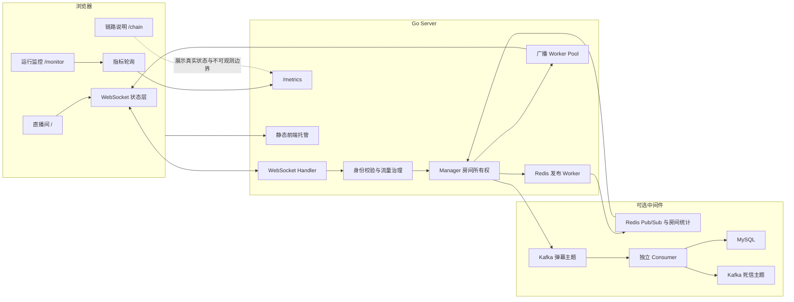
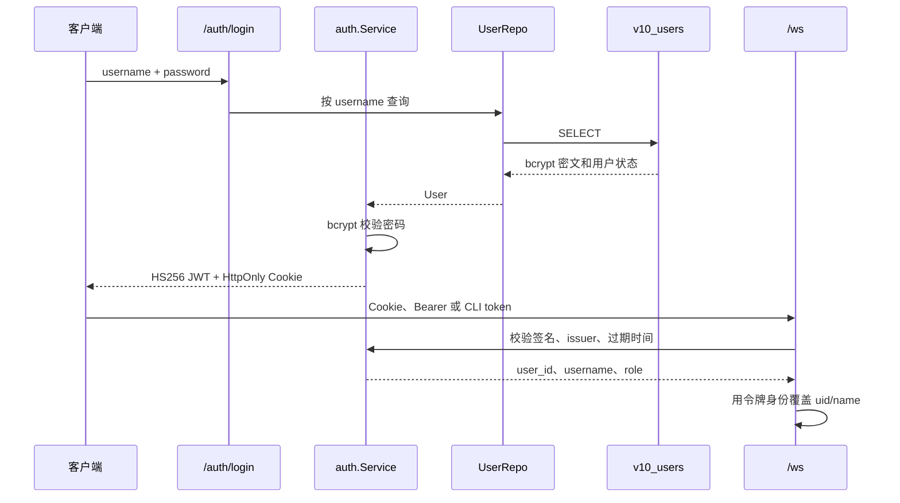
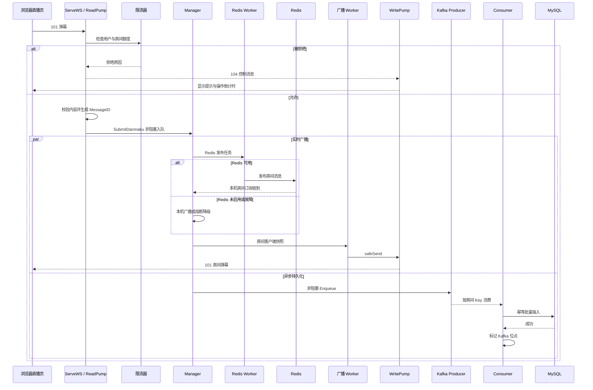
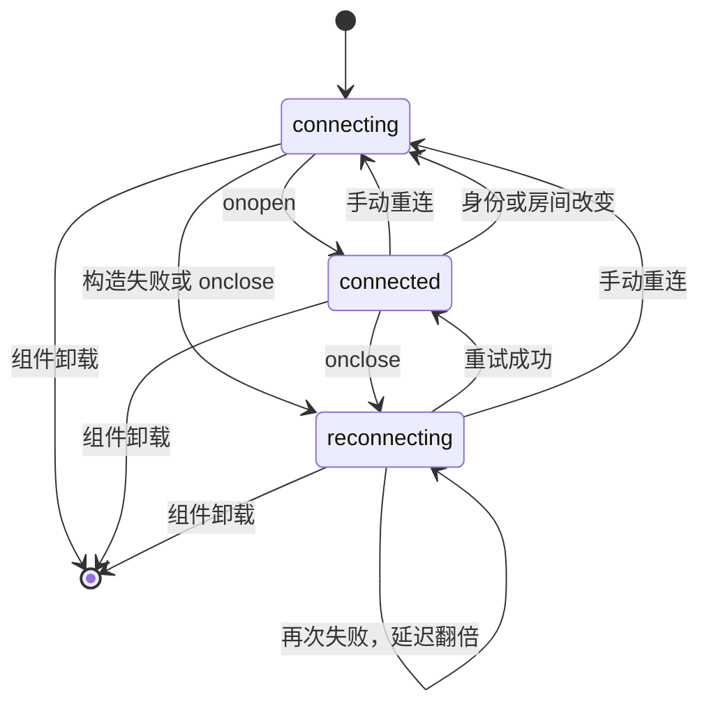
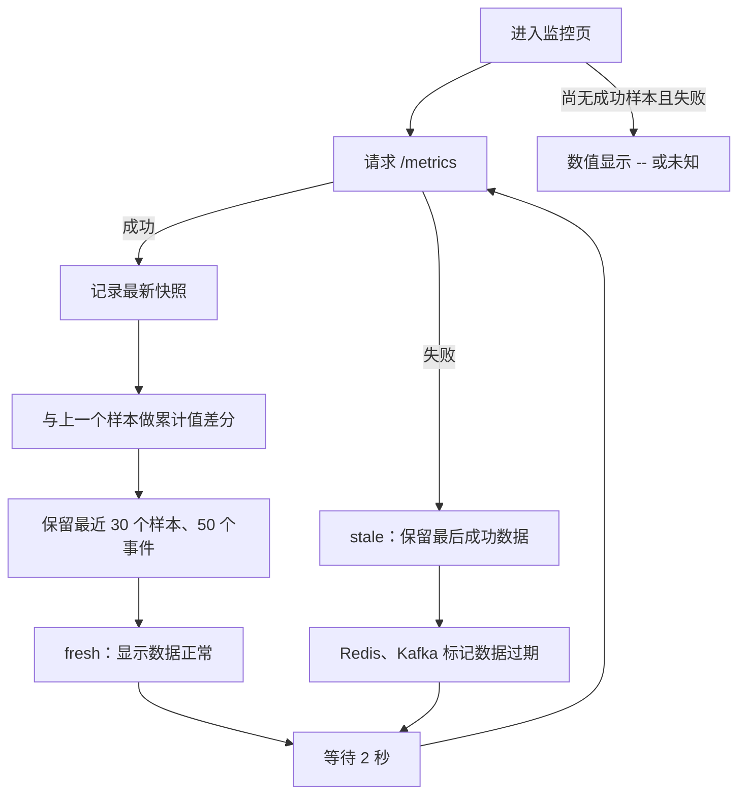
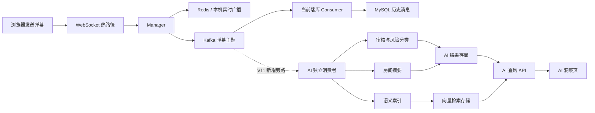

# V10：Web 可视化与真实联调版

V10 延续 V9 的后端治理能力，为它补上一套可以直接操作、观察和讲解的 Web 界面。

阅读这份文档时，建议同时打开：

- [前端入口](web/src/app/App.tsx)
- [WebSocket 状态管理](web/src/realtime/useDanmakuSocket.ts)
- [Go 服务入口](cmd/server/main.go)
- [房间与广播管理](internal/ws/manager.go)
- [客户端读写循环](internal/ws/client.go)

---

## 1. V10 一句话定位

```text
V9 让弹幕服务在过载和依赖故障时能够限流、隔离、降级和恢复；
V10 让这些能力能够被真实浏览器操作、观察和验证。
```

V10 不是另起一个前端演示项目。页面发送的弹幕会进入真实 Go WebSocket 服务，直播页收到真实房间广播，监控页读取真实 `/metrics`，链路页则明确区分：

- 当前接口已经观察到的状态；
- 当前没有启用的依赖；
- 当前服务端接口无法观察的独立进程；
- 未来 V11 才会加入的 AI 异步分支。

---

## 2. V9 与 V10 的差异

| 能力 | V9 | V10 |
|---|---|---|
| 操作入口 | 命令行客户端 | 浏览器直播间 |
| 弹幕展示 | 终端文本 | 舞台弹幕轨道与消息列表 |
| 点赞展示 | 终端统计 | 房间实时点赞数 |
| 限流反馈 | 控制包与日志 | 操作级倒计时和明确提示 |
| 运行指标 | JSON 与日志 | 指标卡、趋势图和治理事件 |
| 链路理解 | 阅读代码和文档 | 可视化实时、持久化两条分支 |
| 房间切换 | 重启命令行客户端 | 页面内切换并重建连接 |
| 前端资源治理 | 无 | 消息、轨道、图表和事件都有上限 |
| 部署形态 | Go 服务 | Go 可直接托管构建后的单页应用 |
| 浏览器验证 | 无 | 真实双客户端、限流、房间隔离测试 |

V10 没有改变 V9 的核心可靠性边界。Redis、Kafka、MySQL、限流器、熔断器、worker pool 和 `safeSend` 仍然在 Go 后端；前端负责把真实状态呈现出来，而不是重新实现一套后端规则。

---

## 3. 前端学习前置知识

### 3.1 建议先掌握

| 知识 | 在 V10 中解决的问题 |
|---|---|
| HTML 表单和语义标签 | 输入弹幕、切换房间、无障碍名称 |
| CSS Grid、Flex 和媒体查询 | 桌面双栏、手机单栏和弹幕舞台 |
| JavaScript 事件循环 | WebSocket 回调、定时重连、指标轮询 |
| TypeScript 接口和联合类型 | 约束四种协议与连接状态 |
| React 组件、状态和属性 | 将直播间拆成舞台、列表、发送区 |
| `useEffect`、`useRef`、`useCallback` | 连接生命周期、定时器和稳定回调 |
| 浏览器 WebSocket | 建连、收包、发包、断线 |
| `fetch` 与 `AbortController` | 指标轮询和页面卸载时取消请求 |
| 前端路由 | `/`、`/monitor`、`/chain` 三个页面 |

不需要先成为前端专家。推荐先读协议和连接 Hook，再读页面组件，最后看样式。

### 3.2 与 Go 并发概念的对应关系

| Go 后端 | 浏览器前端 | 共同问题 |
|---|---|---|
| goroutine | WebSocket 回调与定时任务 | 异步任务何时开始、何时结束 |
| channel | 组件之间的状态和事件 | 数据从生产者流向消费者 |
| `mutex` | React 状态更新函数 | 避免多个异步事件覆盖旧状态 |
| `context` | `AbortController` | 生命周期结束后取消工作 |
| worker pool | 浏览器单线程事件循环 | 限制并发和避免阻塞关键路径 |
| 有界队列 | 有界消息数组 | 防止长期运行后资源无限增长 |

注意：React 状态不是 Go 的 `mutex`。这个类比只帮助理解“基于上一状态计算下一状态”，不要把两者当成同一种实现。

### 3.3 中间件是否是学习 V10 的前置条件

不是。第一遍应使用无中间件模式：

```text
浏览器 -> Go WebSocket -> 本机房间广播 -> 浏览器
```

确认页面和并发链路后，再加入 Redis、Kafka 和 MySQL。这样出错时容易判断问题位于前端、WebSocket 还是中间件。

---

## 4. V10 目录结构

```text
v10/
├── cmd/
│   ├── server/       WebSocket、指标接口、静态前端托管
│   ├── consumer/     Kafka 消费与 MySQL 批量落库
│   ├── migrate/      独立数据库迁移
│   ├── query/        查询房间历史弹幕
│   ├── client/       命令行 WebSocket 客户端
│   └── benchmark/    后端小规模压测入口
├── internal/
│   ├── auth/        用户登录、HS256 令牌和鉴权中间件
│   ├── ws/           连接、房间、广播 worker、safeSend
│   ├── ratelimit/    连接、用户和房间限流
│   ├── resilience/   Redis 熔断器
│   ├── queue/        Kafka 发布、健康状态和死信
│   ├── consumer/     分区内攒批、重试、暂停和恢复
│   ├── repo/         MySQL 幂等批量写入
│   ├── infra/        Redis、Kafka、MySQL 客户端
│   ├── model/        四种协议与数据库模型
│   ├── idgen/        全局消息编号
│   └── webapp/       构建产物和前端深层路由托管
├── web/
│   ├── src/
│   │   ├── app/      应用路由、身份解析
│   │   ├── pages/    直播间、运行监控、链路说明
│   │   ├── realtime/ WebSocket URL 和连接 Hook
│   │   ├── protocol/ 协议解析与运行时校验
│   │   ├── metrics/  指标采样、差分和治理事件
│   │   ├── components/
│   │   ├── styles/
│   │   └── assets/
│   ├── e2e/          真实浏览器与 Go 服务联调
│   └── playwright.config.ts
├── docker-compose.redis-kafka-mysql.yaml
├── IMPLEMENTATION_PLAN.md
└── README.md
```

---

## 5. 浏览器、Go 和中间件架构图



### 5.1 最小闭环

```text
浏览器
  -> ServeWS
  -> Client.ReadPump
  -> Manager.Broadcast
  -> broadcastJobs
  -> broadcastWorker
  -> safeSend
  -> Client.WritePump
  -> 浏览器
```

Redis 和 Kafka 都关闭时，`Manager.handleBroadcast` 会直接进入本机广播队列。这是完整的本机广播逻辑，不是假数据模式。

### 5.2 Go 并发所有权

| 资源 | 主要所有者 | 保护方式 |
|---|---|---|
| WebSocket 读取 | 每个连接的 `ReadPump` | 一个连接只有一个读循环 |
| WebSocket 写入 | 每个连接的 `WritePump` | 其他 goroutine 只写 `Client.Send` |
| 注册、退出、广播入口 | `Manager.Run` | 三个 channel 串联事件 |
| 房间成员表 | `Manager.rooms` | `sync.RWMutex` |
| 点赞增量 | `localLikes` | `sync.Mutex` |
| 高频指标 | 多个 goroutine | `sync/atomic` |
| 广播扇出 | 固定数量 worker | 有界 `broadcastJobs` |
| Redis 发布 | 独立固定 worker | 有界 `redisPublishJobs` |
| 客户端关闭 | 多个退出路径 | `sync.Once` |

为什么既有 Manager channel，又有 `mutex`？

- 注册、退出和广播事件由 `Manager.Run` 串行接收，便于理解事件顺序。
- 广播 worker、统计 goroutine 和 `/metrics` 也会读取房间状态，因此房间表仍需要读写锁。
- 锁只保护“复制房间成员快照”这段短操作，真正向客户端发送时已经释放锁。

---

## 6. 四种消息协议

协议定义同时存在于 [Go 模型](internal/model/message.go) 和 [前端类型](web/src/protocol/types.ts)。

| 编号 | 名称 | 方向 | 用途 |
|---:|---|---|---|
| `101` | 弹幕 | 浏览器 -> 服务端；服务端 -> 房间 | 提交和广播弹幕 |
| `102` | 房间统计 | 服务端 -> 浏览器 | 在线人数与点赞总数 |
| `103` | 点赞 | 浏览器 -> 服务端 | 提交点赞增量 |
| `104` | 控制消息 | 服务端 -> 浏览器 | 限流、过载、内容过长 |

浏览器发送弹幕：

```json
{
  "type": 101,
  "data": {
    "content": "你好，V10"
  }
}
```

服务端广播弹幕时会补齐 `message_id`、房间、用户、昵称和时间。`message_id` 在入口只生成一次，后续 Redis、Kafka 和 MySQL 都沿用它。

Consumer 写 MySQL 前会先按 `message_id` 去除同一批次内的重复记录，再使用 MySQL 唯一索引吸收跨批次重试；原批次中的所有 Kafka 消息仍会在提交成功后统一标记，重复数量进入 `duplicates` 指标。

### 5.2 JWT 登录与用户表

V10 已加入基于 MySQL 的用户表 `v10_users` 和登录服务。密码使用 bcrypt 保存，服务端只签发 HS256 令牌，不在 WebSocket、Kafka 或 MySQL 中传递密码。

首次启动或表结构变化后，先执行迁移并创建本地学习账号：

```bash
go run ./v10/cmd/migrate \
  -mysql-dsn='root:root@tcp(127.0.0.1:3313)/danmaku_v10?charset=utf8mb4&parseTime=True&loc=Local' \
  -seed-username=demo \
  -seed-password=demo123
```

启动服务时，`-auth=true` 会打开登录服务；`-auth-required=true` 会要求 WebSocket 和 `/metrics` 携带有效 JWT。默认关闭强制校验，便于继续学习旧版的 `uid/name` 兼容链路：

```bash
go run ./v10/cmd/server \
  -auth=true \
  -auth-required=true \
  -jwt-secret='请替换为至少32字节的随机字符串'
```

登录后可以使用返回的令牌访问指标和命令行客户端：

```bash
TOKEN=$(curl -s \
  -H 'Content-Type: application/json' \
  -d '{"username":"demo","password":"demo123"}' \
  http://127.0.0.1:8080/auth/login \
  | sed -n 's/.*"access_token":"\([^"]*\)".*/\1/p')

curl -H "Authorization: Bearer $TOKEN" http://127.0.0.1:8080/metrics
go run ./v10/cmd/client -port=8080 -room=room1 -token="$TOKEN"
```

浏览器登录接口会同时写入 HttpOnly Cookie；命令行客户端和本地 benchmark 使用 `-token`。查询参数令牌只为 CLI 和本地压测保留，正式浏览器场景应使用 Cookie 或 Authorization 请求头。

登录链路可以按下面的顺序阅读：



`-auth-required=false` 时，服务仍保留旧版 `uid/name` 兼容入口，适合先学习 WebSocket；`-auth-required=true` 时，缺少或伪造令牌会在升级连接前被拒绝。生产环境还应补充刷新令牌、登出失效名单或短令牌轮换，以及登录接口限流。

### 6.1 完整消息时序



### 6.2 为什么一个连接要一个读 goroutine 和一个写 goroutine

[ServeWS](internal/ws/handler.go) 在升级连接后：

```text
当前 HTTP goroutine -> ReadPump
新 goroutine       -> WritePump
```

`ReadPump` 只负责从浏览器读取，`WritePump` 只负责向浏览器写。广播 worker 不直接调用 WebSocket 写方法，而是将字节放入 `Client.Send`。

这满足 WebSocket 常见的单读者、单写者纪律，避免多个 goroutine 同时写同一个连接。

### 6.3 `safeSend` 为什么不能阻塞

[Manager.safeSend](internal/ws/manager.go) 使用带 `default` 的 `select`：

```text
发送队列有空间 -> 放入消息
发送队列已满   -> 当前消息丢弃
连续丢弃 64 次 -> 主动关闭慢客户端
```

如果这里改成阻塞发送，一个网络很慢的客户端就能占住广播 worker，随后任务队列积压，最终拖慢整个房间。`safeSend` 的目标是让慢客户端只影响自己。

---

## 7. WebSocket 重连状态机

连接逻辑位于 [useDanmakuSocket.ts](web/src/realtime/useDanmakuSocket.ts)。



退避间隔：

```text
500ms -> 1s -> 2s -> 4s -> 8s -> 10s -> 10s ...
```

设计中的三个关键 `ref`：

1. `socketRef` 保存当前连接，发送函数不需要等待 React 重新渲染。
2. `reconnectTimerRef` 保证同一时刻最多只有一个重连定时器。
3. `generationRef` 给每一代连接编号，旧连接迟到的 `onclose` 和 `onmessage` 会被忽略。

`generationRef` 很重要。切换房间时旧连接可能稍后才触发关闭回调；如果不区分代次，旧回调会给新房间再安排一次重连。

### 7.1 房间切换发生了什么

[App.tsx](web/src/app/App.tsx) 更新身份后：

1. URL 查询参数与本地身份被更新；
2. `useDanmakuSocket` 的依赖发生变化；
3. 清理函数取消旧定时器、使旧连接代次失效并关闭旧连接；
4. 消息、统计、控制状态清空；
5. 使用新房间建立连接。

端到端测试验证了切换后的浏览器不会再收到旧房间消息。

---

## 8. 弹幕轨道和前端资源上限

弹幕舞台位于 [DanmakuStage.tsx](web/src/components/DanmakuStage.tsx)。

### 8.1 轨道分配

```text
桌面：8 条轨道
手机：4 条轨道
同一轨道两条弹幕至少间隔 2200ms
```

`assignLane` 查找最早可用的轨道。它不创建定时 goroutine，而是记录每条轨道下一次可用的时间。

房间或屏幕断点改变时，会清空：

- 轨道可用时间；
- 已见消息编号；
- 当前飞行中的弹幕。

舞台轨道区域从房间标题下方开始，浏览器联调测试会比较两者的真实位置，防止第一条弹幕遮挡标题。

### 8.2 为什么必须限制数组长度

一个直播页面可能连续打开几小时。若每收到一条消息都永久追加，内存和渲染开销会持续增长。

| 状态 | 上限 |
|---|---:|
| 消息列表 | 300 条 |
| 舞台活动弹幕 | 40 条 |
| 指标样本 | 30 个 |
| 治理事件 | 50 条 |
| 桌面轨道 | 8 条 |
| 手机轨道 | 4 条 |

后端也使用有界资源：

| 后端队列 | 容量 |
|---|---:|
| Manager 广播入口 | 512 |
| 广播任务队列 | 1024 |
| Redis 发布任务队列 | 512 |
| 单客户端发送队列 | 128 |

有界并不代表“绝不丢消息”，而是要求过载行为可预期、可统计，不能通过无限占用内存来伪装成功。

---

## 9. 指标差分与 stale 设计

指标 Hook 位于 [useMetrics.ts](web/src/metrics/useMetrics.ts)，差分逻辑位于 [derive.ts](web/src/metrics/derive.ts)。

服务端给出的投递量、限流量和丢弃量是进程启动以来的累计值。趋势图需要每秒速率：

```text
每秒速率 = (本次累计值 - 上次累计值) / 两次采样间隔秒数
```

计数器如果因为服务重启变小，本次差值按 `0` 处理，避免图表出现负数。

### 9.1 轮询流程



失败后保留上次数据，是为了避免整个监控页突然变空；但保留的数据必须标记“数据过期”，否则历史状态会被误认为当前状态。

### 9.2 依赖状态的事实边界

| 模块 | 页面如何判断 |
|---|---|
| Redis | 读取当前 Go Server 的 `/metrics.redis` |
| Kafka Producer | 读取当前 Go Server 的 `/metrics.queue` 与 `/metrics.kafka` |
| Consumer | 当前 `/metrics` 没有聚合独立 Consumer 指标 |
| MySQL | 位于 Consumer 之后，当前 `/metrics` 无法观察 |

因此，Consumer 和 MySQL 始终显示“当前接口不可观测”。Kafka Producer 被关闭，不能推出 Consumer 一定关闭；Producer 健康，也不能推出 MySQL 一定健康。

---

## 10. 三个页面的代码链路

### 10.1 直播间 `/`

身份解析和初始连接：

```text
[main.tsx](web/src/main.tsx)
  -> [App.tsx](web/src/app/App.tsx)
  -> [resolveIdentity](web/src/app/identity.ts)
  -> [useDanmakuSocket](web/src/realtime/useDanmakuSocket.ts)
  -> [LiveRoomPage](web/src/pages/LiveRoomPage.tsx)
```

收包链路：

```text
WebSocket onmessage
  -> [parseServerPacket](web/src/protocol/parser.ts)
  -> 101：追加消息，最多 300 条
  -> 102：更新在线与点赞统计
  -> 104：更新控制提示和对应操作的重试时间
  -> LiveRoomPage 重新渲染
  -> [DanmakuStage](web/src/components/DanmakuStage.tsx)
     + [MessageList](web/src/components/MessageList.tsx)
```

发包链路：

```text
[MessageComposer](web/src/components/MessageComposer.tsx)
  -> sendDanmaku / sendLike
  -> encodeDanmaku / encodeLike
  -> 当前 WebSocket.send
```

弹幕和点赞使用独立的 `retryUntil`。弹幕被限流时，点赞按钮仍然可以使用。

### 10.2 运行监控 `/monitor`

```text
[MonitorPage](web/src/pages/MonitorPage.tsx)
  -> useMetrics
  -> 每 2 秒 fetch /metrics
  -> deriveSample 计算速率
  -> deriveEvents 生成本次会话治理事件
  -> [MetricCard](web/src/components/MetricCard.tsx)
  -> [MetricChart](web/src/components/MetricChart.tsx)
  -> [DependencyStatus](web/src/components/DependencyStatus.tsx)
  -> [GovernanceEvents](web/src/components/GovernanceEvents.tsx)
```

趋势图同时提供一个只对辅助技术可见的数据表，图形不是唯一的信息来源。

### 10.3 链路说明 `/chain`

[ChainPage.tsx](web/src/pages/ChainPage.tsx) 将 Manager 接收成功后的处理画成两条分支：

```text
实时广播：
Manager -> Redis 或本机降级 -> 广播 worker -> safeSend

异步持久化：
Manager -> Kafka Producer -> Consumer -> MySQL
```

V11 AI 节点位于 Kafka 后的独立旁路，不属于实时广播分支，也不属于当前落库 Consumer 的内部步骤。

---

## 11. 无中间件启动方法

这是推荐的第一次启动方式。

### 11.1 构建前端

```bash
cd v10/web
npm install
npm run build
cd ../..
```

### 11.2 由 Go 直接托管页面

```bash
go run ./v10/cmd/server \
  -port=18081 \
  -redis=false \
  -kafka=false \
  -web-dir=./v10/web/dist
```

打开：

```text
http://127.0.0.1:18081/
http://127.0.0.1:18081/monitor
http://127.0.0.1:18081/chain
```

可以用两个浏览器窗口进入同一房间，验证互发弹幕与点赞。此模式下：

- 房间广播仅在当前 Go 进程内完成；
- 点赞总数保存在当前进程内存；
- Redis、Kafka 显示未启用；
- MySQL 显示当前接口不可观测；
- 重启服务后不会保留历史消息。

### 11.3 前端开发模式

终端一：

```bash
go run ./v10/cmd/server -port=18080 -redis=false -kafka=false
```

终端二：

```bash
cd v10/web
VITE_BACKEND_TARGET=http://127.0.0.1:18080 npm run dev
```

开发服务器会代理 `/ws`、`/metrics` 和 `/health`。

---

## 12. 完整中间件启动方法

### 12.1 启动依赖

```bash
docker compose -f v10/docker-compose.redis-kafka-mysql.yaml up -d
```

### 12.2 建表

```bash
go run ./v10/cmd/migrate
```

### 12.3 启动 Consumer

```bash
go run ./v10/cmd/consumer
```

### 12.4 启动服务端

```bash
go run ./v10/cmd/server \
  -port=8080 \
  -redis=true \
  -kafka=true \
  -web-dir=./v10/web/dist
```

### 12.5 查询落库结果

```bash
go run ./v10/cmd/query -room=room-01 -limit=20
```

关闭：

```bash
docker compose -f v10/docker-compose.redis-kafka-mysql.yaml down
```

本机 2026-07-26 的完整中间件启动受到 Kafka 镜像拉取错误阻塞，具体见下一节。上面的命令是项目预期运行方式，不代表本次环境已经完成全链路验收。

---

## 13. 测试命令和本机结果

基础验证日期：2026-07-26；消息级延迟压测补充于 2026-08-01。

### 13.1 Go 后端

```bash
gofmt -w $(rg --files v10 -g '*.go')
go test -count=1 ./v10/...
go test -race -count=1 ./v10/internal/...
go vet ./v10/...
docker compose -f v10/docker-compose.redis-kafka-mysql.yaml config --quiet
```

实际结果：

- V10 全部 Go 包测试通过；
- `internal` 下的竞态检测通过；
- `go vet` 通过；
- Compose 配置解析通过；
- 压测数据和口径记录在 [V10 压测实测报告](../docs/benchmark/v10-benchmark-report-2026-08-01.md)；
- Go benchmark 支持消息级 P50/P95/P99 延迟统计，JMeter 负责连接和采样验证。

消息级延迟压测示例：

```bash
go run ./v10/cmd/server -port=18088 -redis=false -kafka=false
go run ./v10/cmd/benchmark \
  -port=18088 -clients=100 -active=1 \
  -interval=300ms -duration=10s -room=latency-room
```

benchmark 会在压测消息中携带发送时间，客户端收到房间广播后计算延迟百分位。该字段仅用于压测观测，通过 `gorm:"-"` 排除在 MySQL 落库之外。

### 13.2 Web 前端

```bash
cd v10/web
npm test
npm run lint
npm run build
npm run test:e2e
```

实际结果：

- 单元与组件测试：`11` 个测试文件、`113` 项测试通过；
- 静态检查通过；
- TypeScript 与生产构建通过；
- 真实浏览器联调：`3` 项通过。

三项真实联调覆盖：

1. 两个独立浏览器连接同一房间，互相收到弹幕和点赞；
2. 突发发送触发真实服务端限流反馈，等待后恢复；
3. 切换房间后不再收到旧房间消息。

### 13.3 Go 托管构建产物

以下地址实际验证成功：

```text
GET /health  -> ok
GET /monitor -> 返回单页应用 index.html
GET /metrics -> 返回真实 JSON 指标
```

响应式检查使用：

```text
1440 x 900
1024 x 768
390 x 844
```

检查结果：

- 没有横向滚动；
- 舞台图片成功从本地构建产物加载；
- 弹幕轨道位于房间标题下方；
- 手机发送区可到达，输入框和按钮不重叠；
- 监控卡片在手机上换成两行；
- 趋势图渲染出三条数据线；
- 链路页的未来 AI 分支不在实时广播分支内。

---

## 14. Docker 实际结果与未验证范围

本机 Docker 引擎可以使用：

```text
Docker Server 29.6.1
8 CPU
7.75 GiB memory
```

已经验证：

- `docker info` 成功；
- Compose 配置解析成功；
- `redis:7` 镜像可以成功下载。

完整 Compose 启动失败在：

```text
bitnami/kafka:3.7
```

当前 Docker Desktop 配置的阿里云镜像代理对该标签返回：

```text
403 Forbidden
failed to resolve reference "docker.io/bitnami/kafka:3.7"
```

因此，本次没有宣称以下项目通过：

- Redis 跨 Go 实例广播；
- Kafka Producer ACK；
- Consumer 真实消费；
- MySQL 真实落库与重复消息幂等；
- Redis 故障后的熔断与恢复；
- MySQL 暂停后的 Consumer 恢复。

修复方式应先解决镜像来源或确认可用的 Kafka 镜像及其配置兼容性，再重新执行完整中间件验收。不要只替换镜像名称而忽略监听器、健康检查和环境变量差异。

---

## 15. 推荐学习顺序

### 阶段一：先理解浏览器和 Go 如何说同一种协议

1. 阅读 [message.go](internal/model/message.go)。
2. 阅读 [types.ts](web/src/protocol/types.ts)。
3. 给四种编号各写一份 JSON。
4. 运行协议解析测试。

目标：能解释为什么浏览器收到 JSON 后仍要做运行时字段校验。

### 阶段二：只跑无中间件实时闭环

1. 启动无中间件服务。
2. 打开两个窗口。
3. 发送弹幕和点赞。
4. 在 [client.go](internal/ws/client.go) 与 [manager.go](internal/ws/manager.go) 中跟踪一次调用。

目标：能画出 `ReadPump -> channel -> worker -> safeSend -> WritePump`。

### 阶段三：学习连接生命周期

1. 阅读 [useDanmakuSocket.ts](web/src/realtime/useDanmakuSocket.ts)。
2. 停止后端，观察 `connected -> reconnecting`。
3. 恢复后端，观察退避重置。
4. 切换房间，解释旧回调为什么不会污染新连接。

目标：能讲清定时器清理、旧连接代次和组件卸载。

### 阶段四：学习前后端的有界资源

1. 对比消息列表 300 条、活动弹幕 40 条；
2. 对比客户端发送队列 128、广播任务队列 1024；
3. 阅读 `safeSend`；
4. 思考每个上限触发后业务如何退化。

目标：理解“有界队列 + 可观测丢弃”比无限堆积更可控。

### 阶段五：学习指标而不是只看图

1. 手算两个累计计数器的每秒速率；
2. 阅读 [derive.ts](web/src/metrics/derive.ts)；
3. 停止服务端，观察 `stale`；
4. 解释为什么 MySQL 不能显示健康。

目标：监控只表达已有证据，不把未知伪装成正常。

### 阶段六：再加入 Redis

重点观察：

- Manager 主循环为什么不直接等待 Redis；
- Redis 发布队列满时为什么回退本机广播；
- 熔断器打开后为什么快速回退；
- 多实例在线数和点赞怎样汇总。

### 阶段七：最后加入 Kafka 和 MySQL

重点观察：

- 为什么广播入口成功后才进入持久化；
- 为什么 Kafka Key 使用房间编号；
- 为什么 MySQL 成功后才标记位点；
- 为什么唯一 `message_id` 能吸收重复；
- 为什么坏消息进死信，数据库故障则暂停当前分区。

---

## 16. 面试高频问题

### 1. 为什么每个 WebSocket 连接要拆成读写两个循环？

答题方向：单读者、单写者；业务 goroutine 不直接并发写连接；所有下行消息通过发送队列交给 `WritePump`。

### 2. Manager 已经通过 channel 串行收事件，为什么还有 `RWMutex`？

答题方向：worker、统计任务和指标接口会并发读取房间；锁只保护成员表和快照复制，网络发送不持锁。

### 3. `safeSend` 为什么选择丢消息，而不是等待客户端？

答题方向：等待会让一个慢客户端阻塞广播 worker；短暂丢弃隔离单客户端，连续 64 次后断开，相关数量进入指标。

### 4. worker pool 解决什么问题？队列满了怎么办？

答题方向：限制扇出并发和 goroutine 数量；任务队列有界；满时丢弃任务并计数，不能无限创建 goroutine。

### 5. 为什么 Redis 发布要有独立 worker pool？

答题方向：Redis 是网络依赖，慢请求不能阻塞 Manager 主循环；独立队列形成舱壁；队列满或熔断时回退本机广播。

### 6. Redis 故障时为什么还能发弹幕？

答题方向：实时互动优先；同实例客户端仍可本机广播；跨实例能力暂时下降并通过指标显示降级。

### 7. Kafka 发送失败会不会阻塞实时广播？

答题方向：`KafkaPublisher.Enqueue` 非阻塞；实时与持久化分支分离；代价是 Publisher 队列满时持久化可能丢弃，因此必须监控并继续演进可靠入口。

### 8. 为什么 Consumer 要先写 MySQL，再标记 Kafka 位点？

答题方向：避免数据库失败后位点已经前进造成永久丢失；失败时不标记，恢复后会重复处理。

### 9. 重复消费为什么不会产生重复行？

答题方向：入口生成稳定 `message_id`；MySQL 对它建立唯一索引；批量写入冲突时忽略，形成业务幂等。

### 10. 为什么 MySQL 失败时只暂停当前分区？

答题方向：Kafka 分区是顺序和位点边界；保留当前分区积压，其他分区仍可由自己的 claim 前进，缩小故障影响。

### 11. 前端为什么需要 `generationRef`？

答题方向：连接关闭回调可能迟到；每次重连或切房增加代次；旧代次的消息和关闭事件不能修改当前状态。

### 12. 前端为什么要限制消息、弹幕和指标数组？

答题方向：长连接页面生命周期长；无限数组会增加内存、协调和 DOM 成本；界面只需要最近窗口。

### 13. 指标请求失败时为什么不把所有值清零？

答题方向：清零会把“未知”误报为“系统空闲”；保留最后成功值并标记过期，同时记录最后成功时间。

### 14. 为什么页面不能直接显示“MySQL 正常”？

答题方向：当前 `/metrics` 来自 Server 进程，只包含 Producer 和 Manager 状态；Consumer、MySQL 是独立进程，没有证据就必须显示不可观测。

### 15. 为什么 AI 不能直接放进 WebSocket 收包流程？

答题方向：模型调用延迟高、成本高、可能超时；进入热路径会扩大尾延迟和故障范围；应从 Kafka 异步旁路消费。

---

## 17. V11 AI 扩展接口

V10 不调用模型，只预留正确的工程位置。



### 17.1 推荐先做哪个能力

建议先做“异步审核结果与运营聚合”，不是在发送前同步调用模型。

原因：

1. Kafka 已经提供既有的异步消息入口；
2. AI 消费失败不会阻塞实时广播；
3. 可以按房间攒批，降低模型调用次数；
4. 结果可以与原始 `message_id` 关联；
5. 更容易记录耗时、成本、模型版本和失败原因。

### 17.2 推荐的数据契约

AI 结果至少应包含：

```text
message_id
room_id
task_type
model_version
result_version
status
risk_labels
summary
confidence
latency_millis
token_usage
created_at
```

`message_id + task_type + result_version` 可以作为幂等键，避免 Kafka 重复消费导致重复结果。

### 17.3 不要只“缝一个聊天框”

真正有业务价值的方向：

- 审核：识别辱骂、广告、引战和敏感内容，输出可追溯标签；
- 聚合：按时间窗总结房间话题和观众情绪；
- 语义搜索：运营人员按含义查询历史弹幕；
- 风险事件：将短时间内重复出现的风险主题合并成事件；
- 人机协同：高置信度自动处置，低置信度进入人工复核。

每个能力都需要同时回答：

```text
输入从哪里来？
是否允许延迟？
失败是否影响实时直播？
结果如何幂等？
如何评估准确率、成本和延迟？
运营人员如何复核？
模型升级后如何重放历史数据？
```

只要坚持“AI 异步旁路、结果可追踪、失败不影响实时广播”，V11 才是在增强系统，而不是把不可控延迟塞进最关键的链路。
