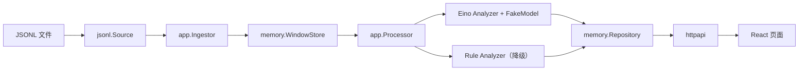

# V11 AI 直播运营洞察：从 JSONL 到网页的最小闭环

`v11/insight` 是一个可以独立启动的直播消息洞察模块。它把一段时间内的弹幕按房间和时间窗口汇总，计算规则指标，生成带事件证据的语义结果，并通过 HTTP API 和 React 页面展示。

当前版本的目标是验证完整的数据闭环，不是接入生产中间件：

- 输入是本地 JSONL fixture；
- 窗口和结果存储在进程内存；
- 语义模型是确定性的 `FakeModel`，不会联网，也不读取 API Key；
- HTTP 服务只使用 Go 标准库；
- 没有 Kafka、Redis、MySQL、DeepSeek 或任何 HTTP/gRPC 中间件。

## 1. 架构和目录



目录职责如下：

| 目录或文件 | 职责 |
| --- | --- |
| `cmd/insightd/main.go` | 解析启动参数，组装各个适配器，回放 fixture，处理到期窗口并启动 HTTP 服务。 |
| `internal/domain` | 领域对象，例如 `MessageEvent`、`InsightWindow`、`RoomInsight`。这里不依赖外部中间件。 |
| `internal/ports` | 小而稳定的接口，定义事件来源、窗口、分析器和结果仓库的边界。 |
| `internal/app` | 用例层：接收消息、领取到期窗口、并发分析、保存结果、执行降级。 |
| `internal/adapters/source/jsonl` | 将一行 JSON 转成一个经过校验的 `MessageEvent`。 |
| `internal/adapters/window/memory` | 带锁的内存时间窗口实现。 |
| `internal/adapters/analyzer/rule` | 确定性规则统计，也是模型失败时的降级分析器。 |
| `internal/adapters/analyzer/eino` | 只在这里使用 Eino Graph、提示词、JSON 解析和 `FakeModel`。 |
| `internal/adapters/repository/memory` | 带锁的内存结果仓库，按幂等键保存洞察。 |
| `internal/httpapi` | `/health`、房间最新洞察 API，以及可选静态网页托管。 |
| `web` | 独立 React/Vite 页面和 Playwright 端到端测试。 |
| `testdata/fixtures/demo.jsonl` | 9 条确定性 fixture 消息，包含 `room-alpha` 和 `room-beta`。 |

## 2. 一次消息从文件走到页面的全过程

1. `insightd` 打开 `testdata/fixtures/demo.jsonl`，`jsonl.Source` 逐行解码并调用 `MessageEvent.Validate()`。
2. `app.Ingestor.Handle()` 调用 `WindowStore.Add()`。窗口键由 `RoomID` 和 `OccurredAt.Truncate(60s)` 决定；每个窗口结束后再等待 10 秒才可分析。
3. fixture 的事件时间在过去，因此 `Processor.ProcessDue(time.Now().UTC())` 会领取全部到期窗口。
4. `Processor` 把领取到的窗口放入有界 `jobs` channel。固定数量的 worker 从 channel 读取任务，调用主分析器。
5. Eino 图依次运行 `prepare`、`complete`、`parse_and_validate`：先算规则统计和提示词，再调用模型，最后校验 JSON 和证据 EventID。
6. 主分析器成功时保存 `normal` 结果。失败时，处理器调用规则分析器，保存带失败原因的 `degraded` 结果；窗口不会因模型故障丢失。
7. `memory.Repository` 依据“房间 + UTC 窗口边界 + 提示词版本”的幂等键保存结果。
8. 浏览器请求 `GET /api/v1/rooms/{roomID}/insights/latest`。React 校验 JSON 结构、展示规则指标，并让用户点击语义结论查看 EventID 证据。

默认页面加载 `room-alpha` 的最新窗口，即 `12:01:00` 到 `12:02:00 UTC`。该窗口有 2 条消息、2 个用户、1 个问句、`0.0%` 重复率和 `1` 条/秒峰值。较早的 `12:00` 窗口才包含两条重复的 `The card is lagging again` 消息；当前页面只读取最新结果，不提供历史窗口切换。

## 3. 初学者需要理解的 Go 并发概念

### Mutex：保护共享内存

内存窗口和内存仓库都由多个 worker 和 HTTP 请求共同访问。它们用 `sync.RWMutex`：

- 写入消息、领取窗口、完成窗口、保存结果时使用写锁；
- 查询最新结果或列表时使用读锁；
- 读锁允许多个查询并发进行，写锁保证 map 和窗口状态不会同时被破坏。

不要在拿着锁时调用模型、网络或其他耗时逻辑。当前实现只在临界区读写内存状态，把分析工作放在锁外。

### Channel：有边界的任务交接

`Processor.ProcessDue()` 使用两个 channel：

- `jobs`：主线程把待处理窗口交给 worker；
- `results`：worker 把完成、降级或失败的汇总结果交回主线程。

`jobs` 的容量由 `JobCapacity` 控制，默认是 128。它不是无限队列：如果模型变慢或输入暴涨，无限 goroutine 和无限缓存会放大内存压力。有限队列会让生产者自然等待，形成可观察的背压。

### Worker pool：固定数量的分析协程

`Workers` 默认是 2。处理器只启动这固定数量的 worker，而不是“每个窗口启动一个 goroutine”。这样并发度可以预测，模型、CPU 和内存不会因为窗口积压而被无限并发压垮。

### WaitGroup：等所有 worker 收尾

主线程用 `sync.WaitGroup` 记录已启动 worker 的数量：每个 worker 退出时调用 `Done()`，主线程调用 `Wait()`。只有全部 worker 完成后，`results` channel 才会关闭并被安全汇总。

### Context：取消和关闭传播

`context.Context` 从服务启动一路传给 JSONL 回放、窗口操作和模型调用：

- 收到 `SIGINT` 或 `SIGTERM` 时，`signal.NotifyContext` 取消根 context；
- `FakeModel` 的延迟和 Eino 图会检查取消信号；
- HTTP 服务使用带 5 秒超时的 `Shutdown` 优雅停止。

这使“停止服务”成为一条可传播的信号，而不是依赖散落的全局布尔值。

## 4. 为什么这些上限不能省

当前契约限制每个窗口最多保存 500 条代表事件、系统提示词和用户提示词合计最多 8000 个 Unicode 字符、单次领取最多 32 个到期窗口、默认任务队列容量为 128。它们分别限制内存、模型输入、单轮工作量和积压规模。

以下限制明确留待下一次迭代，当前没有实现：进程重启前不会淘汰已完成的内存窗口或结果；单窗口超过 500 个唯一事件后，保留样本按首次到达顺序有界截取，规则详情和 `message_count` 反映的是保留事件，而不是完整窗口的精确聚合；代表性采样和保留策略仍是后续工作。

## 5. Eino Graph 为什么被隔离

应用层只依赖 `ports.InsightAnalyzer`，并不知道 Eino、模型供应商或提示词格式。Eino 相关代码全部在 `internal/adapters/analyzer/eino`：

```text
InsightWindow
  -> prepare（规则统计 + 构建有长度上限的提示词）
  -> complete（调用 CompletionModel）
  -> parse_and_validate（严格 JSON + EventID 证据校验）
  -> AnalysisResult
```

这种隔离有两个好处：

1. 替换 Eino 或模型实现时，不会改动窗口、调度、API 和页面；
2. 模型的 JSON 不能绕过领域校验，任何不存在于窗口内的 EventID 都会被拒绝并触发降级。

`FakeModel` 是当前唯一可用的模型实现。它返回固定的中性语义 JSON，便于测试可重复；它不是自然语言模型，也不会从环境变量、文件或网络读取密钥。主分析器发生错误时，规则分析器产生降级结果，网页会显示 `Degraded` 状态和原因。

## 6. 本地运行和验证

要求：Go 1.25+、Node.js 25+、npm。以下命令均在本模块中执行：

```bash
cd v11/insight
go test -count=1 ./...
go test -race -count=1 ./...
go vet ./...

cd web
npm install
npm test
npm run lint
npm run build
npx playwright install chromium
npm run test:e2e
```

手动启动“构建网页 + 真实 Go 服务”：

```bash
cd v11/insight/web
npm run build
go run ../cmd/insightd \
  -listen=:18121 \
  -input=../testdata/fixtures/demo.jsonl \
  -web-dir=./dist
```

打开 `http://127.0.0.1:18121`，或检查 API：

```bash
curl http://127.0.0.1:18121/health
curl http://127.0.0.1:18121/api/v1/rooms/room-alpha/insights/latest
curl http://127.0.0.1:18121/api/v1/rooms/room-beta/insights/latest
```

Playwright 使用真实 Go 进程和已构建的 React 静态文件，不使用浏览器内 mock。它在 Chromium 的 `1440x900` 和 `390x844` 视口验证默认房间、精确指标、证据交互、切换到 `room-beta` 与无横向溢出，并在 `.superpowers/sdd/artifacts` 写出截图。

## 7. 常见排查

| 现象 | 首先检查什么 |
| --- | --- |
| 页面提示找不到洞察 | 确认 room ID 是 `room-alpha` 或 `room-beta`，并确认 JSONL 路径相对于 `web` 目录正确。 |
| `go run` 无法监听端口 | 18121 已被其他进程占用时，停止旧进程或换一个 `-listen` 端口。 |
| 页面只显示旧结果并标记 Stale | 检查浏览器网络请求和 `/health`；前端会保留最后一次成功结果，避免失败时页面变空。 |
| E2E 找不到 Chromium | 执行 `npx playwright install chromium`，不要把下载的浏览器或 `node_modules` 提交进仓库。 |
| 结果是 `Degraded` | 查看 `degraded_reason`。这说明主分析器失败、规则降级成功；这条路径是预期的可恢复行为。 |
| API 返回 404 | 目前只保存回放 fixture 的两个房间，且 API 只查询内存中的当前进程结果。重启会清空内存并重新回放 fixture。 |

## 8. 后续接入点：不是现在的依赖

这些扩展应通过端口新增适配器，而不是把 SDK 或中间件导入 `domain`、`app`：

| 目标能力 | 接入位置 | 需要做的事 |
| --- | --- | --- |
| DeepSeek | `eino.CompletionModel` 实现 | 新建 OpenAI 兼容 Chat Completions 适配器；从运行环境读取密钥；维持 JSON 模式、超时、错误分类和现有证据校验。 |
| Kafka | `ports.EventSource` 实现 | 独立 consumer group 解析原项目消息，转换为 `MessageEvent`，在 `WindowStore.Add()` 成功后再提交位点。 |
| Redis | `ports.WindowStore` 实现 | 使用原子脚本维护窗口事件、统计、到期集合和领取锁；保持 EventID 去重、过期和有界采样语义。 |
| MySQL | `ports.InsightRepository` 实现 | 以 `IdempotencyKey()` 建唯一索引；保存窗口、状态、模型元数据、降级原因和语义证据，支持最新和历史查询。 |

接入真实模型前，应先增加模型超时、重试策略、观测指标和脱敏日志；这些都是下一阶段工作，不应破坏当前确定性最小闭环。
