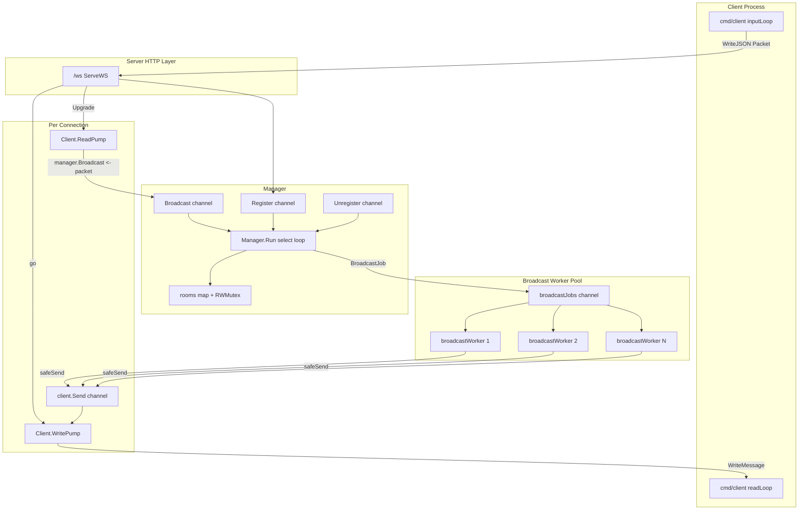
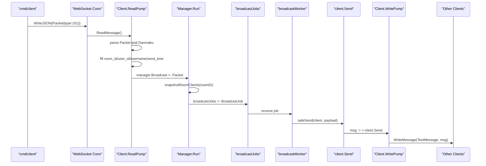

# V2: 单机 Worker Pool 广播版

V2 是在 V1 最小闭环上的第一次高并发进阶。

V1 已经能做到：

```text
WebSocket 客户端 -> ReadPump -> Manager.Broadcast -> 同房间广播 -> WritePump -> WebSocket 客户端
```

V2 继续保持单机、无 Redis、无 Kafka、无 MySQL。它只解决一个核心问题：

```text
当一个房间里客户端很多时，Manager 不应该亲自给所有人发送消息。
```

所以 V2 引入：

```text
BroadcastJob
broadcastJobs channel
固定数量 broadcastWorker goroutine
非阻塞 job 投递
基础 metrics 指标
```

这就是原项目高并发广播设计的简化版。

## V2 学习目标

学完 V2，你应该能理解：

1. 为什么 V1 的广播方式在大房间会卡住 Manager。
2. worker pool 是什么，以及为什么它适合广播扇出。
3. channel 不只是传数据，也可以表达队列、背压、削峰。
4. `select + default` 如何实现非阻塞发送。
5. `RWMutex` 如何保护房间 map。
6. `sync/atomic` 为什么适合做高并发计数。
7. `safeSend` 为什么要丢弃慢客户端消息。
8. 如何通过 `/metrics` 观察并发系统的运行状态。

## V2 需要了解的技术栈

### 必须掌握

Go 基础：

```text
struct
method
interface 不强制，但知道概念更好
pointer
map
slice
error
defer
```

Go 并发：

```text
goroutine
channel
buffered channel
select
select default
sync.RWMutex
sync.Once
sync/atomic
```

网络：

```text
HTTP handler
WebSocket upgrade
WebSocket ReadMessage / WriteMessage
```

依赖库：

```text
github.com/gorilla/websocket
```

### V2 暂时不需要

```text
Redis
Kafka
MySQL
Gin
GORM
Docker
消息队列
分布式部署
```

V2 没有使用中间件。这里的 worker pool 是 Go 进程内部的并发模型，不是 Redis/Kafka 这种外部中间件。

## V2 相比 V1 改进了什么

### V1 的广播方式

V1 的 Manager 收到一条弹幕后，直接遍历房间里的所有客户端：

```text
Manager.handleBroadcast
    -> snapshotRoomClients
    -> for each client
    -> safeSend
```

小房间没问题，但大房间会出现一个问题：

```text
Manager 主循环既要处理注册、注销，又要处理广播。
如果它花很多时间给一个大房间扇出消息，后面的 Register/Unregister/Broadcast 都要排队等。
```

这个问题叫 Head-of-Line Blocking，可以理解为“队头任务太重，后面的任务全被挡住”。

### V2 的广播方式

V2 把广播拆成两段：

```text
Manager:
    只负责复制房间客户端列表，并创建 BroadcastJob

broadcastWorker:
    负责真正遍历客户端并 safeSend
```

也就是：

```text
Manager.handleBroadcast
    -> snapshotRoomClients
    -> enqueue BroadcastJob
    -> quickly return

broadcastWorker
    -> receive BroadcastJob
    -> for each client
    -> safeSend
```

这样 Manager 的主循环更轻，能更快继续处理新连接、断开、下一条弹幕。

### 新增能力

V2 新增了：

```text
broadcastJobs channel      # 广播任务队列
workerCount                # worker 数量
BroadcastJob               # 一次广播任务
/metrics                   # 查看运行指标
atomic counters            # 并发安全计数
```

## 整体框架



## 一条弹幕的代码链路图



## 目录结构

```text
v2/
├── README.md
├── cmd/
│   ├── server/
│   │   └── main.go          # 启动服务，增加 -workers 和 /metrics
│   └── client/
│       └── main.go          # 命令行客户端
└── internal/
    ├── model/
    │   └── message.go       # Packet 和 Danmaku
    └── ws/
        ├── handler.go       # HTTP Upgrade
        ├── client.go        # ReadPump / WritePump
        └── manager.go       # Manager + BroadcastJob + worker pool
```

## 如何运行

启动服务端：

```bash
go run ./v2/cmd/server -port 8080 -workers 8
```

启动 Alice：

```bash
go run ./v2/cmd/client -uid 1001 -name alice -room room1 -port 8080
```

启动 Bob：

```bash
go run ./v2/cmd/client -uid 1002 -name bob -room room1 -port 8080
```

查看健康检查：

```bash
curl http://127.0.0.1:8080/health
```

查看指标：

```bash
curl http://127.0.0.1:8080/metrics
```

返回类似：

```json
{
  "rooms": 1,
  "clients": 2,
  "worker_count": 8,
  "broadcast_packets": 3,
  "enqueued_jobs": 3,
  "dropped_jobs": 0,
  "delivered_messages": 6,
  "dropped_messages": 0
}
```

如果你在国内网络下第一次下载依赖较慢，可以只对当前命令临时使用：

```bash
GOPROXY=https://goproxy.cn,direct go run ./v2/cmd/server -port 8080 -workers 8
```

## 逐文件阅读顺序

建议按这个顺序读：

1. `v2/cmd/server/main.go`
2. `v2/internal/ws/manager.go`
3. `v2/internal/ws/client.go`
4. `v2/internal/ws/handler.go`
5. `v2/cmd/client/main.go`
6. `v2/internal/model/message.go`

V2 的主要变化都在 `manager.go`。

## server/main.go

V2 服务端新增了 worker 数量配置：

```go
workers := flag.Int("workers", ws.DefaultWorkerCount, "number of broadcast workers")
manager := ws.NewManager(*workers)
go manager.Run()
```

这表示你可以启动不同数量的广播 worker：

```bash
go run ./v2/cmd/server -workers 1
go run ./v2/cmd/server -workers 8
go run ./v2/cmd/server -workers 32
```

学习时可以先用 `-workers 1`，再用 `-workers 8`。对比代码路径，你会更容易理解 worker pool 只是“多个 goroutine 共同消费同一个 job channel”。

V2 还新增了：

```go
http.HandleFunc("/metrics", ...)
```

它让你能看到当前房间数、客户端数、广播包数量、任务入队数量、丢弃数量。

## manager.go 是 V2 核心

### Manager 新增字段

V2 的 Manager 多了这些字段：

```go
broadcastJobs chan *BroadcastJob
workerCount   int
```

`broadcastJobs` 是广播任务队列。Manager 把任务放进去，worker 从里面取。

还多了这些 atomic 计数器：

```go
broadcastPackets atomic.Uint64
enqueuedJobs     atomic.Uint64
droppedJobs      atomic.Uint64
deliveredMessages atomic.Uint64
droppedMessages  atomic.Uint64
```

它们用于并发安全地统计运行状态。

为什么不用普通 `uint64`？

因为多个 worker goroutine 会同时增加这些数字。如果直接写：

```go
deliveredMessages++
```

在并发下可能出现数据竞争。`atomic.Uint64` 的 `Add` 和 `Load` 是并发安全的。

### Worker Pool 是什么

V2 启动 worker 的代码是：

```go
for id := 1; id <= m.workerCount; id++ {
    go m.broadcastWorker(id)
}
```

每个 worker 都执行：

```go
for job := range m.broadcastJobs {
    for _, client := range job.Clients {
        m.safeSend(client, job.Payload)
    }
}
```

所以 worker pool 的本质是：

```text
多个 goroutine
共同从同一个 channel 里取任务
谁先空闲谁取下一份任务
```

这非常适合弹幕广播，因为每条弹幕广播都可以抽象成一个任务。

### BroadcastJob 是什么

```go
type BroadcastJob struct {
    RoomID  string
    Clients []*Client
    Payload []byte
}
```

一次弹幕广播需要三样东西：

1. 广播到哪个房间。
2. 当时这个房间有哪些客户端。
3. 要发送的 JSON bytes。

这三样东西组合起来，就是一个 `BroadcastJob`。

### 为什么要 snapshotRoomClients

Manager 不能把 `rooms` map 直接交给 worker。

错误思路：

```text
worker 拿着 rooms[roomID] 直接遍历
```

问题是：worker 遍历的时候，可能刚好有用户加入或离开，map 被并发读写，Go 会报错甚至崩溃。

所以 V2 先复制一份：

```go
clients := m.snapshotRoomClients(packet.RoomID)
```

这个函数在 `RLock` 保护下把当前客户端指针复制到 slice，释放锁后再交给 worker。

这叫快照：

```text
我不把共享 map 交出去。
我只复制这一刻的客户端列表。
```

### 为什么 job 入队也要非阻塞

V2 的 job 投递是：

```go
select {
case m.broadcastJobs <- job:
    m.enqueuedJobs.Add(1)
default:
    m.droppedJobs.Add(1)
}
```

如果 `broadcastJobs` 已经满了，说明 worker 来不及处理。此时如果 Manager 阻塞等待，整个系统会开始堆积。

V2 的选择是直接丢弃这个广播任务。

这是实时系统里很常见的取舍：

```text
宁可丢一部分过期弹幕，也不能让整个服务卡死。
```

注意：这不是所有业务都能接受。比如支付订单不能这样丢。但弹幕更偏实时流，允许在极端压力下牺牲少量消息。

## client.go 里的并发模型

每个连接有两个 pump：

```text
ReadPump:  客户端 -> 服务端
WritePump: 服务端 -> 客户端
```

### ReadPump

ReadPump 负责：

```text
ReadMessage
parse Packet
parse Danmaku
补全服务端字段
manager.Broadcast <- packet
```

它不做房间广播。这样每个连接的读 goroutine 很轻。

### WritePump

WritePump 负责：

```text
从 client.Send 取消息
WriteMessage 到 WebSocket
```

为什么只有 WritePump 写 WebSocket？

因为同一个 WebSocket 连接不应该被多个 goroutine 同时写。worker 只负责把消息放进 `client.Send`，真正写 socket 的只有 WritePump。

## safeSend 再理解一次

V2 有两层防卡死设计：

第一层是 job 队列：

```text
Manager -> broadcastJobs
```

如果 worker pool 忙不过来，丢整个 job。

第二层是客户端发送队列：

```text
worker -> client.Send
```

如果某个客户端太慢，丢这个客户端的这条消息。

对应代码：

```go
select {
case client.Send <- payload:
    m.deliveredMessages.Add(1)
default:
    m.droppedMessages.Add(1)
}
```

这就是 `safeSend` 的意义：

```text
慢客户端只影响自己，不影响房间，不影响 Manager。
```

## V2 的完整并发分工

```text
main goroutine
    启动 HTTP server

manager goroutine
    Manager.Run
    处理 Register / Unregister / Broadcast

N 个 worker goroutine
    broadcastWorker
    从 broadcastJobs 取任务并 safeSend

每个客户端 1 个 ReadPump goroutine
    读取客户端发来的消息

每个客户端 1 个 WritePump goroutine
    写服务端广播给客户端的消息

metrics goroutine
    每 5 秒打印一次指标
```

如果有 1000 个客户端，8 个 worker，那么大致是：

```text
1 manager goroutine
8 worker goroutines
1000 ReadPump goroutines
1000 WritePump goroutines
1 metrics goroutine
```

Go 的 goroutine 很轻量，所以这种“一连接两 goroutine”的模型在 Go WebSocket 服务里很常见。

## 指标怎么看

`/metrics` 里最重要的是：

```text
broadcast_packets
enqueued_jobs
dropped_jobs
delivered_messages
dropped_messages
```

### broadcast_packets

Manager 收到多少条需要广播的弹幕。

### enqueued_jobs

成功放进 worker job 队列的广播任务数。

正常情况下：

```text
enqueued_jobs == broadcast_packets
```

### dropped_jobs

Manager 想把任务放进 `broadcastJobs`，但队列满了，于是丢弃。

如果这个值增长，说明：

```text
worker 数量太少
或者广播量太大
或者每个 job 太重
```

### delivered_messages

worker 成功投递到客户端 `Send` channel 的消息数量。

如果一个房间有 10 个人，一条弹幕广播成功给 10 个人：

```text
delivered_messages +10
```

### dropped_messages

某个客户端的 `Send` channel 满了，worker 放不进去，于是跳过。

如果这个值增长，说明有慢客户端，或者发送缓冲太小，或者消息太密。

## V2 的局限

V2 不是最终高并发版本。

它仍然有这些限制：

```text
只能单机广播
不同 server 之间不能互通
弹幕不会落库
服务重启后消息丢失
没有鉴权
没有心跳
没有限流
没有真正压测工具
```

它已经比 V1 更接近原项目，但还没有进入分布式。

## 为什么不直接上 Redis 和 Kafka

因为学习高并发项目时，最怕一上来把所有东西混在一起：

```text
WebSocket
goroutine
channel
mutex
worker pool
Redis
Kafka
MySQL
GORM
Docker
```

这样你很难判断一个问题到底来自 Go 并发，还是来自外部中间件。

V2 故意只引入 worker pool。等你把这个模型吃透，再进入 Redis/Kafka 会轻松很多。

## 推荐练习

### 练习 1：调整 worker 数量

分别运行：

```bash
go run ./v2/cmd/server -workers 1
go run ./v2/cmd/server -workers 8
go run ./v2/cmd/server -workers 32
```

观察服务端启动日志和 `/metrics`。

### 练习 2：读懂三种 channel

V2 有三类关键 channel：

```text
manager.Broadcast      # 客户端上行弹幕进入 Manager
manager.broadcastJobs  # Manager 交给 worker 的任务队列
client.Send            # worker 交给某个客户端 WritePump 的发送队列
```

请你分别回答：

```text
谁往这个 channel 写？
谁从这个 channel 读？
满了会怎样？
它保护了谁不被谁拖慢？
```

### 练习 3：画出你自己的链路图

手写一遍：

```text
inputLoop
-> WebSocket
-> ReadPump
-> Manager.Broadcast
-> Manager.Run
-> broadcastJobs
-> broadcastWorker
-> safeSend
-> client.Send
-> WritePump
-> WebSocket
-> readLoop
```

如果这条线能不看文档画出来，V2 就基本通了。

### 练习 4：故意把 buffer 调小

可以试着把：

```go
SendBufferSize = 64
JobBufferSize = 512
```

改小，比如改成：

```go
SendBufferSize = 1
JobBufferSize = 1
```

然后快速发送消息，观察 `dropped_jobs` 和 `dropped_messages`。

这能帮助你理解背压和丢弃策略。

## 和原项目的对应关系

V2 对应原项目这些概念：

```text
v2 Manager.Run                -> internal/ws/manager.go Start
v2 BroadcastJob               -> 原项目 BroadcastJob
v2 broadcastJobs              -> 原项目 broadcastJobChan
v2 broadcastWorker            -> 原项目 broadcastWorker
v2 safeSend                   -> 原项目 safeSend
v2 snapshotRoomClients        -> 原项目广播前复制 clients
v2 Send channel               -> 原项目 Client.Send
```

原项目后续还多了：

```text
Redis Pub/Sub
Kafka AsyncProducer
sync.Pool
在线人数统计
点赞统计
批量落库 consumer
```

这些都可以在 V3、V4、V5 逐步加。

## 下一步建议

V3 推荐继续保持单机，但加入 `sync.Pool` 复用 `[]*Client`，专门学习 GC 压力和对象复用。

也可以选择让 V3 加 Redis Pub/Sub，学习多 server 广播。两条路线都可以，但如果你的目标是先吃透 Go 高并发，我建议先做 `sync.Pool + 小压测工具`。
