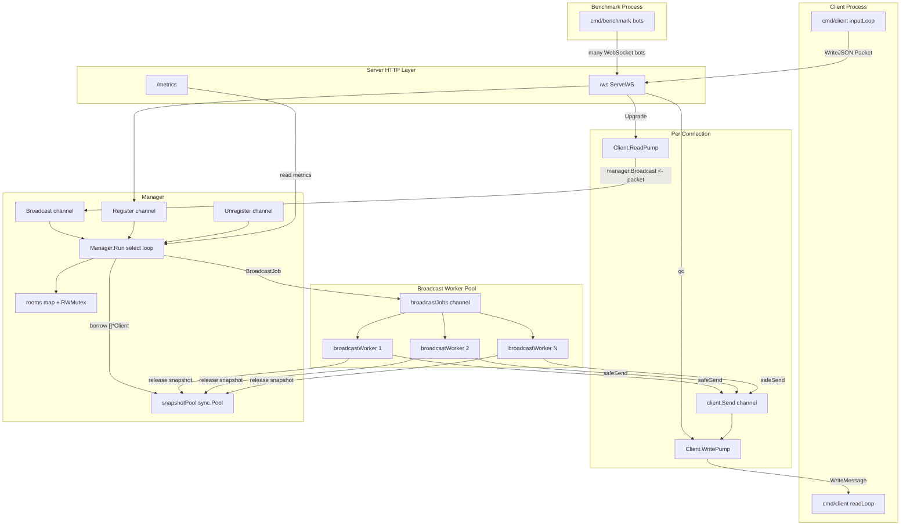
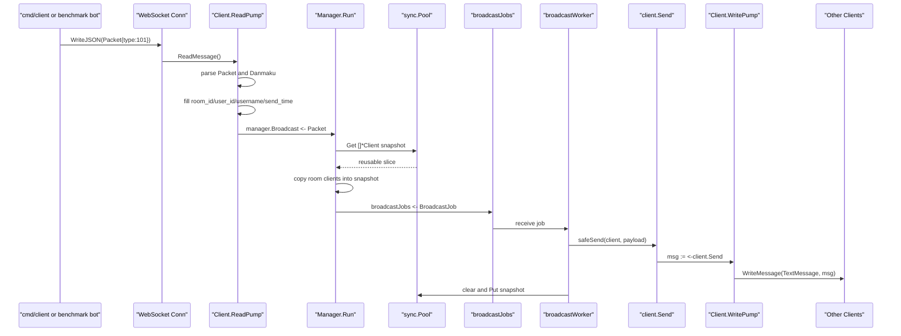
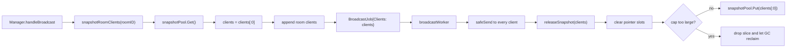

# V3: 单机广播性能优化版

V3 是在 V2 Worker Pool 广播版上的第二次进阶。

V2 已经解决了一个关键问题：

```text
Manager 不亲自给所有客户端发送消息，而是创建 BroadcastJob，交给 worker pool 扇出。
```

V3 继续保持：

```text
单机
无 Redis
无 Kafka
无 MySQL
```

这一版只新增两个学习重点：

```text
sync.Pool 复用房间客户端快照 slice
cmd/benchmark 简单压测工具
```

V3 对应原项目里的这类优化：

```go
clientPool sync.Pool
broadcastJobChan chan *BroadcastJob
broadcastWorker()
safeSend()
```

## V3 学习目标

学完 V3，你应该能理解：

1. V2 为什么每次广播都会创建 `[]*Client`。
2. 高频弹幕为什么会带来大量短生命周期对象。
3. GC 是什么，为什么频繁分配会增加 GC 压力。
4. `sync.Pool` 的作用是什么。
5. 什么叫“借出对象”和“归还对象”。
6. 为什么归还 `[]*Client` 前要清空里面的指针。
7. 为什么队列满、任务丢弃时也要归还 slice。
8. 如何用 `/metrics` 和 `cmd/benchmark` 观察服务状态。

## V3 需要了解的技术栈

### Go 并发

```text
goroutine
channel
buffered channel
select
select default
sync.RWMutex
sync.Once
sync.Pool
sync/atomic
```

### Go 性能基础

```text
堆分配
短生命周期对象
GC
runtime.ReadMemStats
runtime.NumGoroutine
```

### 网络

```text
net/http
WebSocket upgrade
gorilla/websocket
```

### V3 暂时不需要

```text
Redis
Kafka
MySQL
Docker
Gin
GORM
分布式部署
```

V3 仍然不是中间件阶段。它是 Go 进程内部性能优化阶段。

## V3 相比 V2 改进了什么

### V2 的问题

V2 每次广播都会做一件事：

```go
clients := make([]*Client, 0, len(roomClients))
for client := range roomClients {
    clients = append(clients, client)
}
```

这段代码很合理，因为不能把 `rooms` map 直接交给 worker。必须先复制一份快照。

但问题是：

```text
每条弹幕都要创建一个新的 []*Client slice。
```

如果一个房间每秒 1000 条弹幕，这意味着每秒至少创建 1000 个客户端快照 slice。

这些 slice 很快用完，又很快变成垃圾。垃圾多了，Go 的 GC 就要更频繁地工作。

### V3 的改进

V3 用 `sync.Pool` 复用这些 slice：

```text
广播开始:
    从 sync.Pool 借一个 []*Client slice

广播中:
    把当前房间客户端复制进去
    创建 BroadcastJob
    worker 使用这个 slice 扇出

广播结束:
    worker 清空 slice
    把 slice 放回 sync.Pool
```

这样多数广播不需要重新分配 slice，只需要复用旧的底层数组。

### 一句话对比

```text
V2:
每次广播都 make 一个客户端快照 slice

V3:
从 sync.Pool 借一个 slice，用完再还回去
```

## 整体框架图



## 一条弹幕的链路图



## sync.Pool 借还链路图



## 目录结构

```text
v3/
├── README.md
├── cmd/
│   ├── server/
│   │   └── main.go          # 服务端，带 /metrics 和运行时指标
│   ├── client/
│   │   └── main.go          # 交互式客户端
│   └── benchmark/
│       └── main.go          # 简单 WebSocket 压测工具
└── internal/
    ├── model/
    │   └── message.go       # Packet 和 Danmaku
    └── ws/
        ├── handler.go       # HTTP Upgrade
        ├── client.go        # ReadPump / WritePump
        └── manager.go       # worker pool + sync.Pool + metrics
```

## 如何运行

启动服务端：

```bash
go run ./v3/cmd/server -port 8080 -workers 16
```

启动两个交互式客户端：

```bash
go run ./v3/cmd/client -uid 1001 -name alice -room room1 -port 8080
go run ./v3/cmd/client -uid 1002 -name bob -room room1 -port 8080
```

查看指标：

```bash
curl http://127.0.0.1:8080/metrics
```

运行简单压测：

```bash
go run ./v3/cmd/benchmark -port 8080 -clients 200 -active 0.1 -interval 1s -duration 30s
```

参数含义：

```text
-clients    创建多少个 WebSocket 客户端
-active     多少比例的客户端会发消息
-interval   活跃客户端平均多久发一条
-duration   压测持续多久
-ramp       客户端启动间隔，避免瞬间打爆本机
```

## 逐文件阅读顺序

建议按这个顺序读：

1. `v3/internal/ws/manager.go`
2. `v3/cmd/server/main.go`
3. `v3/cmd/benchmark/main.go`
4. `v3/internal/ws/client.go`
5. `v3/internal/ws/handler.go`
6. `v3/cmd/client/main.go`
7. `v3/internal/model/message.go`

V3 的重点在 `manager.go` 和 `cmd/benchmark/main.go`。

## manager.go 核心解释

### 新增 sync.Pool

V3 的 Manager 多了：

```go
snapshotPool sync.Pool
```

初始化时：

```go
m.snapshotPool.New = func() any {
    m.snapshotPoolNews.Add(1)
    return make([]*Client, 0, SnapshotInitialCapacity)
}
```

`New` 的意思是：当 Pool 里暂时没有可复用对象时，创建一个新的。

这里创建的是：

```go
make([]*Client, 0, SnapshotInitialCapacity)
```

也就是一个长度为 0、容量为 256 的客户端指针 slice。

### 借出快照

```go
clients := m.snapshotPool.Get().([]*Client)
m.snapshotPoolGets.Add(1)
clients = clients[:0]
```

这里有两个关键点。

第一，`Get()` 返回的是 `any`，所以要类型断言：

```go
.([]*Client)
```

第二，`clients = clients[:0]` 表示复用底层数组，但把长度重置为 0。

之后再 append：

```go
for client := range roomClients {
    clients = append(clients, client)
}
```

这就得到了一份当前房间客户端快照。

### 为什么仍然需要 RWMutex

`rooms` 是共享 map。

注册和注销会修改它：

```go
m.mu.Lock()
```

广播时复制快照会读取它：

```go
m.mu.RLock()
```

即使 V3 用了 `sync.Pool`，也不能去掉锁。`sync.Pool` 解决的是 slice 分配问题，不解决 map 并发读写问题。

### 归还快照

worker 用完以后调用：

```go
m.releaseSnapshot(job.Clients)
```

归还前会清空指针：

```go
for i := range clients {
    clients[i] = nil
}
```

为什么要清空？

因为 `[]*Client` 的底层数组里存的是指针。如果不清空，Pool 里的 slice 可能继续持有旧的 `*Client` 引用，让 GC 以为这些对象还被引用着。

这会让对象活得更久，增加 GC 压力。

清空之后：

```go
clients = clients[:0]
m.snapshotPool.Put(clients)
```

这表示这个 slice 可以被下一次广播复用了。

### 为什么太大的 slice 不归还

V3 有一个常量：

```go
MaxSnapshotRetainCap = 8192
```

如果某次房间非常大，slice 扩容到了很大的容量。之后如果房间变小，把这个巨大 slice 放回 Pool，可能长期占用较多内存。

所以 V3 做了保护：

```go
if cap(clients) > MaxSnapshotRetainCap {
    m.snapshotPoolDrops.Add(1)
    return
}
```

太大的 slice 不归还，让 GC 回收。

这个策略叫：

```text
复用常规大小对象，放弃异常大的对象。
```

## 队列满时为什么也要 releaseSnapshot

V3 的广播逻辑：

```go
clients := m.snapshotRoomClients(packet.RoomID)
job := &BroadcastJob{Clients: clients, Payload: payload}

select {
case m.broadcastJobs <- job:
    m.enqueuedJobs.Add(1)
default:
    m.droppedJobs.Add(1)
    m.releaseSnapshot(clients)
}
```

如果 job 成功入队，worker 以后会归还 `clients`。

如果 job 队列已经满了，这个任务会被丢弃。此时没有 worker 会拿到这个 job，所以必须由 Manager 自己归还 `clients`。

否则这个 slice 就丢了，Pool 复用效果会变差。

这是学习资源管理时很重要的一点：

```text
谁最后拥有资源，谁负责释放或归还资源。
```

## V3 的 metrics 怎么看

`/metrics` 返回的核心字段：

```text
rooms
clients
worker_count
broadcast_queue_len
job_queue_len
broadcast_packets
enqueued_jobs
dropped_jobs
delivered_messages
dropped_messages
snapshot_pool_gets
snapshot_pool_puts
snapshot_pool_news
snapshot_pool_drops
goroutines
alloc_bytes
total_alloc_bytes
num_gc
```

### snapshot_pool_gets

从 Pool 借出快照 slice 的次数。

### snapshot_pool_puts

归还快照 slice 的次数。

正常情况下，系统稳定后：

```text
snapshot_pool_puts 应该接近 snapshot_pool_gets
```

如果差很多，要检查是否有某个路径借了没有还。

### snapshot_pool_news

Pool 里不够用时，新创建 slice 的次数。

如果压测开始阶段增长很正常。稳定后如果一直快速增长，说明复用效果不好，可能是并发任务太多或 slice 容量经常过大被丢弃。

### snapshot_pool_drops

太大的 slice 被放弃归还的次数。

这个值偶尔增长可以接受。频繁增长说明房间规模波动很大，或者 `MaxSnapshotRetainCap` 设置太小。

### alloc_bytes

当前堆上仍然存活的内存大小。

### total_alloc_bytes

程序启动以来累计分配过的内存。这个值只增不减。

### num_gc

GC 执行次数。

压测时你可以观察：

```text
V2 高压广播时 total_alloc_bytes 和 num_gc 的增长
V3 高压广播时 total_alloc_bytes 和 num_gc 的增长
```

这就是 `sync.Pool` 的学习重点。

## benchmark 怎么工作

`cmd/benchmark` 会启动很多 bot。

每个 bot 做的事情：

```text
连接 WebSocket
启动 readLoop 接收广播
按 active 比例决定自己是否发消息
活跃 bot 按 interval 周期发送弹幕
统计 sent / received / errors
```

它使用了这些 Go 并发工具：

```text
goroutine        每个 bot 一个
WaitGroup        等所有 bot 退出
atomic.Int64     并发统计 counters
context          控制压测结束
signal           Ctrl+C 退出
```

运行示例：

```bash
go run ./v3/cmd/benchmark -clients 500 -active 0.05 -interval 1s -duration 60s
```

含义：

```text
创建 500 个连接
其中 5% 是活跃用户
活跃用户平均每秒发一条
压测 60 秒
```

## V1、V2、V3 对比

```text
V1:
    最小闭环
    Manager 直接遍历客户端 safeSend

V2:
    加入 worker pool
    Manager 创建 BroadcastJob
    worker 并发扇出

V3:
    加入 sync.Pool
    复用客户端快照 slice
    加入 benchmark 和运行时指标
```

对应到性能思维：

```text
V1 先保证链路正确
V2 解决 Manager 被广播扇出阻塞
V3 减少高频广播中的重复分配和 GC 压力
```

## V3 的局限

V3 仍然不是完整弹幕系统。

它还没有：

```text
Redis Pub/Sub 跨 server 广播
Kafka 异步落库队列
MySQL 历史弹幕
点赞统计
在线人数统计
鉴权
心跳
限流
```

V3 的目标很明确：

```text
学习单机 Go 并发广播中的内存复用和观测。
```

## 推荐练习

### 练习 1：观察 Pool 指标

启动服务：

```bash
go run ./v3/cmd/server -workers 16
```

启动压测：

```bash
go run ./v3/cmd/benchmark -clients 200 -active 0.1 -interval 1s -duration 30s
```

观察：

```bash
curl http://127.0.0.1:8080/metrics
```

重点看：

```text
snapshot_pool_gets
snapshot_pool_puts
snapshot_pool_news
alloc_bytes
total_alloc_bytes
num_gc
```

### 练习 2：减少 worker 数量

用 1 个 worker：

```bash
go run ./v3/cmd/server -workers 1
```

再跑压测，看：

```text
job_queue_len
dropped_jobs
dropped_messages
```

你会更容易理解 worker 不够时系统如何出现排队和丢弃。

### 练习 3：调小队列和缓冲

尝试把这些常量调小：

```go
BroadcastBufferSize
JobBufferSize
SendBufferSize
```

然后压测，观察丢弃指标。

这能帮助你理解：

```text
channel buffer 是削峰空间，不是无限容量。
```

### 练习 4：比较 V2 和 V3

分别运行：

```bash
go run ./v2/cmd/server -workers 16
go run ./v3/cmd/server -workers 16
```

用类似压力压它们，观察 V3 的 Pool 指标和 GC 指标。

注意：这个简化 benchmark 不一定能精确证明性能差异，但它能帮你建立观察方法。

## 下一步 V4 建议

V4 可以开始加入 Redis Pub/Sub。

V4 的学习目标会变成：

```text
单机内存广播
-> 多 server 实例之间也能互相广播
```

也就是：

```text
Server A 收到弹幕
-> Publish 到 Redis channel
-> Server A / B / C 都订阅这个 room channel
-> 各自广播给本机客户端
```

这一步会从“单进程并发”进入“多进程协作”。
