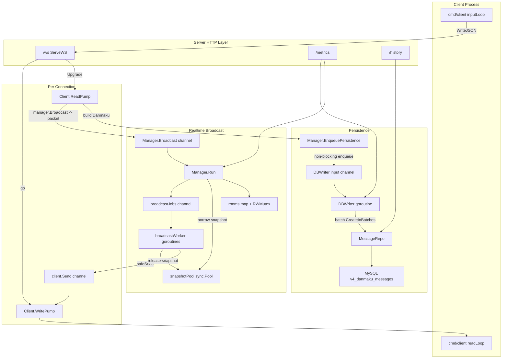
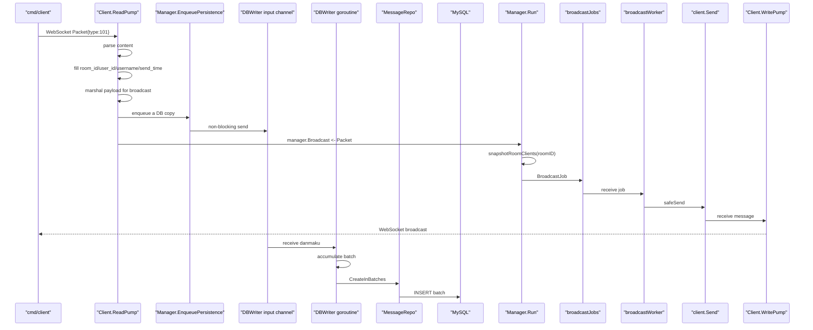

# V4: 单机 MySQL/GORM 持久化版

V4 是在 V3 单机广播性能优化版上的第三次进阶。

V3 已经有：

```text
WebSocket 实时广播
worker pool 并发扇出
sync.Pool 复用客户端快照
benchmark 压测工具
/metrics 运行指标
```

V4 新增：

```text
MySQL
GORM
Repo 层
异步 DB Writer
批量落库
/history 查询历史弹幕
优雅关闭时 flush 剩余弹幕
```

V4 仍然没有 Redis 和 Kafka。它的目标是先让你理解“弹幕如何落到 MySQL”，以及为什么真实项目不会在 WebSocket 读消息时直接同步写数据库。

## V4 一句话总结

```text
V3:
    弹幕只实时广播，不保存

V4:
    弹幕实时广播，同时异步批量写入 MySQL
```

## V4 是否需要学习 GORM

需要，但只需要学基础。

V4 涉及的 GORM 知识：

```text
gorm.Open                      # 连接数据库
gorm struct tag                # 定义表字段、索引、主键
AutoMigrate                    # 自动建表/补字段
CreateInBatches                # 批量插入
Where / Order / Limit / Find   # 查询历史弹幕
Model / Count                  # 统计某房间弹幕数量
WithContext                    # 给数据库操作带 context
```

V4 暂时不需要深入：

```text
复杂事务
多表关联
Preload
软删除
复杂索引优化
读写分离
分库分表
连接池深度调参
```

你可以把 V4 当成 GORM 入门实战：会建表、会插入、会批量插入、会查询，就够了。

## V4 需要了解的技术栈

Go 基础：

```text
struct tag
interface
context
defer
error wrapping
flag
net/http
```

Go 并发：

```text
goroutine
channel
buffered channel
select
select default
sync.WaitGroup
sync.RWMutex
sync.Pool
sync/atomic
signal.NotifyContext
```

数据库：

```text
MySQL
DSN
表
主键
索引
批量插入
```

ORM：

```text
GORM 基础 CRUD
AutoMigrate
CreateInBatches
```

## V4 为什么不直接同步写 MySQL

最直观的写法是：

```text
ReadPump 收到弹幕
-> 写 MySQL
-> 广播给房间用户
```

这个写法很好理解，但不适合弹幕实时系统。

原因是 MySQL 写入是网络 I/O：

```text
Go 进程
-> TCP
-> MySQL
-> 磁盘/缓存/锁/索引
-> 返回结果
```

如果每条弹幕都等 MySQL 写完再广播，那么 MySQL 一慢，用户就会立刻感觉弹幕延迟。

所以 V4 使用：

```text
ReadPump 收到弹幕
-> 先交给 DB Writer 队列
-> 立刻进入实时广播链路
-> DB Writer 后台批量写 MySQL
```

这就是实时链路和持久化链路解耦。

## V4 整体框架图



## 一条弹幕的完整链路



注意这里有两条链路：

```text
实时广播链路:
    ReadPump -> Manager.Broadcast -> broadcastJobs -> worker -> client.Send -> WritePump

持久化链路:
    ReadPump -> DBWriter input channel -> batch -> Repo -> MySQL
```

两条链路从 `ReadPump` 分叉，互相不等待。

## 目录结构

```text
v4/
├── README.md
├── docker-compose.mysql.yaml
├── cmd/
│   ├── server/
│   │   └── main.go          # 服务端，串联 WS + MySQL + history API
│   ├── client/
│   │   └── main.go          # 交互式客户端
│   └── benchmark/
│       └── main.go          # 简单压测工具
└── internal/
    ├── model/
    │   └── message.go       # Packet + Danmaku GORM model
    ├── infra/
    │   └── db.go            # MySQL/GORM 初始化
    ├── repo/
    │   └── message_repo.go  # 数据库访问层
    ├── store/
    │   └── db_writer.go     # 异步批量落库
    └── ws/
        ├── handler.go       # WebSocket Upgrade
        ├── client.go        # ReadPump / WritePump
        └── manager.go       # 广播 + 持久化入口 + metrics
```

## 如何运行

启动 V4 专用 MySQL：

```bash
docker compose -f v4/docker-compose.mysql.yaml up -d
```

启动服务端：

```bash
go run ./v4/cmd/server -port 8080 -workers 16
```

启动两个客户端：

```bash
go run ./v4/cmd/client -uid 1001 -name alice -room room1 -port 8080
go run ./v4/cmd/client -uid 1002 -name bob -room room1 -port 8080
```

发送几条弹幕后查询历史：

```bash
curl "http://127.0.0.1:8080/history?room=room1&limit=10"
```

查看指标：

```bash
curl http://127.0.0.1:8080/metrics
```

不想启动 MySQL，只想先看 WebSocket 链路，可以临时关闭持久化：

```bash
go run ./v4/cmd/server -port 8080 -persist=false
```

## MySQL 连接配置

V4 默认 DSN：

```text
root:root@tcp(127.0.0.1:3307)/danmaku_v4?charset=utf8mb4&parseTime=True&loc=Local
```

这个 DSN 对应 `v4/docker-compose.mysql.yaml`：

```text
本机端口: 3307
容器端口: 3306
数据库:   danmaku_v4
用户名:   root
密码:     root
```

你也可以通过 flag 覆盖：

```bash
go run ./v4/cmd/server \
  -mysql-dsn "root:root@tcp(127.0.0.1:3306)/danmaku_db?charset=utf8mb4&parseTime=True&loc=Local"
```

或者通过环境变量：

```bash
export V4_MYSQL_DSN="root:root@tcp(127.0.0.1:3307)/danmaku_v4?charset=utf8mb4&parseTime=True&loc=Local"
go run ./v4/cmd/server
```

## 逐文件阅读顺序

建议按这个顺序读：

1. `v4/internal/model/message.go`
2. `v4/internal/infra/db.go`
3. `v4/internal/repo/message_repo.go`
4. `v4/internal/store/db_writer.go`
5. `v4/internal/ws/client.go`
6. `v4/internal/ws/manager.go`
7. `v4/cmd/server/main.go`

这次先读 model/infra/repo/store，再回到 ws，会更容易理解持久化链路。

## model/message.go

V4 的 `Danmaku` 同时是：

```text
WebSocket data payload
GORM database model
```

核心字段：

```go
type Danmaku struct {
    ID       uint64    `gorm:"primaryKey;autoIncrement" json:"id"`
    RoomID   string    `gorm:"type:varchar(64);not null;index:idx_room_time" json:"room_id"`
    UserID   string    `gorm:"type:varchar(64);not null;index" json:"user_id"`
    Username string    `gorm:"type:varchar(64);not null" json:"username"`
    Content  string    `gorm:"type:varchar(500);not null" json:"content"`
    SendTime time.Time `gorm:"type:datetime(3);not null;index:idx_room_time" json:"send_time"`
}
```

GORM tag 是写在 struct field 后面的反引号里：

```go
`gorm:"primaryKey;autoIncrement" json:"id"`
```

这里同时有两类 tag：

```text
gorm tag: 告诉 GORM 怎么建表
json tag: 告诉 encoding/json 怎么转 JSON
```

V4 使用独立表名：

```go
func (Danmaku) TableName() string {
    return "v4_danmaku_messages"
}
```

这样不会影响原项目的 `danmaku_messages` 表。

## infra/db.go

`infra` 层负责基础设施初始化。

V4 的 `InitDB` 做三件事：

```text
gorm.Open 连接 MySQL
设置连接池参数
AutoMigrate 自动建表
```

```go
db, err := gorm.Open(mysql.Open(dsn), &gorm.Config{})
```

这行会创建 GORM DB 对象。

```go
sqlDB.SetMaxOpenConns(20)
sqlDB.SetMaxIdleConns(10)
sqlDB.SetConnMaxLifetime(30 * time.Minute)
```

这是底层数据库连接池配置。

```go
db.AutoMigrate(&model.Danmaku{})
```

这会根据 `Danmaku` struct 自动创建或更新表结构。

注意：V4 不会 DropTable。学习项目里也不应该每次启动都清表，否则你很难观察历史数据。

## repo/message_repo.go

Repo 层负责隔离 GORM 细节。

WebSocket、DB Writer、HTTP Handler 都不直接写 GORM 语句，而是调用：

```go
MessageRepo.CreateInBatches
MessageRepo.ListRecentByRoom
MessageRepo.CountByRoom
```

这样做的好处：

```text
业务层不用知道 GORM 怎么写
以后替换 SQL 或调优时，改 repo 就可以
测试时也更容易替换 repo
```

批量插入：

```go
return r.db.WithContext(ctx).CreateInBatches(messages, len(messages)).Error
```

这里 `len(messages)` 表示把当前 batch 一次性写入。

历史查询：

```go
Where("room_id = ?", roomID).
Order("send_time DESC").
Limit(limit).
Find(&messages)
```

这就是基础 GORM 查询链式写法。

## store/db_writer.go

这是 V4 的重点。

DB Writer 是一个后台 goroutine：

```text
input channel 收弹幕
buffer 暂存弹幕
攒够 batchSize 写一次
或者到 flushInterval 写一次
失败时重试
关闭时 flush 剩余数据
```

### 为什么要 DB Writer

如果 `ReadPump` 直接调用 repo 写 MySQL：

```text
客户端发弹幕
-> ReadPump
-> MySQL INSERT
-> 等待 MySQL 返回
-> 才能继续广播
```

MySQL 变慢时，实时链路就会被拖慢。

DB Writer 改成：

```text
ReadPump
-> DBWriter.Enqueue
-> 立刻返回
```

写库在后台完成。

### Enqueue 为什么非阻塞

```go
select {
case w.input <- message:
    w.enqueued.Add(1)
    return true
default:
    w.dropped.Add(1)
    return false
}
```

如果 DB 队列满了，V4 选择丢弃持久化消息，而不是阻塞 WebSocket 实时链路。

这是一个取舍：

```text
实时性优先:
    数据库慢时，允许少量历史弹幕丢失

可靠性优先:
    不允许丢失，但实时链路可能被阻塞
```

真实项目下一步会用 Kafka 解决这个问题。Kafka 作为更可靠、更大的缓冲层，比进程内 channel 更适合削峰填谷。

### 批量写入

DB Writer 内部有：

```go
buffer := make([]*model.Danmaku, 0, w.batchSize)
```

每收到一条弹幕：

```go
buffer = append(buffer, message)
```

如果达到 batch size：

```go
w.flush(ctx, buffer)
buffer = buffer[:0]
```

如果消息不够多，也不能一直等，所以有 ticker：

```go
ticker := time.NewTicker(w.flushInterval)
```

每隔一段时间，哪怕 batch 没满，也会 flush。

这就是典型的双触发批处理：

```text
数量触发: len(buffer) >= batchSize
时间触发: ticker 到点
```

## ws/client.go 中的持久化分叉

V4 的 `handleDanmaku` 做了两件事：

```text
1. EnqueuePersistence
2. manager.Broadcast
```

但这里有一个很重要的并发细节：

```go
payload, err := json.Marshal(full)

dbCopy := *full
manager.EnqueuePersistence(&dbCopy)
```

为什么要 copy？

因为 GORM 插入数据库时可能会回填 `ID` 字段。如果同一个 `*Danmaku` 一边被 DB Writer 写库，一边被 WebSocket 广播读取，就可能出现数据竞争。

所以 V4 给 DB Writer 传的是一份 copy。

这就是并发编程里很重要的概念：

```text
跨 goroutine 传递数据时，要想清楚谁拥有这个对象，谁会修改它。
```

## ws/manager.go 中的 Persister 接口

Manager 里没有直接依赖 `store.DBWriter`，而是依赖接口：

```go
type DanmakuPersister interface {
    Enqueue(message *model.Danmaku) bool
}
```

这样做的好处是：

```text
Manager 不关心底层是 MySQL、Kafka、文件，还是空实现
只要对方能 Enqueue 一条弹幕就行
```

这也是后续 V5 加 Kafka 时的铺垫。

这里还有一个 Go 接口细节：

```go
var dbWriter *store.DBWriter = nil
var persister ws.DanmakuPersister = dbWriter
```

这种情况下 `persister != nil`，因为接口里装的是“类型为 `*DBWriter` 的 nil 指针”。所以 V4 server 入口里会先判断：

```go
var persister ws.DanmakuPersister
if dbWriter != nil {
    persister = dbWriter
}
```

这是 Go 新手很容易踩的 nil interface 坑。

## cmd/server/main.go

V4 server 入口做了更多组装工作：

```text
解析命令行参数
初始化 MySQL
初始化 repo
初始化 DBWriter
初始化 Manager
注册 /ws /health /metrics /history
监听退出信号
优雅关闭
```

核心组装顺序：

```go
db := infra.InitDB(...)
msgRepo := repo.NewMessageRepo(db)
dbWriter := store.NewDBWriter(msgRepo, ...)
dbWriter.Start(ctx)
manager := ws.NewManager(*workers, dbWriter)
```

这就是依赖注入的简单形式：

```text
infra -> repo -> store -> ws/server
```

## /history 接口

V4 新增：

```text
GET /history?room=room1&limit=10
```

返回：

```json
{
  "room": "room1",
  "count": 123,
  "messages": []
}
```

这个接口帮助你确认弹幕真的落到了 MySQL。

## /metrics 新增了什么

V4 的 `/metrics` 分成两块：

```json
{
  "websocket": {},
  "db_writer": {},
  "mysql": {
    "status": "enabled"
  }
}
```

`websocket` 里看实时链路：

```text
broadcast_packets
delivered_messages
dropped_messages
persist_enqueued
persist_dropped
```

`db_writer` 里看落库链路：

```text
queue_len
queue_cap
enqueued
dropped
saved
flushes
failed_flushes
```

正常情况下：

```text
persist_enqueued ~= db_writer.enqueued
db_writer.saved 会逐步追上 enqueued
dropped 应该是 0
failed_flushes 应该是 0
```

如果 `db_writer.queue_len` 持续很高，说明 MySQL 写入跟不上。

如果 `db_writer.dropped` 增长，说明持久化队列满了。

## benchmark 使用

启动服务：

```bash
docker compose -f v4/docker-compose.mysql.yaml up -d
go run ./v4/cmd/server -workers 16 -db-batch 100 -db-flush 1s
```

启动压测：

```bash
go run ./v4/cmd/benchmark -clients 200 -active 0.1 -interval 1s -duration 30s
```

观察：

```bash
curl http://127.0.0.1:8080/metrics
curl "http://127.0.0.1:8080/history?room=room1&limit=5"
```

## V4 的局限

V4 仍然不是最终方案。

最大问题：

```text
DBWriter input channel 是进程内队列。
如果服务进程崩溃，队列里还没写入 MySQL 的弹幕会丢。
```

另外：

```text
如果 MySQL 长时间很慢，队列满了会丢持久化消息。
多台 server 之间还不能互相广播。
没有 Redis Pub/Sub。
没有 Kafka。
```

所以 V4 是学习 MySQL/GORM 和异步落库的阶段，不是最终可靠性方案。

## V4 和未来 V5 的关系

V4：

```text
ReadPump
-> DBWriter channel
-> MySQL
```

V5 或更后面的 Kafka 版会变成：

```text
ReadPump
-> Kafka Producer
-> Kafka Topic
-> Consumer
-> MySQL
```

Kafka 的价值是：

```text
比进程内 channel 更可靠
容量更大
支持消费者独立扩容
服务重启后消息还在 Kafka
削峰填谷能力更强
```

所以 V4 是 Kafka 版之前的过渡阶段。你先理解异步批量落库，再理解为什么要把这个队列从进程内 channel 升级成 Kafka。

## 推荐练习

### 练习 1：确认落库

启动 MySQL 和 server，发几条弹幕，然后查询：

```bash
curl "http://127.0.0.1:8080/history?room=room1&limit=10"
```

看 `messages` 是否有数据。

### 练习 2：观察批量 flush

用小 batch：

```bash
go run ./v4/cmd/server -db-batch 3 -db-flush 5s
```

发 3 条弹幕，观察日志里是否触发保存。

### 练习 3：观察时间 flush

用大 batch：

```bash
go run ./v4/cmd/server -db-batch 100 -db-flush 2s
```

只发 1 条弹幕，等 2 秒，看它是否也会落库。

### 练习 4：关闭持久化

```bash
go run ./v4/cmd/server -persist=false
```

确认 WebSocket 广播仍然能跑，但 `/history` 会返回不可用。

这能帮助你理解：实时广播链路和持久化链路是解耦的。

### 练习 5：思考可靠性

想一想：

```text
如果 DBWriter 队列里有 100 条弹幕，服务突然 kill -9，会发生什么？
如果 MySQL 停了 30 秒，会发生什么？
如果业务要求一条弹幕都不能丢，V4 哪里不够？
```

这些问题就是下一阶段 Kafka 要解决的方向。
