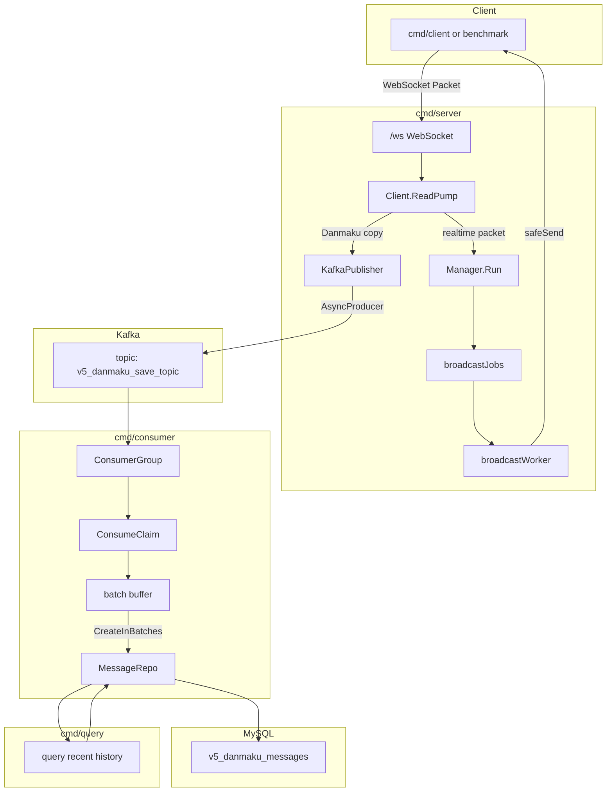
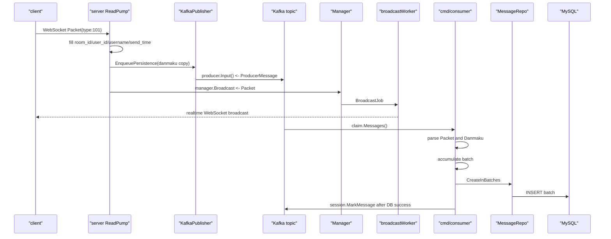

# V5: Kafka 异步持久化版

V5 是在 V4 MySQL/GORM 持久化版上的第四次进阶。

V4 的持久化链路是：

```text
WebSocket server
-> 进程内 DBWriter channel
-> MySQL
```

V5 改成：

```text
WebSocket server
-> Kafka Producer
-> Kafka Topic
-> 独立 consumer 进程
-> MySQL
```

这就是原项目里“削峰填谷”的核心思想。

## V5 一句话总结

```text
V4:
    server 自己启动 DBWriter，后台写 MySQL

V5:
    server 只写 Kafka
    consumer 单独从 Kafka 读消息，批量写 MySQL
```

## V5 相比 V4 改进了什么

### V4 的问题

V4 的 DBWriter 是进程内 channel：

```text
ReadPump -> DBWriter input channel -> MySQL
```

它有两个明显限制：

```text
1. server 进程崩溃时，channel 里没写完的弹幕会丢
2. MySQL 慢时，server 进程内存会承担所有积压压力
```

虽然 V4 已经把实时广播和写库解耦了，但这个“队列”仍然在 server 进程内部。

### V5 的改进

V5 把队列从进程内 channel 换成 Kafka：

```text
ReadPump
-> Kafka AsyncProducer
-> Kafka topic
-> ConsumerGroup
-> batch insert MySQL
```

Kafka 的价值：

```text
容量更大
消息可以持久化
server 和 consumer 可以独立部署
consumer 可以单独扩容
MySQL 慢时，Kafka 可以先扛住积压
server 重启后，Kafka 里的消息还在
```

这就是削峰填谷：

```text
峰值流量先进 Kafka
consumer 按 MySQL 能承受的速度慢慢写库
```

## V5 需要学习哪些技术

Go 方面：

```text
goroutine
channel
select default
sync.Pool
sync/atomic
context
signal.NotifyContext
interface nil 坑
```

GORM 方面：

```text
AutoMigrate
CreateInBatches
Where / Order / Limit / Find
Count
```

Kafka 方面：

```text
broker
topic
producer
async producer
consumer
consumer group
offset
ack
batch consume
```

Sarama 方面：

```text
sarama.AsyncProducer
producer.Input()
producer.Errors()
sarama.ConsumerGroup
ConsumerGroupHandler
Setup / Cleanup / ConsumeClaim
session.MarkMessage
```

V5 暂时不深入：

```text
Kafka 分区规划
ISR
高水位
事务消息
exactly-once
复杂 rebalance 调优
死信队列
Schema Registry
```

## V5 整体架构图



## 一条弹幕的完整链路



注意这里也是两条链路：

```text
实时链路:
    ReadPump -> Manager -> worker -> WebSocket clients

持久化链路:
    ReadPump -> Kafka -> consumer -> MySQL
```

V5 的关键是：这两条链路由 Kafka 隔开了。

## 目录结构

```text
v5/
├── README.md
├── docker-compose.kafka-mysql.yaml
├── cmd/
│   ├── server/
│   │   └── main.go          # WebSocket server + Kafka producer
│   ├── consumer/
│   │   └── main.go          # Kafka consumer group + MySQL batch insert
│   ├── query/
│   │   └── main.go          # 查询 MySQL 历史弹幕
│   ├── client/
│   │   └── main.go          # 交互式客户端
│   └── benchmark/
│       └── main.go          # WebSocket 压测工具
└── internal/
    ├── model/
    │   └── message.go       # Packet + Danmaku GORM model
    ├── infra/
    │   ├── db.go            # MySQL/GORM 初始化
    │   └── kafka.go         # Sarama producer/consumer group 初始化
    ├── repo/
    │   └── message_repo.go  # MySQL 数据访问层
    ├── queue/
    │   └── kafka_publisher.go
    ├── consumer/
    │   └── handler.go       # ConsumerGroupHandler
    └── ws/
        ├── handler.go
        ├── client.go
        └── manager.go
```

## 如何运行

启动 V5 专用 Kafka + MySQL：

```bash
docker compose -f v5/docker-compose.kafka-mysql.yaml up -d
```

启动 consumer：

```bash
go run ./v5/cmd/consumer
```

启动 server：

```bash
go run ./v5/cmd/server -port 8080 -workers 16
```

启动客户端：

```bash
go run ./v5/cmd/client -uid 1001 -name alice -room room1 -port 8080
go run ./v5/cmd/client -uid 1002 -name bob -room room1 -port 8080
```

发送几条弹幕后查询 MySQL：

```bash
go run ./v5/cmd/query -room room1 -limit 10
```

查看 server 指标：

```bash
curl http://127.0.0.1:8080/metrics
```

如果只想验证 WebSocket，不想启动 Kafka：

```bash
go run ./v5/cmd/server -port 8080 -kafka=false
```

此时实时广播仍然可用，但不会持久化。

## 默认端口和配置

V5 专用 compose 使用：

```text
Kafka broker: 127.0.0.1:9094
MySQL:        127.0.0.1:3308
database:     danmaku_v5
table:        v5_danmaku_messages
topic:        v5_danmaku_save_topic
group:        v5_danmaku_save_group
```

你也可以用环境变量覆盖：

```bash
export V5_KAFKA_BROKERS="127.0.0.1:9094"
export V5_KAFKA_TOPIC="v5_danmaku_save_topic"
export V5_KAFKA_GROUP="v5_danmaku_save_group"
export V5_MYSQL_DSN="root:root@tcp(127.0.0.1:3308)/danmaku_v5?charset=utf8mb4&parseTime=True&loc=Local"
```

## KafkaProducer 怎么工作

server 里创建的是：

```go
sarama.AsyncProducer
```

它的发送方式不是：

```go
producer.SendMessage(...)
```

而是：

```go
producer.Input() <- kafkaMsg
```

V5 再包了一层 `KafkaPublisher`：

```go
type KafkaPublisher struct {
    producer sarama.AsyncProducer
    topic    string
}
```

它实现了 Manager 需要的接口：

```go
type DanmakuPersister interface {
    Enqueue(message *model.Danmaku) bool
}
```

所以 Manager 不知道底层是 Kafka，只知道：

```text
我有一条弹幕，交给 persister.Enqueue
```

这和 V4 的 DBWriter 是同一个接口思想。

## 为什么 KafkaPublisher 要 drain Errors

Sarama AsyncProducer 有一个错误 channel：

```go
producer.Errors()
```

如果你开启：

```go
config.Producer.Return.Errors = true
```

就必须读取这个 channel。

否则错误堆积在 channel 里，最终可能让 producer 卡住。

V5 里：

```go
go p.drainErrors()
```

专门用一个 goroutine 持续读取错误。

这是使用 async producer 很重要的习惯。

## ConsumerGroup 怎么理解

consumer 使用：

```go
sarama.ConsumerGroup
```

你可以先这样理解：

```text
topic 是消息队列
consumer group 是一组消费者
同一个 group 内，Kafka 会把分区分给不同消费者
每条消息通常只会被 group 内一个消费者处理
```

V5 本地通常只启动一个 consumer，但用 ConsumerGroup 是为了接近真实项目。

ConsumerGroupHandler 有三个方法：

```go
Setup
ConsumeClaim
Cleanup
```

V5 的核心在：

```go
ConsumeClaim
```

它不断从：

```go
claim.Messages()
```

读取 Kafka 消息。

## offset 和 MarkMessage

Kafka 消费时有一个重要概念：offset。

你可以理解成：

```text
我这个 consumer group 已经消费到 topic 的第几条消息了
```

V5 的策略是：

```text
先写 MySQL
写成功后 session.MarkMessage
```

也就是：

```go
repo.CreateInBatches(...)
session.MarkMessage(msg, "")
```

这样比“刚读到消息就 Mark”更可靠。

但注意：这也不是 exactly-once。

如果 MySQL 写成功后、offset 提交前 consumer 崩溃，这批消息可能会被再次消费，导致重复写入。

V5 先接受这个问题。真实系统可以用唯一键、幂等写入、业务消息 ID 等方式处理。

## Consumer 批量落库

consumer 不会每条消息写一次 MySQL。

它会：

```text
解析 Kafka message
append 到 pending buffer
满 batchSize 就写库
或者 flushInterval 到了就写库
```

这和 V4 DBWriter 的批处理思想一样，只是队列换成了 Kafka。

运行参数：

```bash
go run ./v5/cmd/consumer -batch 100 -flush 1s
```

含义：

```text
攒够 100 条写一次
如果 1 秒内没攒够，也写一次
```

## V5 的可靠性语义

V5 比 V4 更可靠，但还不是绝对可靠。

server 侧：

```text
producer.Input() 成功，只代表消息进入 Sarama producer 内部队列
真正写 Kafka 成功与否要看 producer.Errors()
```

consumer 侧：

```text
MySQL 写成功后才 MarkMessage
失败则不 Mark，并返回错误让 consume loop 重试
```

所以 V5 更接近：

```text
至少一次 at-least-once
```

可能出现：

```text
重复消息
极端情况下 producer 内部队列里的消息丢失
```

要进一步加强，需要：

```text
同步等待 Kafka ack
业务唯一 ID
MySQL 幂等写入
死信队列
重试 topic
```

这些留给后续版本。

## V5 和原项目的对应关系

V5 对应原项目这些模块：

```text
v5/cmd/server              -> cmd/server
v5/cmd/consumer            -> cmd/consumer
v5/internal/infra/kafka.go -> internal/infra/kafka.go
v5/internal/consumer       -> internal/consumer
v5/internal/repo           -> internal/repo
v5/internal/ws             -> internal/ws
```

V5 仍然没有：

```text
Redis Pub/Sub 跨 server 广播
点赞统计
在线人数统计
更完整的压测和参数优化
```

所以 V5 解决的是“持久化削峰”，还没有解决“多 server 实时广播”。

## 推荐学习顺序

先读：

```text
v5/internal/queue/kafka_publisher.go
v5/internal/consumer/handler.go
```

再读：

```text
v5/cmd/server/main.go
v5/cmd/consumer/main.go
```

最后回头看：

```text
v5/internal/ws/client.go
v5/internal/ws/manager.go
```

这次不要从 WebSocket 开始，因为 WebSocket 部分基本沿用 V4。V5 的新东西在 Kafka。

## 推荐练习

### 练习 1：只跑 WebSocket

```bash
go run ./v5/cmd/server -kafka=false
go run ./v5/cmd/client -uid 1 -name alice
go run ./v5/cmd/client -uid 2 -name bob
```

确认实时广播仍然可用。

### 练习 2：完整跑 Kafka 到 MySQL

```bash
docker compose -f v5/docker-compose.kafka-mysql.yaml up -d
go run ./v5/cmd/consumer
go run ./v5/cmd/server
go run ./v5/cmd/client -uid 1 -name alice
go run ./v5/cmd/query -room room1 -limit 10
```

### 练习 3：先停 consumer

只启动 Kafka/MySQL 和 server，不启动 consumer。

发送几条弹幕，然后再启动 consumer。

观察：consumer 启动后是否能把 Kafka 里积压的消息写入 MySQL。

这就是 Kafka 作为缓冲层的直观效果。

### 练习 4：调小 consumer batch

```bash
go run ./v5/cmd/consumer -batch 3 -flush 5s
```

发 3 条消息，观察是否立刻 batch insert。

### 练习 5：调大 flush

```bash
go run ./v5/cmd/consumer -batch 100 -flush 10s
```

只发 1 条消息，观察它会不会等到 flush 时间才落库。

## 下一步 V6 建议

V6 可以加入 Redis Pub/Sub。

目标是解决：

```text
多台 WebSocket server 之间如何互相广播
```

也就是：

```text
Server A 收到弹幕
-> Redis Publish
-> Server A/B/C 都 Subscribe
-> 各自广播给本机客户端
```

到那一步，你就会同时拥有：

```text
Kafka: 负责异步持久化
Redis: 负责跨 server 实时广播
MySQL: 负责历史数据
```

这就非常接近原项目的完整架构了。
