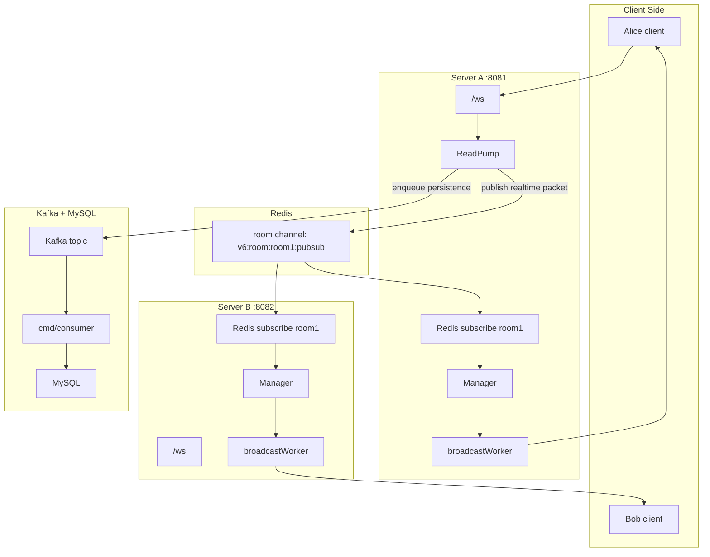
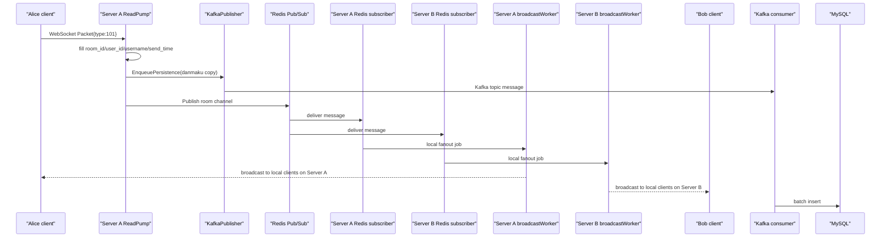

# V6: Redis Pub/Sub 跨 Server 实时广播版

V6 是在 V5 Kafka 异步持久化版上的第五次进阶。

V5 已经有：

```text
WebSocket 实时广播
Kafka 异步持久化
consumer 批量写 MySQL
worker pool
sync.Pool
benchmark
```

V6 新增：

```text
Redis Pub/Sub
按房间订阅 Redis channel
多 server 实例之间实时广播互通
本机广播路径和跨机广播路径统一
```

这一版开始非常接近原项目的核心架构。

## V6 一句话总结

```text
V5:
    单个 WebSocket server 内部广播，Kafka 负责持久化

V6:
    多个 WebSocket server 之间通过 Redis Pub/Sub 互相广播
    Kafka 仍然负责持久化
```

## V6 解决了什么问题

假设你启动两个 server：

```bash
go run ./v6/cmd/server -port 8081
go run ./v6/cmd/server -port 8082
```

Alice 连到 8081：

```bash
go run ./v6/cmd/client -port 8081 -uid 1 -name alice -room room1
```

Bob 连到 8082：

```bash
go run ./v6/cmd/client -port 8082 -uid 2 -name bob -room room1
```

如果没有 Redis，8081 和 8082 各自只知道本进程里的客户端。Alice 发弹幕，Bob 收不到。

V6 加入 Redis 后：

```text
8081 收到 Alice 弹幕
-> Publish 到 Redis room1 channel
-> 8081 和 8082 都订阅 room1 channel
-> 两边都收到 Redis 消息
-> 各自广播给本机 room1 客户端
```

这样 Alice 和 Bob 即使连在不同 server 上，也能在同一个房间聊天。

## Redis 和 Kafka 的分工

V6 同时有 Redis 和 Kafka，它们不是重复的。

Redis 负责实时广播：

```text
低延迟
只关心当前在线客户端
消息不持久化
server 间传播弹幕
```

Kafka 负责持久化削峰：

```text
可积压
可持久化
consumer 慢慢写 MySQL
用于历史弹幕
```

一条弹幕会走两条链路：

```text
实时链路:
    server -> Redis Pub/Sub -> all servers -> local clients

持久化链路:
    server -> Kafka -> consumer -> MySQL
```

## V6 需要学习哪些技术

Go 并发：

```text
goroutine
channel
select
context.WithCancel
sync.RWMutex
sync.Pool
sync/atomic
```

Redis：

```text
Pub/Sub
Publish
Subscribe
channel per room
subscription lifecycle
```

Kafka：

```text
AsyncProducer
ConsumerGroup
topic
offset
batch consume
```

MySQL/GORM：

```text
AutoMigrate
CreateInBatches
基础查询
```

V6 暂时不深入：

```text
Redis Cluster
Redis Stream
Kafka exactly-once
消息去重
多机部署脚本
服务发现
负载均衡器
```

## V6 整体架构图



## 一条弹幕的完整链路



## 为什么本机也走 Redis

一个容易想到的写法是：

```text
收到弹幕后:
    1. 直接广播给本机客户端
    2. 再 Publish 到 Redis 给其他 server
```

这个写法会带来两个问题。

第一，本机和其他机器路径不一致：

```text
本机客户端走本地广播
其他 server 客户端走 Redis
```

调试时容易出现“本机正常，跨 server 不正常”的割裂。

第二，如果本机也订阅 Redis，那么会重复：

```text
本机直接广播一次
Redis 回来又广播一次
```

所以 V6 使用统一路径：

```text
收到弹幕
-> Publish 到 Redis
-> 包括本机在内的所有 server 从 Redis 收到
-> 各自广播给本机客户端
```

这样每个 server 都只从 Redis 入口做本地扇出。

## 房间订阅生命周期

V6 不是启动时订阅所有房间，而是按需订阅。

当本 server 第一个用户进入某个房间：

```text
创建 rooms[roomID]
创建 context.WithCancel
启动 subscribeToRoom goroutine
```

当本 server 该房间最后一个用户离开：

```text
delete rooms[roomID]
调用 cancel()
subscribeToRoom goroutine 退出
```

这样可以避免无意义地订阅大量没有本机用户的房间。

对应代码在：

```text
v6/internal/ws/manager.go
handleRegister
handleUnregister
subscribeToRoom
```

## V6 的目录结构

```text
v6/
├── README.md
├── docker-compose.redis-kafka-mysql.yaml
├── cmd/
│   ├── server/
│   │   └── main.go          # WebSocket + Redis + Kafka producer
│   ├── consumer/
│   │   └── main.go          # Kafka consumer + MySQL batch insert
│   ├── query/
│   │   └── main.go          # 查询 MySQL 历史弹幕
│   ├── client/
│   │   └── main.go
│   └── benchmark/
│       └── main.go
└── internal/
    ├── infra/
    │   ├── db.go
    │   ├── kafka.go
    │   └── redis.go
    ├── queue/
    │   └── kafka_publisher.go
    ├── consumer/
    │   └── handler.go
    ├── repo/
    │   └── message_repo.go
    ├── model/
    │   └── message.go
    └── ws/
        ├── client.go
        ├── handler.go
        └── manager.go
```

## 如何运行

启动 V6 专用 Redis + Kafka + MySQL：

```bash
docker compose -f v6/docker-compose.redis-kafka-mysql.yaml up -d
```

启动 consumer：

```bash
go run ./v6/cmd/consumer
```

启动两个 server：

```bash
go run ./v6/cmd/server -port 8081
go run ./v6/cmd/server -port 8082
```

启动两个客户端，连到不同 server，但同一个 room：

```bash
go run ./v6/cmd/client -port 8081 -uid 1001 -name alice -room room1
go run ./v6/cmd/client -port 8082 -uid 1002 -name bob -room room1
```

Alice 输入弹幕，Bob 应该能收到。

查询 MySQL：

```bash
go run ./v6/cmd/query -room room1 -limit 10
```

## 无中间件模式

如果只想验证 WebSocket 本地广播：

```bash
go run ./v6/cmd/server -port 8080 -redis=false -kafka=false
```

这时 V6 会退回本机广播模式：

```text
ReadPump -> Manager -> worker -> local clients
```

不会跨 server，也不会持久化。

如果只想验证 Redis 跨 server，不想启动 Kafka/MySQL：

```bash
go run ./v6/cmd/server -port 8081 -kafka=false
go run ./v6/cmd/server -port 8082 -kafka=false
```

前提是 Redis 已经启动。

## 默认端口

V6 compose 使用：

```text
Redis:  127.0.0.1:6380
Kafka:  127.0.0.1:9095
MySQL:  127.0.0.1:3309
DB:     danmaku_v6
Topic:  v6_danmaku_save_topic
Group:  v6_danmaku_save_group
```

环境变量：

```bash
export V6_REDIS_ADDR="127.0.0.1:6380"
export V6_KAFKA_BROKERS="127.0.0.1:9095"
export V6_KAFKA_TOPIC="v6_danmaku_save_topic"
export V6_KAFKA_GROUP="v6_danmaku_save_group"
export V6_MYSQL_DSN="root:root@tcp(127.0.0.1:3309)/danmaku_v6?charset=utf8mb4&parseTime=True&loc=Local"
```

## Redis Pub/Sub 代码链路

server 收到客户端弹幕后：

```text
Client.ReadPump
-> manager.Broadcast <- Packet
-> Manager.handleBroadcast
-> Redis Publish
```

每个本机有该房间用户的 server 都会运行：

```text
subscribeToRoom
-> receive Redis message
-> enqueueLocalBroadcast
-> broadcastWorker
-> client.Send
-> WritePump
```

核心区别：

```text
V5:
    handleBroadcast 直接 enqueueLocalBroadcast

V6:
    handleBroadcast 先 Redis Publish
    subscribeToRoom 收到 Redis 消息后 enqueueLocalBroadcast
```

## /metrics 关注什么

V6 的 `/metrics` 里新增 Redis 相关字段：

```text
redis_enabled
redis_published
redis_publish_errors
redis_received
redis_subscriptions
redis_unsubscriptions
local_fanout_packets
```

含义：

```text
redis_published:
    当前 server 发布到 Redis 的弹幕数

redis_received:
    当前 server 从 Redis 收到的弹幕数

redis_subscriptions:
    本 server 创建过多少个房间订阅

redis_unsubscriptions:
    本 server 取消过多少个房间订阅

local_fanout_packets:
    当前 server 实际对本机客户端扇出的弹幕数
```

如果启动两个 server，Alice 在 8081 发一条弹幕：

```text
8081:
    redis_published +1
    redis_received +1
    local_fanout_packets +1

8082:
    redis_published 不变
    redis_received +1
    local_fanout_packets +1
```

## V6 的重要取舍

Redis Pub/Sub 不持久化。

如果某个 server 当时没有订阅房间 channel，那么它不会收到过去的消息。

这没问题，因为 Redis 在 V6 里只负责实时在线广播。历史弹幕由 Kafka/MySQL 链路负责。

所以：

```text
在线实时消息 -> Redis
历史持久化   -> Kafka + MySQL
```

## V6 的局限

V6 已经很接近原项目，但还少：

```text
在线人数统计
点赞统计
Redis 心跳式在线人数
更严格的 Kafka 可靠性
消息去重
鉴权
限流
生产级配置
```

另外，V6 目前不做消息去重。如果 Redis publish 成功但客户端重连等边界场景复杂起来，真实系统通常会引入消息 ID。

## 推荐练习

### 练习 1：本机模式

```bash
go run ./v6/cmd/server -redis=false -kafka=false
```

确认 V6 退回单机广播仍然可用。

### 练习 2：两个 server 跨端口

```bash
docker compose -f v6/docker-compose.redis-kafka-mysql.yaml up -d redis
go run ./v6/cmd/server -port 8081 -kafka=false
go run ./v6/cmd/server -port 8082 -kafka=false
```

然后两个客户端分别连 8081 和 8082，同房间互发弹幕。

### 练习 3：观察订阅生命周期

一个客户端进入 `room1`，看 server 日志：

```text
[redis-sub] subscribed room=room1
```

客户端退出后，看：

```text
[redis-sub] unsubscribed room=room1
```

### 练习 4：完整链路

```bash
docker compose -f v6/docker-compose.redis-kafka-mysql.yaml up -d
go run ./v6/cmd/consumer
go run ./v6/cmd/server -port 8081
go run ./v6/cmd/server -port 8082
```

发弹幕后：

```bash
go run ./v6/cmd/query -room room1 -limit 10
```

你应该能同时验证：

```text
Redis: 跨 server 实时广播
Kafka: 异步持久化队列
MySQL: 历史数据落库
```

## 下一步 V7 建议

V7 可以加入在线人数和点赞统计。

目标是学习：

```text
Redis INCR
Redis TTL
server heartbeat
按房间聚合在线人数
定时向客户端广播 stats
```

这会对应原项目里的：

```text
TypeStats
ActionLike
localLikes
broadcastStats
UpdateServerOnline
GetTotalOnline
```
