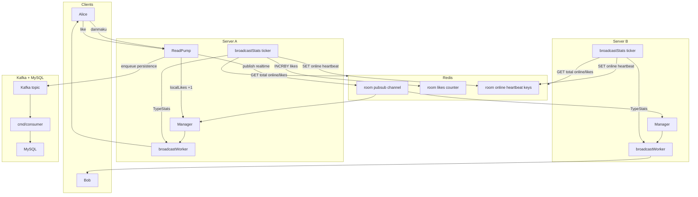
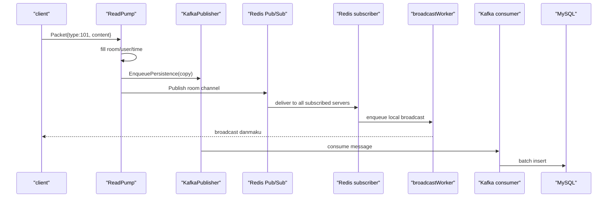
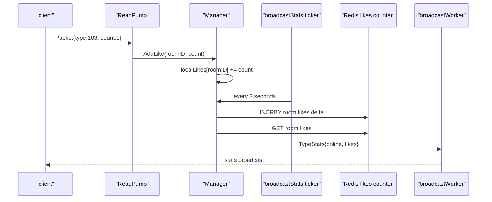
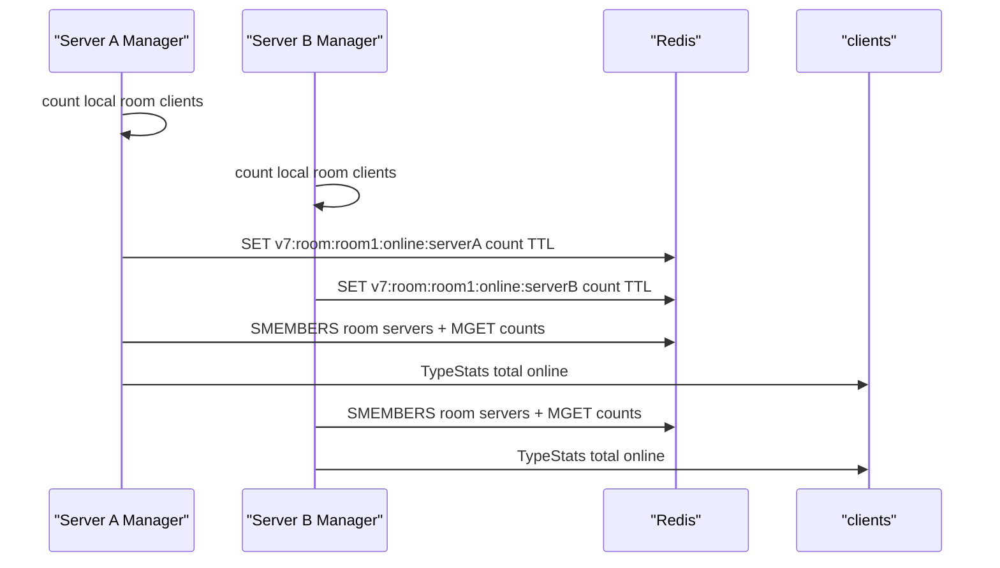

# V7: 在线人数 + 点赞 + Stats 广播版

V7 是在 V6 Redis Pub/Sub + Kafka/MySQL 版本上的第六次进阶。

V6 已经有：

```text
WebSocket 实时广播
Redis Pub/Sub 跨 server 广播
Kafka 异步持久化
consumer 批量写 MySQL
worker pool
sync.Pool
benchmark
```

V7 新增：

```text
ActionLike 点赞消息
TypeStats 统计消息
本机点赞聚合 localLikes
Redis INCRBY 全局点赞数
Redis server heartbeat 在线人数
定时向客户端广播在线人数和点赞数
```

这对应原项目里的：

```text
ActionLike
TypeStats
localLikes
broadcastStats
UpdateServerOnline
GetTotalOnline
GetRoomLikes
```

## V7 是否和原代码一样了？

结论：核心功能链路已经非常接近原项目，但还不是 100% 一样。

V7 已经覆盖原项目的核心学习闭环：

```text
WebSocket 弹幕收发
房间内广播
worker pool 并发扇出
safeSend 慢客户端保护
sync.Pool 复用客户端快照
Redis Pub/Sub 跨 server 实时广播
Kafka 异步持久化
consumer 批量写 MySQL
Redis 点赞计数
Redis 心跳式在线人数
定时 TypeStats 广播
```

但 V7 仍然是学习版，和原项目有这些差异：

```text
没有使用 Gin，仍使用 net/http
没有 Zap logger，仍使用标准 log
没有完全复刻原项目目录命名和所有注释
Kafka/MySQL/Redis 参数更偏教学，未做生产调优
没有完整鉴权
没有消息去重/幂等 ID
没有严格 exactly-once
benchmark 仍是简化版
没有完整生产级 graceful shutdown
```

所以你可以这样理解：

```text
V7 是“功能核心接近原项目”的学习复刻版；
原项目是“工程化和性能参数更完整”的项目版。
```

如果你的目标是学习原项目，V1 到 V7 已经把主要技术路线拆开了。

## V7 一句话总结

```text
V6:
    弹幕可以跨 server 实时广播，也能通过 Kafka 落库

V7:
    在 V6 基础上增加房间在线人数和点赞数统计，并定时推送给客户端
```

## 学 V7 前建议先知道什么

Go 语法方面：

```text
goroutine:
    ReadPump / WritePump / Manager.Run / worker / stats ticker 都是独立 goroutine

channel:
    Register / Unregister / Broadcast / broadcastJobs 都是 goroutine 之间的队列

select:
    Manager.Run 用 select 同时处理注册、退出、弹幕广播和定时统计

sync.RWMutex:
    保护 rooms，读多写少，所以房间快照用 RLock

sync.Mutex:
    保护 localLikes，因为点赞是读写都很频繁的 map

atomic:
    统计指标只需要累加，不需要锁住整个 Manager

sync.Pool:
    复用客户端切片，减少广播高峰期的临时对象分配
```

中间件方面：

```text
Redis Pub/Sub:
    负责跨 server 实时广播弹幕

Redis INCRBY:
    负责累计房间点赞数

Redis SET + TTL:
    每台 server 定时上报自己的本机在线人数

Redis SMEMBERS + MGET:
    汇总一个房间在所有 server 上的在线人数

Kafka:
    负责削峰，把 WebSocket 请求线程和 MySQL 写入解耦

MySQL:
    保存历史弹幕
```

## V7 相比 V6 改进了什么

V6 解决的是：

```text
弹幕能不能跨 server 广播？
弹幕能不能异步落库？
```

V7 继续解决的是：

```text
客户端怎么知道房间当前在线人数？
客户端怎么知道房间累计点赞数？
点赞这么高频，能不能不要每点一下都广播？
多台 server 时，在线人数怎么汇总？
```

所以 V7 增加了一个新的“统计面”：

```text
弹幕:
    高频但需要实时广播，所以走 Redis Pub/Sub

点赞:
    更高频但不需要逐条广播，所以先本机聚合，再批量写 Redis

在线人数:
    每台 server 只知道自己的连接数，所以用 Redis TTL 心跳合并

Stats:
    服务端定时把 online/likes 推给客户端
```

## V7 的两类消息

V7 支持三种 packet type：

```go
const (
    TypeDanmaku = 101
    TypeStats   = 102
    ActionLike  = 103
)
```

含义：

```text
TypeDanmaku:
    客户端发弹幕，服务端也广播弹幕

ActionLike:
    客户端发点赞，只上行，不逐条广播

TypeStats:
    服务端定时下发在线人数和点赞数
```

为什么点赞不逐条广播？

因为点赞可能非常高频。如果每点一下都广播给房间所有人，会浪费大量带宽。

V7 的策略是：

```text
点赞先在本机内存聚合
每 3 秒批量写入 Redis
每 3 秒广播一次总点赞数
```

## V7 整体架构图



## 一条弹幕链路



## 一次点赞链路



## 在线人数链路



核心思想：

```text
每台 server 只上报自己的本机在线人数
Redis 聚合所有 server 的在线人数
server 宕机后，在线 key 会 TTL 过期
```

## 目录结构

```text
v7/
├── README.md
├── docker-compose.redis-kafka-mysql.yaml
├── cmd/
│   ├── server/
│   ├── consumer/
│   ├── query/
│   ├── client/
│   └── benchmark/
└── internal/
    ├── model/        # Danmaku / Like / StatsData / Packet
    ├── infra/        # Redis / Kafka / MySQL
    ├── repo/         # MySQL repo
    ├── queue/        # Kafka publisher
    ├── consumer/     # Kafka consumer handler
    └── ws/           # Client / Manager / Redis PubSub / stats
```

## 如何运行

只验证本机广播 + stats，不启动中间件：

```bash
go run ./v7/cmd/server -port 8080 -redis=false -kafka=false
go run ./v7/cmd/client -uid 1001 -name alice -room room1
go run ./v7/cmd/client -uid 1002 -name bob -room room1
```

客户端里：

```text
输入普通文字: 发送弹幕
输入 1:       发送点赞
```

每 3 秒会看到：

```text
[stats] online=2 likes=1
```

验证 Redis 跨 server + stats：

```bash
docker compose -f v7/docker-compose.redis-kafka-mysql.yaml up -d redis
go run ./v7/cmd/server -port 8081 -kafka=false
go run ./v7/cmd/server -port 8082 -kafka=false
go run ./v7/cmd/client -port 8081 -uid 1001 -name alice -room room1
go run ./v7/cmd/client -port 8082 -uid 1002 -name bob -room room1
```

完整链路：

```bash
docker compose -f v7/docker-compose.redis-kafka-mysql.yaml up -d
go run ./v7/cmd/consumer
go run ./v7/cmd/server -port 8081
go run ./v7/cmd/server -port 8082
go run ./v7/cmd/client -port 8081 -uid 1001 -name alice -room room1
go run ./v7/cmd/client -port 8082 -uid 1002 -name bob -room room1
go run ./v7/cmd/query -room room1 -limit 10
```

## 默认端口

```text
Redis:  127.0.0.1:6381
Kafka:  127.0.0.1:9096
MySQL:  127.0.0.1:3310
DB:     danmaku_v7
Table:  v7_danmaku_messages
Topic:  v7_danmaku_save_topic
Group:  v7_danmaku_save_group
```

## 核心文件阅读顺序

建议这样读：

```text
1. v7/internal/model/message.go
2. v7/internal/ws/client.go
3. v7/internal/ws/manager.go
4. v7/internal/infra/redis.go
5. v7/cmd/server/main.go
```

V7 的新增重点都在：

```text
model.Like
model.StatsData
Client.handleLike
Manager.AddLike
Manager.broadcastStats
infra.IncrRoomLikes
infra.UpdateServerOnline
infra.GetTotalOnline
```

## /metrics 关注什么

V7 新增这些指标：

```text
stats_broadcasts
like_events
like_deltas_flushed
online_reports
```

含义：

```text
stats_broadcasts:
    server 已经广播了多少次 TypeStats

like_events:
    收到的点赞数总和

like_deltas_flushed:
    已经写入 Redis 或本地统计周期的点赞增量

online_reports:
    当前 server 向 Redis 上报在线人数的次数
```

Redis 关闭时：

```text
online = 本机房间人数
likes = 本机累计点赞
```

Redis 开启时：

```text
online = 所有 server 在线人数总和
likes = Redis 全局点赞总数
```

## V7 的局限

V7 已经覆盖原项目核心功能，但还不是生产版。

主要缺口：

```text
没有鉴权
没有限流
没有消息 ID 和幂等去重
Kafka producer 仍是速度优先
Redis 失败时点赞增量会放回本地等待下次重试，但 stats 可能短暂不准
没有完整压测参数调优
没有 Gin/Zap 等原项目工程化细节
```

但作为学习路线，V7 已经把原项目的主要技术点拆开了。

## 下一步建议

接下来你可以做两件事之一：

```text
1. 回到原项目源码，对照 V7 理解每个模块
2. 做 V8，把目录、命名、日志、配置进一步贴近原项目
```

如果目标是面试和学习，我建议先做第 1 件：回读原项目。现在你已经有足够的上下文，不会再被一堆中间件和 goroutine 绕晕。
