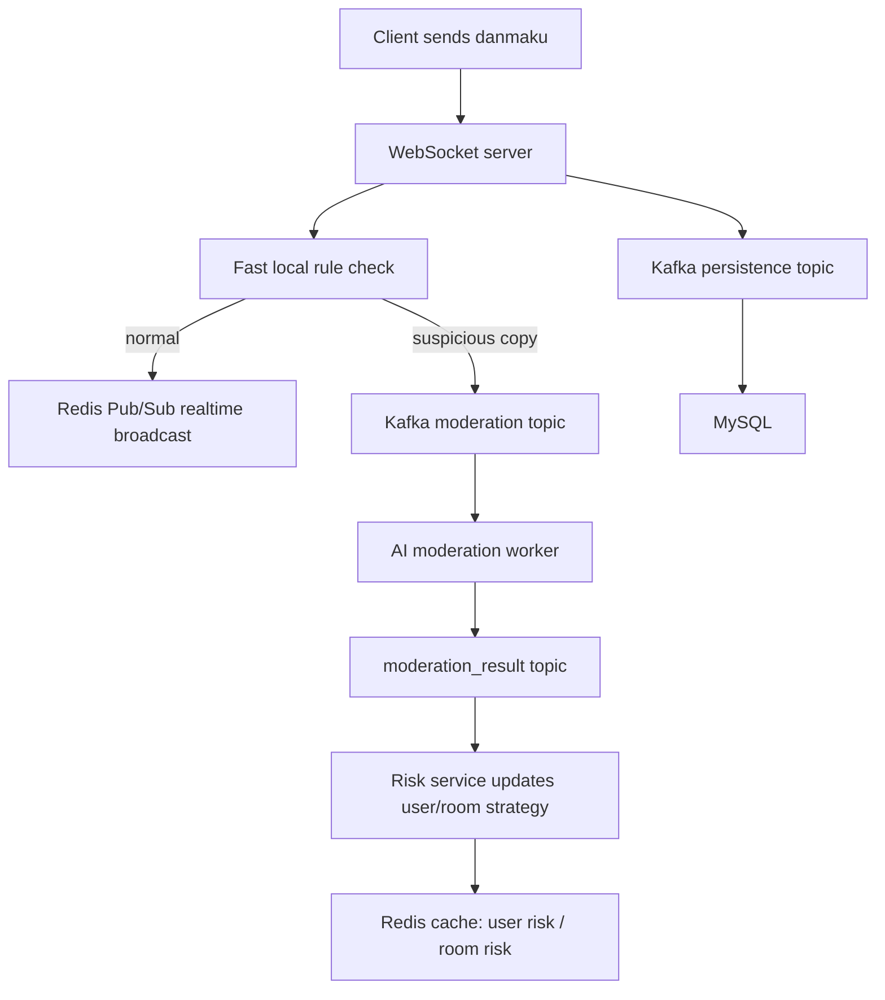
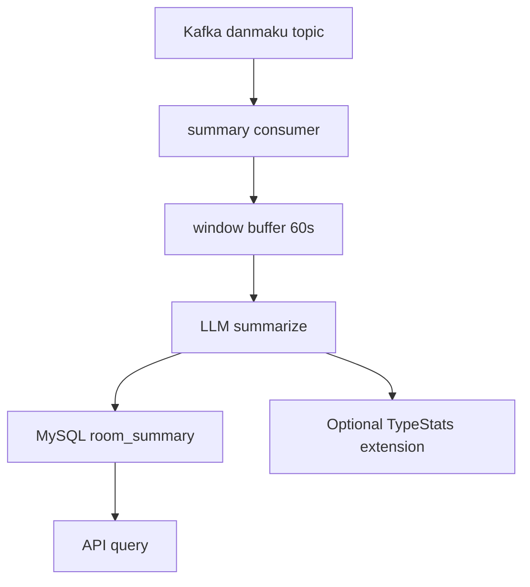
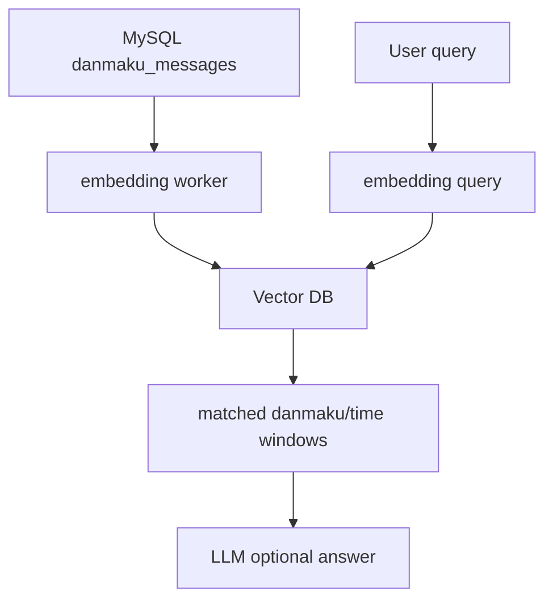

# V7 与原项目差距、学习路线、工程优化和 AI 赋能分析

本文写于 2026-07-09，目标不是继续堆功能，而是帮你站在三个视角重新看这个项目：

```text
1. 学习视角:
   V7 和原项目还有什么差距？我该按什么路线彻底吃透？

2. 工程视角:
   这个项目如果真的要接近生产系统，还能优化什么？

3. 求职和 AI 视角:
   用它投字节跳动这类后端岗位，还缺什么？怎样做 AI 赋能才不是硬缝一个聊天接口？
```

## 1. V7 和原项目的定位差异

一句话结论：

```text
V7 已经复现了原项目的核心业务链路和核心并发模型；
但 V7 仍然是“学习版”，原项目更像“工程展示版”。
```

V7 已经覆盖：

```text
WebSocket 长连接
房间管理
弹幕广播
goroutine 读写分离
channel 注册/注销/广播
worker pool 并发扇出
safeSend 慢客户端保护
sync.Pool 复用客户端快照
Redis Pub/Sub 跨 server 广播
Kafka 异步削峰
consumer 批量写 MySQL
Redis 点赞计数
Redis 在线人数心跳
TypeStats 定时广播
benchmark
```

原项目额外体现得更明显的是：

```text
Gin API 层
api / service / repo 分层
Dispatcher + Router 的消息分发机制
Zap 结构化日志
更激进的性能参数
更完整的 README 性能叙事
Kafka benchmark 子模块
更接近一个简历项目的工程包装
```

## 2. V7 与原项目逐项对比

| 维度 | V7 | 原项目 | 差距判断 |
|---|---|---|---|
| 入口 | `v7/cmd/server` 使用 `net/http` | `cmd/server` 使用 Gin | V7 更直观，原项目更贴近常见业务工程 |
| WebSocket | Gorilla WebSocket | Gorilla WebSocket | 核心一致 |
| 协议模型 | `Packet / Danmaku / Like / StatsData` | `WsPacket / DanmakuMessage / Like / StatsData` | 基本一致，命名不同 |
| 用户 ID | V7 用 string | 原项目用 uint64 | 原项目更贴近真实 UID |
| 消息处理 | `client.go` 里 switch | `Dispatcher + RegisterAction` | 原项目扩展性更好 |
| Manager | Register / Unregister / Broadcast / worker pool / stats ticker | 同类设计 | 核心一致 |
| safeSend | 非阻塞写入，满了丢弃 | 非阻塞写入，满了丢弃 | 核心一致 |
| sync.Pool | 复用客户端快照 | 复用客户端快照 | 核心一致 |
| Redis Pub/Sub | 可开关，支持无中间件学习 | 默认强依赖 Redis | V7 更适合学习，原项目更像完整链路 |
| Redis 点赞 | 本地聚合后 INCRBY，失败可放回本地 | 本地聚合后 INCRBY | V7 在失败处理上更显式 |
| 在线人数 | SET + TTL + SMEMBERS + MGET | 同类设计 | 核心一致 |
| Kafka Producer | 包了一层 `KafkaPublisher`，有指标和非阻塞 Enqueue | 直接 `producer.Input() <- msg` | V7 更利于学习背压，原项目更短 |
| Kafka Consumer | channel + dbWorker + batch flush | channel + dbWorker + batch flush | 核心接近 |
| MySQL | GORM AutoMigrate + repo | GORM AutoMigrate + repo | 核心接近 |
| 日志 | 标准库 `log` | Zap | 原项目更工程化 |
| 配置 | flag + env | 多处常量 + flag | 两者都还不够生产化 |
| 指标 | `/metrics` JSON | README 叙事 + 日志 | 两者都缺 Prometheus 级观测 |
| 压测 | 简化 WebSocket benchmark | WebSocket benchmark + Kafka benchmark | 原项目更完整 |
| 测试 | 基本编译验证 | 基本没有系统化测试 | 两者都需要补 |

## 3. V7 还没有完全复刻的原项目模块

### 3.1 API / Service / Repo 分层

原项目目录：

```text
internal/api
internal/service
internal/repo
```

V7 为了学习直观，把很多逻辑直接放在 `cmd/server` 和 `internal/ws` 里。

这不是错误，而是学习阶段的刻意简化。

如果要继续贴近原项目，可以下一步这样改：

```text
v8/
├── internal/api        # HTTP / WebSocket handler
├── internal/service    # 房间、弹幕、回放、统计业务
├── internal/repo       # MySQL 查询
├── internal/ws         # 只保留长连接和广播核心
└── internal/logger     # Zap 初始化
```

核心思想：

```text
ws.Manager 不应该知道太多业务；
api 负责接请求；
service 负责业务编排；
repo 负责数据访问；
infra 负责中间件初始化。
```

### 3.2 Dispatcher / Router

原项目有：

```text
internal/ws/dispatcher.go
internal/ws/router.go
```

它的价值是把这类代码：

```go
switch packet.Type {
case TypeDanmaku:
    handleDanmaku()
case ActionLike:
    handleLike()
}
```

变成：

```go
RegisterAction(TypeDanmaku, handleDanmaku)
RegisterAction(ActionLike, handleLike)
```

好处是：

```text
新增消息类型时，不需要一直改 Client.ReadPump
每个 action 可以单独测试
业务处理和 WebSocket 读循环解耦
更像真实 IM / 直播系统里的消息路由层
```

V7 现在没有这层，所以扩展 AI 审核、礼物、禁言、关注、进房事件时，会越来越容易把 `client.go` 写胖。

### 3.3 Zap 日志和结构化观测

原项目用了 Zap。

结构化日志的价值是：

```text
不是打印一句 "error happened"
而是打印 room_id / user_id / topic / partition / offset / latency / error
```

真实排障时，你需要能回答：

```text
哪个房间丢包？
哪个用户发送异常？
Kafka 哪个 topic 或 partition 慢？
MySQL 批量写入失败了多少次？
Redis Pub/Sub 是否延迟？
```

V7 的 `/metrics` 已经有学习价值，但还没有达到生产观测要求。

### 3.4 原项目也仍然不是生产完成态

这一点很重要：不要把“原项目”误认为“线上系统”。

原项目仍然缺：

```text
JWT / session 鉴权
WebSocket Origin 白名单
用户级限流
房间级限流
消息 ID 和幂等去重
Kafka 消费失败的 DLQ
Prometheus 指标
OpenTelemetry tracing
pprof 常态化性能分析
CI 测试
容器化部署说明
Kubernetes / HPA / 滚动升级
灰度发布
容量规划文档
安全和内容审核
```

所以 V7 和原项目的差距主要是“工程组织和包装”，而原项目和生产系统的差距主要是“可靠性、可观测性、安全、部署治理”。

## 4. 原项目推荐学习路线

你已经从 V1 学到 V7，接下来不要急着堆 V8。

建议按这条路线回读原项目。

### 阶段 1：先吃透 WebSocket 生命周期

重点文件：

```text
internal/api/chat_handler.go
internal/ws/client.go
internal/ws/manager.go
```

你要能解释：

```text
HTTP 如何升级成 WebSocket？
为什么每个 client 至少有 ReadPump 和 WritePump？
为什么写 WebSocket 要单独走 Send channel？
断开连接时，谁负责 Unregister？
为什么不轻易 close(client.Send)？
```

这一阶段的核心是：

```text
连接生命周期
goroutine 生命周期
channel 关闭风险
```

### 阶段 2：理解房间广播和并发扇出

重点文件：

```text
internal/ws/manager.go
```

你要能解释：

```text
Rooms map 为什么需要 RWMutex？
广播时为什么先复制 client 快照？
为什么不能拿着锁直接给每个 client 写消息？
worker pool 解决的瓶颈是什么？
safeSend 为什么不能阻塞？
慢客户端应该丢消息还是踢下线？
```

这一阶段的核心是：

```text
锁的粒度
复制快照
非阻塞发送
背压策略
```

### 阶段 3：理解 Redis 的两个角色

Redis 在这个项目里不是只做缓存，它有两个角色：

```text
1. Pub/Sub:
   解决多台 server 之间的实时广播

2. KV counter + TTL heartbeat:
   解决点赞数和在线人数统计
```

你要能解释：

```text
为什么本机广播不够？
为什么 Redis Pub/Sub 收到消息后再本地广播？
为什么本机发送后不能再直接广播一次？
为什么在线人数不能只用 INCR/DECR？
为什么 TTL 心跳能处理 server 宕机？
```

### 阶段 4：理解 Kafka 的削峰角色

Kafka 不是为了“显得高级”，它解决的是：

```text
WebSocket 实时链路不能被 MySQL 拖慢。
```

你要能解释：

```text
为什么弹幕先广播，再异步落库？
Kafka producer 的缓冲区满了怎么办？
消费端为什么要批量写 MySQL？
offset 在 DB 写入前提交还是写入后提交？
at-most-once 和 at-least-once 怎么取舍？
```

这一阶段可以画出：

```text
WebSocket hot path:
    client -> server -> Redis -> clients

persistence cold path:
    server -> Kafka -> consumer -> MySQL
```

### 阶段 5：理解 GORM 和 MySQL 查询模型

重点文件：

```text
internal/model/message.go
internal/repo/message_repo.go
internal/service/chat_service.go
```

你要能解释：

```text
为什么 RoomID + SendTime 要建联合索引？
历史弹幕回放的查询模式是什么？
批量插入和单条插入的差距在哪里？
数据量上来后是否需要分表？
冷热数据如何归档？
```

### 阶段 6：把原项目当成面试项目重构

此时你可以开始补工程能力：

```text
配置管理
结构化日志
Prometheus 指标
pprof 性能分析
单元测试
集成测试
压测报告
容量规划
故障注入
部署文档
```

这一步比继续多加几个功能更有价值。

## 5. 从工程实际角度，还可以优化什么

### 5.1 连接层优化

当前项目可以补：

```text
WebSocket ping/pong
ReadDeadline / WriteDeadline
单 IP 连接数限制
用户重复连接踢旧连接
房间连接数上限
慢客户端淘汰策略
消息大小限制
Origin 白名单
JWT 鉴权
```

尤其是 ping/pong 很重要。

没有心跳时，很多“假在线”连接可能不会及时释放。

### 5.2 广播层优化

可以补：

```text
按 room 分片的 worker pool
大房间和小房间隔离
热点房间独立队列
慢房间不影响其他房间
广播耗时 histogram
每个 client 的丢包计数
超过阈值自动断开慢客户端
```

现在的 worker pool 是全局的。真实场景中，一个超级大房间可能挤占普通房间的广播资源。

更工程化的设计是：

```text
roomID -> shard -> worker queue
```

这样能做到：

```text
同一房间消息相对有序
不同房间互不拖累
热点房间可单独扩容
```

### 5.3 Redis 层优化

Redis Pub/Sub 的问题：

```text
只负责实时分发
不保留历史
订阅者断开时消息会丢
没有 ack
没有消费位点
```

如果业务要求更强可靠性，可以考虑：

```text
Redis Streams
Kafka realtime topic
NATS JetStream
Pulsar
```

但要注意：弹幕实时广播通常允许少量丢弃。不是所有消息都值得强一致。

### 5.4 Kafka / MySQL 可靠性优化

当前项目最大的问题是：

```text
为了性能，可能在 DB 真正写入前就提交 Kafka offset。
```

可以补：

```text
消息全局唯一 ID
MySQL 唯一键去重
DB 写成功后再 MarkMessage
失败进入 DLQ topic
消费重试带指数退避
按 room_id 或 message_id 做 partition key
consumer lag 监控
```

面试时你要能说清楚：

```text
我这里选择的是性能优先；
如果要可靠性优先，我会把 offset commit 放到 DB 成功之后；
同时用 message_id + unique key 做幂等，避免重复写入。
```

这类取舍很加分。

### 5.5 MySQL 存储优化

可以补：

```text
RoomID + SendTime 联合索引
按时间或房间分表
冷热数据归档
批量插入大小调优
连接池参数调优
慢查询日志
历史弹幕分页游标
```

不要只说“用了 MySQL”。

要能说：

```text
我的查询模式是按 room_id 和 send_time 拉历史弹幕；
所以索引要服务这个查询模式；
如果数据到亿级，需要按时间归档或分表。
```

### 5.6 可观测性优化

建议补三个层次：

```text
日志:
    Zap，带 room_id / user_id / topic / offset / latency

指标:
    Prometheus，记录连接数、广播数、丢包数、Kafka lag、DB flush latency

追踪:
    OpenTelemetry，串联 WS -> Kafka -> consumer -> MySQL
```

最适合补的指标：

```text
active_connections
rooms_total
broadcast_jobs_total
broadcast_dropped_total
client_send_dropped_total
kafka_enqueue_total
kafka_enqueue_dropped_total
kafka_consumer_lag
mysql_batch_insert_latency
stats_broadcast_total
redis_publish_errors_total
```

### 5.7 测试和压测优化

需要补：

```text
单元测试:
    dispatcher
    manager register/unregister
    safeSend
    stats aggregation

集成测试:
    Redis Pub/Sub
    Kafka -> consumer -> MySQL

压测:
    不同房间数量
    不同单房间人数
    慢客户端比例
    Kafka 不可用
    Redis 延迟升高
    MySQL 写入变慢

故障注入:
    kill Redis
    kill Kafka
    kill consumer
    限制 MySQL IOPS
```

你最后要产出一份可复现压测报告，而不是只写“支持高并发”。

## 6. 对字节跳动后端应届 JD 的差距分析

这里不假设某一个具体岗位，因为不同团队差异很大。按字节后端校招/实习岗位的常见要求，关键词一般包括：

```text
代码能力
数据结构和算法
Web 后端技术
协议、架构、存储、缓存、安全、消息队列
产品意识
复杂问题分析能力
沟通协作
```

我查到的字节招聘页面里，飞书后端校招岗位提到“产品意识”和“掌握 Web 后端开发技术：协议、架构、存储”等要求；一些后端岗位还会强调缓存、安全、消息队列、复杂工程问题分析能力。

### 6.1 这个项目已经能覆盖的 JD 能力

这个项目对后端应届生是有含金量的，已经覆盖：

```text
Go 后端开发
WebSocket 协议
HTTP 服务
并发编程
锁和 channel
高并发广播
Redis
Kafka
MySQL
GORM
批量写入
性能优化
压测
系统设计
```

如果你能讲清楚 V1 到 V7 的演进，而不是只说“我做了一个弹幕系统”，这个项目会比较有说服力。

### 6.2 目前相对字节后端岗位的主要短板

#### 短板 1：算法和基础课还不能靠项目替代

字节非常看重：

```text
数据结构和算法
操作系统
计算机网络
数据库
Linux
```

这个项目能帮你讲网络、并发、存储，但不能替代算法题。

建议补：

```text
LeetCode 高频题
TCP / HTTP / WebSocket / epoll
Go GMP 调度
内存分配和 GC
MySQL 索引和事务
Redis 数据结构和持久化
Kafka partition / offset / consumer group
```

#### 短板 2：生产工程能力还不够完整

面试官可能会问：

```text
线上怎么部署？
怎么灰度？
怎么监控？
怎么报警？
Kafka 堆积怎么办？
Redis 挂了怎么办？
MySQL 慢了怎么办？
怎么定位丢包？
怎么保证消息不重复？
怎么防刷？
```

当前项目还需要补：

```text
Prometheus + Grafana
pprof
OpenTelemetry
限流
鉴权
DLQ
幂等
CI
Docker Compose 完整验证
Kubernetes 部署说明
```

#### 短板 3：业务抽象和产品意识还不够

字节很多后端岗位不是只写接口，而是要求：

```text
理解产品效果
关注数据指标
参与方案设计
能解释为什么做这个功能
```

这个项目可以补一层产品指标：

```text
弹幕送达率
端到端延迟
用户发送成功率
慢客户端比例
房间热度
点赞转化率
违规弹幕拦截率
历史回放查询延迟
```

如果你能说：

```text
我不是为了用 Kafka 而用 Kafka；
我是为了把实时广播链路和 MySQL 落库链路解耦，保证用户侧低延迟。
```

这就比单纯堆技术名词强很多。

### 6.3 建议补成简历项目的三个方向

#### 方向 A：高并发与性能

补：

```text
可复现压测脚本
压测环境说明
性能瓶颈分析
pprof 火焰图
优化前后对比
```

简历表达可以是：

```text
基于 Go 实现直播弹幕系统，通过 WebSocket 长连接、房间级广播、worker pool 和非阻塞发送实现高并发消息分发；使用 Redis Pub/Sub 支持多实例广播，Kafka 异步削峰并由 consumer 批量写入 MySQL。
```

注意：具体 QPS 数字必须自己压测出来，不能直接照抄 README。

#### 方向 B：稳定性与可靠性

补：

```text
Kafka DLQ
消息 ID 幂等
慢客户端治理
Redis/Kafka/MySQL 故障降级
Prometheus 告警
```

简历表达可以是：

```text
设计消息可靠性方案，通过 message_id 唯一键实现 MySQL 幂等写入；引入 DLQ 和重试退避处理消费失败，降低 Kafka 消费链路数据丢失风险。
```

#### 方向 C：AI 赋能

补：

```text
AI 内容审核
房间热点摘要
语义回放搜索
运维诊断助手
```

这会让项目从“中间件练习”变成“有业务增量的系统”。

## 7. Go 生态有没有类似 Spring AI 的 AI 工具？

有，但生态形态和 Java 不一样。

Spring AI 的定位是：

```text
把企业数据和 API 连接到 AI 模型，沿用 Spring 生态的模块化和可移植设计。
```

Go 里可以重点看这几个：

### 7.1 CloudWeGo Eino

推荐优先级最高。

原因：

```text
Go 原生
CloudWeGo 生态
字节跳动开源背景
面向 LLM 应用编排
支持组件化、链式编排、图编排、工具调用等
适合后端工程项目
```

对你这个项目尤其合适，因为你目标是字节后端岗位，Eino 和字节技术生态关联更强。

### 7.2 LangChainGo

LangChainGo 是 LangChain 的 Go 实现。

适合：

```text
快速做 RAG
接多种 LLM provider
接向量数据库
写 agent / tools
学习 LLM 应用基本范式
```

但它在 Go 圈的工程落地感未必像 Eino 那么贴近字节生态。

### 7.3 openai-go

这是 OpenAI 官方 Go SDK。

它适合：

```text
直接调用模型 API
不需要复杂编排
你想自己控制 prompt、重试、超时、限流、降级
```

如果你只做一个简单审核或摘要服务，直接用 SDK 也可以。

但如果你要做复杂流程，比如：

```text
先规则过滤
再模型审核
再写审核结果
再触发人工复核
再生成房间摘要
```

那 Eino 这类编排框架更合适。

## 8. 这个项目如何做 AI 赋能，才不是硬缝合？

不要做这个：

```text
在页面上加一个 AI 聊天机器人
或者用户发弹幕时同步调用大模型
```

这两个都很容易变成“为了 AI 而 AI”。

真正合理的 AI 赋能，应该从项目的业务问题出发：

```text
直播弹幕系统有什么真实痛点？
哪些痛点传统规则不好解决？
哪些功能能提高安全、效率、体验或运营能力？
哪些 AI 调用不能阻塞实时链路？
```

### 8.1 最推荐切入点：AI 内容安全和反垃圾

这是最实际的方向。

业务问题：

```text
直播弹幕可能有辱骂、广告、色情、涉政、刷屏、引战等内容。
纯关键词规则误杀高，漏判也高。
```

AI 方案：

```text
第一层:
    本地规则和词库，毫秒级处理明显违规内容

第二层:
    异步 AI 审核，对疑似风险内容打标签

第三层:
    高风险内容进入人工复核或自动降权
```

关键原则：

```text
不要让 LLM 同步阻塞 WebSocket 广播主链路。
```

推荐链路：



为什么这是合理的：

```text
实时链路低延迟
AI 链路异步处理
成本可控
可以逐步灰度
可以用结果反哺规则和风控
```

可以新增模块：

```text
internal/ai/moderation
cmd/moderator
internal/model/moderation.go
internal/repo/moderation_repo.go
```

可以新增 Kafka topic：

```text
danmaku_moderation_topic
danmaku_moderation_result_topic
```

### 8.2 第二推荐切入点：直播间热点摘要

业务问题：

```text
直播间弹幕很多，主播、运营、回放用户很难知道某段时间大家在讨论什么。
```

AI 方案：

```text
每 30 秒或 60 秒聚合一批弹幕
提取主题、情绪、问题、热点词
生成房间摘要
写入 MySQL 或 Redis
提供 /api/rooms/{room}/summary
```

链路：



这比“AI 聊天”更贴合直播场景。

面试时也更容易讲产品价值：

```text
帮助主播快速感知观众关注点；
帮助运营复盘直播效果；
帮助回放用户定位高能片段。
```

### 8.3 第三推荐切入点：历史弹幕语义搜索

业务问题：

```text
普通 MySQL 只能按 room_id / time 查；
但用户可能想搜“大家什么时候讨论抽奖”“什么时候开始骂卡顿”。
```

AI 方案：

```text
consumer 落库后，异步生成 embedding
写入向量数据库
查询时把自然语言转 embedding
返回相关时间段和弹幕片段
```

链路：



可选向量存储：

```text
pgvector
Milvus
Qdrant
Redis Vector
Elasticsearch vector
```

这个方向比较适合展示：

```text
RAG
embedding
向量检索
历史数据价值
```

### 8.4 第四推荐切入点：AI 运维诊断助手

这是更偏后端工程的 AI 赋能，也很适合面试。

业务问题：

```text
系统出现丢包、Kafka 堆积、MySQL 慢写、Redis 发布失败时，新人很难快速定位原因。
```

AI 方案：

```text
把 README、架构文档、指标说明、告警规则、日志样例做成知识库
当指标异常时，AI 根据 metrics + logs + runbook 给出排障建议
```

例子：

```text
输入:
    dropped_messages 上升
    job_queue_len 接近 cap
    goroutines 正常
    kafka lag 正常

输出:
    更可能是 WebSocket 下行慢客户端导致；
    建议查看 Send channel 满的用户比例；
    可以临时降低单房间广播频率或踢出慢客户端。
```

这个方向的好处：

```text
不影响用户实时链路
容易做 demo
体现工程思维
适合和 Prometheus / logs 结合
```

## 9. AI 赋能最建议的落地顺序

不要一上来做全套。

建议分四个版本：

### AI-V1：离线房间摘要

目标：

```text
消费 Kafka 中的弹幕
按房间和时间窗口聚合
调用 LLM 生成摘要
写入 MySQL
提供查询接口
```

为什么先做它：

```text
不影响实时链路
失败也不会影响弹幕发送
容易展示产品价值
实现难度适中
```

### AI-V2：异步内容审核

目标：

```text
规则初筛
疑似内容进入 moderation topic
AI worker 打标签
结果写库
高风险用户写 Redis 风控状态
```

难点：

```text
误杀率
漏判率
成本
延迟
降级策略
```

### AI-V3：语义回放搜索

目标：

```text
对历史弹幕做 embedding
支持自然语言搜索
返回相关时间段
```

难点：

```text
向量库
embedding 成本
文本切片
召回效果
```

### AI-V4：运维诊断助手

目标：

```text
接入 metrics / logs / runbook
对异常指标给出排障建议
生成故障复盘草稿
```

难点：

```text
指标标准化
日志结构化
防止模型胡说
答案必须引用具体指标
```

## 10. AI 模块应该从哪里入手

最推荐从 Kafka consumer 旁边入手，而不是 WebSocket 热路径。

原因：

```text
WebSocket 热路径追求低延迟和高吞吐
AI 调用天然慢、贵、不稳定
Kafka 已经是异步解耦点
从 consumer 旁边加 AI worker，风险最小
```

推荐目录：

```text
cmd/ai-summary
cmd/ai-moderator
internal/ai
internal/ai/provider
internal/ai/prompt
internal/ai/moderation
internal/ai/summary
internal/repo/summary_repo.go
internal/repo/moderation_repo.go
```

推荐接口：

```go
type Moderator interface {
    Moderate(ctx context.Context, msg DanmakuMessage) (ModerationResult, error)
}

type Summarizer interface {
    Summarize(ctx context.Context, roomID string, messages []DanmakuMessage) (RoomSummary, error)
}
```

为什么要先定义接口：

```text
你可以先用 mock 实现
再接 openai-go
再换 Eino
再换本地模型
业务层不用跟着改
```

## 11. AI 赋能必须关注的工程问题

AI 接进来以后，真正难的不是调用 API，而是这些问题：

```text
超时:
    每次模型调用必须有 context timeout

限流:
    防止弹幕高峰把模型 API 打爆

熔断:
    模型不可用时不能拖垮主系统

降级:
    模型失败时只使用规则审核或跳过摘要

成本:
    按窗口聚合，不能每条弹幕都调 LLM

隐私:
    不要把敏感用户信息直接发给外部模型

缓存:
    重复文本、重复用户、重复风险模式可以缓存

评估:
    需要人工标注样本计算误杀率、漏判率

可观测:
    记录 ai_latency、ai_error_rate、ai_cost、ai_tokens
```

这些点讲清楚，比“我接了一个大模型接口”有价值得多。

## 12. 面试时如何讲 AI 赋能

不要这样讲：

```text
我给弹幕系统加了 AI，可以聊天。
```

建议这样讲：

```text
我没有把 AI 放在 WebSocket 实时广播主链路里，因为模型调用延迟和稳定性不可控。
我选择从 Kafka 异步链路切入，把 AI 用在内容审核、房间摘要和语义回放搜索上。
实时链路仍然保证低延迟，AI 链路通过 worker pool、限流、超时和熔断控制成本与稳定性。
```

这段话体现了：

```text
你理解业务
你理解性能
你理解工程风险
你不是为了 AI 而 AI
```

## 13. 最推荐你接下来做的三件事

### 第一件：回读原项目并写源码注释

按这个顺序：

```text
1. internal/ws/client.go
2. internal/ws/manager.go
3. internal/ws/router.go
4. internal/infra/redis.go
5. internal/infra/kafka.go
6. internal/consumer/handler.go
7. internal/repo/message_repo.go
```

每个文件都写：

```text
这个模块解决什么问题？
用了哪些 goroutine？
用了哪些 channel？
用了哪些锁？
如果中间件挂了会怎样？
```

### 第二件：补工程化能力

优先级：

```text
1. Prometheus metrics
2. pprof 性能分析
3. Kafka DLQ
4. message_id 幂等
5. JWT + 限流
6. Docker Compose 完整联调
7. 压测报告
```

### 第三件：做 AI-V1 房间摘要

最小闭环：

```text
Kafka -> summary worker -> LLM -> MySQL -> query API
```

不要先碰 WebSocket 主链路。

如果你想和字节技术生态贴近，可以优先调研：

```text
CloudWeGo Eino
Kitex
Hertz
OpenTelemetry
Prometheus
Kafka consumer lag
pprof
```

## 14. 参考资料

以下资料用于本文对 JD 和 Go AI 生态的判断：

```text
ByteDance 校招岗位搜索结果:
https://jobs.bytedance.com/campus/m/position/detail/7529448380604565767

ByteDance 后端岗位搜索结果:
https://jobs.bytedance.com/experienced/position/7392794636605196595/detail

CloudWeGo Eino 官方文档:
https://www.cloudwego.io/docs/eino/

CloudWeGo Eino GitHub:
https://github.com/cloudwego/eino

Eino 在字节实践:
https://www.cloudwego.io/docs/eino/overview/bytedance_eino_practice/

LangChainGo GitHub:
https://github.com/tmc/langchaingo

Go 官方博客: Building LLM-powered applications in Go:
https://go.dev/blog/llmpowered

OpenAI Go SDK:
https://github.com/openai/openai-go

Spring AI 官方文档:
https://docs.spring.io/spring-ai/reference/index.html
```

## 15. 最后总结

你现在的项目路线已经从“能跑”进入了“能讲设计”的阶段。

下一阶段不要只追求继续加版本号，而要把项目升级成：

```text
1. 能解释清楚并发模型
2. 能解释清楚中间件取舍
3. 能解释清楚故障和降级
4. 能拿出压测和观测数据
5. 能基于业务痛点做 AI 赋能
```

如果做到这里，它就不再只是一个 Go 练手项目，而是一个可以支撑后端校招面试讨论的系统设计项目。
