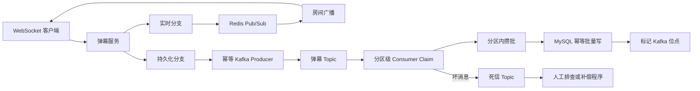
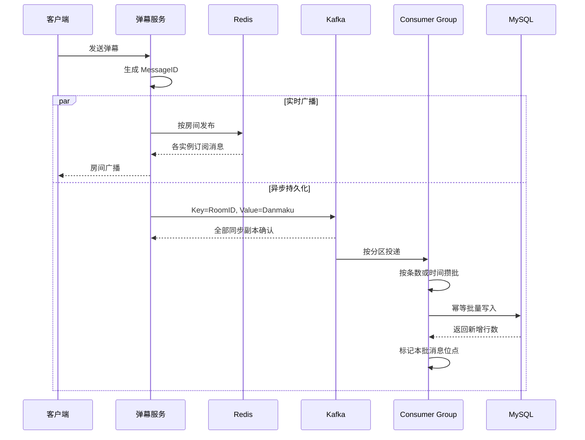

# V8：Kafka 到 MySQL 的可靠落库版

V8 不再继续横向增加功能，而是选择一个真实工程问题深入优化：

```text
一条弹幕已经被 Kafka 消费，但 MySQL 还没写成功时，服务突然宕机会怎样？
```

V8 的目标是把 V7 的“可以批量落库”升级为：

```text
可以批量落库
+ 失败后可以重新消费
+ 重复消费不会产生重复数据
+ 坏消息不会静默丢失
+ 消费者重平衡不会破坏内部队列
+ 数据库迁移不再跟随业务进程启动
```

## 一句话理解 V8

```text
V7 关注功能闭环：弹幕最终可以写入 MySQL。

V8 关注故障闭环：进程宕机、重复投递、坏消息和重平衡发生时，
数据仍然可以恢复，并且能够解释数据去了哪里。
```

## 为什么这一版值得深入学习

很多项目会写：

```text
使用 Kafka 削峰，消费者批量写 MySQL。
```

这句话只能说明使用了中间件，不能说明链路可靠。面试官通常会继续问：

```text
什么时候提交 Kafka 位点？
数据库写成功但位点没提交怎么办？
消息重复了怎么办？
数据库持续不可用怎么办？
坏消息会不会卡住整个分区？
消费者重平衡时，内存中的批次怎么办？
```

V8 就是围绕这些问题完成一次工程化改造。

## V8 改动总览

| 改动 | V7 | V8 |
|---|---|---|
| 消息身份 | 只有数据库自增编号 | 服务入口生成全局消息编号 |
| Kafka 生产确认 | Leader 收到即可 | 全部同步副本确认 |
| Kafka 重试去重 | 未显式开启 | 开启幂等生产者 |
| 分区策略 | 房间号哈希 | 保留房间号哈希，保证单房间分区顺序 |
| 数据库写入 | 普通批量插入 | 基于消息编号幂等批量插入 |
| 消费位点 | MySQL 成功后标记 | 保留此顺序，并用幂等解决崩溃后的重复投递 |
| 坏消息 | 记录后跳过 | 先写死信主题，成功后才标记位点 |
| 数据库建表 | 打开数据库时自动迁移 | 独立 `cmd/migrate` 负责迁移 |
| 生产端指标 | 入队、丢弃、错误 | 增加 Kafka 已确认数量 |
| 消费端指标 | 解析、保存、批次、失败 | 增加新增行、重复行、死信、重试和批次耗时 |

## 原项目中发现的工程问题

### 1. 原项目会在启动时删除表

原项目的 `internal/infra/db.go` 在数据库初始化时执行 `DropTable`。这在学习阶段方便反复建表，但在真实环境中意味着服务重启会删除历史数据。

V8 的处理方式：

```text
业务进程：只连接数据库，不修改表结构

迁移进程：显式执行建表或表结构升级
```

对应入口：

```text
v8/cmd/migrate
```

### 2. 只把位点移动到落库之后仍然不够

原项目曾在消息进入内存队列后立即标记消费。数据库真正写入前宕机，会形成永久丢失。

V7 已经将位点标记移动到 MySQL 成功之后，但仍存在另一个窗口：

```text
MySQL 写入成功
    ↓
进程在 Kafka 位点提交前宕机
    ↓
Kafka 重复投递
    ↓
普通 INSERT 产生重复弹幕
```

所以 V8 不能只调整调用顺序，还必须增加消息编号和数据库幂等。

### 3. 坏消息不能直接丢弃

JSON 损坏、字段缺失或协议不兼容的消息被称为“毒消息”。如果直接提交位点，消息永久消失；如果始终不提交，整个分区可能反复消费同一条坏消息。

V8 的处理方式是：

```text
解析失败
    ↓
同步写入死信主题
    ↓
死信写入成功
    ↓
标记原消息位点
```

死信也写失败时，原消息不会被标记，下次仍可重新处理。

## V8 整体架构



这里有两个独立分支：

```text
实时分支：优先保证直播间低延迟广播
持久化分支：保证历史弹幕最终进入 MySQL
```

V8 仍然保留 V7 的非阻塞持久化入口。Kafka 本地队列满时，实时广播不会被拖住，但会增加持久化丢弃指标。这是“实时优先”的产品选择，不代表绝对零丢失。

## 一条正常弹幕的完整链路



## MessageID 为什么是整个方案的支点

数据库自增主键只能在 MySQL 插入时产生。Kafka 重复投递发生在插入之前，因此消费者无法根据自增主键判断两条消息是不是同一条业务消息。

V8 在弹幕刚进入服务端时生成 `MessageID`：

```text
时间戳 + 进程随机前缀 + 原子递增序号
```

它满足三个要求：

```text
同一进程并发生成不重复
不同进程依靠随机前缀降低冲突概率
同一条消息重试时继续携带原 MessageID
```

MySQL 对 `message_id` 建立唯一索引。消费者使用幂等批量插入：

```sql
INSERT INTO v8_danmaku_messages (...)
VALUES (...), (...)
ON DUPLICATE KEY UPDATE message_id = message_id;
```

当 Kafka 重复投递时，MySQL 发现相同 `message_id`，不会新增第二行。

## 为什么是“至少一次 + 幂等”，不是分布式事务

Kafka 的事务无法直接把 Kafka 位点和普通 MySQL 事务变成一个原子操作。若强行引入分布式事务，会增加协调、阻塞和故障恢复复杂度，也会降低吞吐。

V8 接受 Kafka 可能重复投递，并把不变量定义为：

```text
数据库未成功：不标记位点，允许重新投递

数据库已成功但位点未提交：允许重新投递，由唯一索引去重

数据库已成功且位点已提交：正常完成
```

因此更准确的表述是：

```text
消息传输语义是至少一次；
通过 MySQL 幂等写入，使业务结果只保留一份。
```

## Kafka 分区与房间顺序

生产者使用 `RoomID` 作为 Kafka Key，同一房间会被哈希到同一分区，因此 Kafka 可以维持该分区内的消息顺序。

V8 本地 Kafka 默认创建 6 个分区，使多个消费者实例可以并行处理不同分区。

消费者的每个 `ConsumeClaim` 只处理一个分区，并在该分区内部维护自己的批次。批次不会跨越消费者重平衡生命周期。

这也带来一个工程取舍：

```text
普通房间：房间号哈希能够较均匀分布

超级热门房间：所有弹幕集中到一个分区，可能形成热点
```

如果一个房间已经超过单分区吞吐上限，可以将 Key 改成：

```text
room_id + virtual_shard
```

代价是消费者需要额外处理多个虚拟分片之间的顺序问题。

## 批量落库策略

V8 默认参数：

```text
批次大小：500 条
定时刷盘：200ms
单次收尾超时：5s
MySQL 重试：3 次
```

触发以下任一条件就刷盘：

```text
批次达到 500 条
等待达到 200ms
分区结束或发生重平衡
服务准备退出
```

批次越大，SQL 往返次数越少，但单条消息等待更久、失败重试成本更高。V8 将吞吐和延迟同时纳入设计，而不是只追求最大批次。

## 重平衡为什么容易写错

Sarama 会为每个被分配的分区调用 `ConsumeClaim`。发生重平衡后，旧会话结束，新会话可能再次使用同一个 Handler。

错误做法是：

```text
在 Setup 中启动长期后台协程
在 Cleanup 中关闭共享队列
下一次会话继续复用这个已关闭队列
```

V8 不再维护跨会话共享的消费队列。批次直接属于当前 `ConsumeClaim`：

```text
会话开始 -> 创建分区批次
会话运行 -> 接收、攒批、落库
会话结束 -> 限时刷完剩余批次
函数返回 -> 批次随会话销毁
```

这叫让资源生命周期与框架生命周期对齐。

## 死信消息包含什么

V8 的死信记录包括：

```text
原 Topic
原 Partition
原 Offset
原 Key
原始消息内容
失败原因
失败时间
```

因此可以精确回答：

```text
哪条消息失败了？
来自哪个分区和位点？
为什么失败？
修复程序应该重放什么？
```

## 生产端的两种“成功”

V8 将生产端指标拆成：

```text
kafka_enqueued：消息进入 Sarama 本地发送队列
kafka_acked：Kafka 已经确认消息
```

二者不能混为一谈。只看到 `enqueued` 增长，并不能证明数据已经进入 Kafka。

还需要关注：

```text
kafka_dropped：本地队列已满，为保护实时链路而放弃持久化
kafka_errors：Kafka 最终写入失败
```

## 消费端指标

```text
parsed：成功解析的弹幕数
saved：MySQL 接受并完成幂等处理的消息数
inserted：真正新增的数据库行数
duplicates：被唯一索引识别的重复消息数
batches：成功批量写入次数
dead_letters：成功进入死信主题的消息数
dead_letter_failures：死信写入失败数
retry_attempts：MySQL 重试次数
failed_batches：最终仍失败的批次数
last_batch_ms：最近一个批次从写入到完成的耗时
```

其中：

```text
saved = inserted + duplicates
```

如果 `duplicates` 突然升高，可能意味着消费者频繁重启、位点提交变慢或发生了重平衡。

## V8 目录结构

```text
v8/
├── cmd/
│   ├── server/       WebSocket、Redis 实时广播、Kafka 生产
│   ├── consumer/     Kafka 消费和 MySQL 可靠落库
│   ├── migrate/      独立数据库迁移
│   ├── query/        查询历史弹幕
│   ├── client/       交互式客户端
│   └── benchmark/    WebSocket 压测工具
├── internal/
│   ├── idgen/        全局消息编号生成器
│   ├── model/        弹幕、协议和死信模型
│   ├── queue/        Kafka 正常生产者和死信生产者
│   ├── consumer/     分区级批处理与位点控制
│   ├── repo/         MySQL 幂等批量写入
│   ├── infra/        Redis、Kafka、MySQL 初始化
│   └── ws/           WebSocket 与房间广播
└── docker-compose.redis-kafka-mysql.yaml
```

## 需要掌握的 Go 知识

### 原子递增

消息编号生成器使用原子递增序号，多个连接并发发送弹幕时不需要用一个大锁保护计数器。

### 接口与依赖反转

消费者依赖的是：

```go
type BatchRepository interface {
    CreateIdempotent(ctx context.Context, messages []*model.Danmaku) (int64, error)
}
```

它不直接依赖具体 GORM 实现，因此单元测试可以注入假的数据库仓储，准确验证“先写库、后标记”的调用顺序。

### context 与超时

服务退出或重平衡时，剩余批次只允许在有限时间内收尾。没有超时的 `context.Background()` 可能让进程永远卡在数据库操作中。

### goroutine 生命周期

Kafka 框架负责并发运行不同分区的 `ConsumeClaim`。V8 不再额外创建跨会话的数据库协程，避免重平衡后遗留协程继续操作旧会话。

### atomic 指标

生产者和消费者指标由多个 goroutine 更新，使用原子计数避免为了简单累加而引入全局互斥锁。

## 启动 V8

### 1. 启动中间件

```bash
docker compose -f v8/docker-compose.redis-kafka-mysql.yaml up -d
```

端口：

```text
Redis: 6382
Kafka: 9097
MySQL: 3311
```

### 2. 执行数据库迁移

```bash
go run ./v8/cmd/migrate
```

业务进程不会自动建表。首次运行或表结构升级后，需要显式执行迁移。

### 3. 启动消费者

```bash
go run ./v8/cmd/consumer
```

### 4. 启动弹幕服务

```bash
go run ./v8/cmd/server -port 8080
```

### 5. 启动客户端

```bash
go run ./v8/cmd/client -uid 1001 -name alice -room room1
```

输入普通文字发送弹幕，输入 `1` 发送点赞。

### 6. 查询历史弹幕

```bash
go run ./v8/cmd/query -room room1 -limit 20
```

## 测试与故障验证

运行单元测试：

```bash
go test ./v8/...
```

当前测试覆盖：

```text
并发生成 2000 个消息编号不重复
MySQL 成功后才标记 Kafka 消息
MySQL 失败时绝不标记消息
重复消息被统计为幂等冲突
坏消息先进入死信主题再标记
死信写入失败时不标记原消息
先缓存正常消息、后遇到坏消息时，前序消息必须先落库，位点不能跨越
```

推荐继续做以下故障实验：

```text
实验 1：MySQL 提交前杀掉消费者，重启后消息应重新消费

实验 2：MySQL 提交后、位点提交前杀掉消费者，重启后数据库不应增加重复行

实验 3：关闭 MySQL，Kafka 积压应上升，但位点不能越过失败批次

实验 4：向正常 Topic 写入非法 JSON，应能在死信 Topic 找到原消息

实验 5：启动第二个消费者触发重平衡，不应出现向已关闭队列发送的异常
```

## 10 个面试高频问题

### 1. 为什么实时弹幕还需要 Kafka？

Redis 和 WebSocket 解决的是“现在让用户看到”，Kafka 解决的是“把历史数据可靠地交给下游”。如果在 WebSocket 处理流程中同步写 MySQL，数据库抖动会直接增加弹幕延迟。Kafka 将实时链路与落库链路解耦，并允许数据库变慢时把压力暂存在 Broker。

### 2. 为什么 Kafka 消息要在 MySQL 成功后再标记？

标记代表消费者告诉 Kafka“这条消息已经处理完成”。如果在 MySQL 成功前标记，进程宕机后 Kafka 会从更大的位点继续消费，这条消息不会再来，形成永久丢失。失败时不标记，才能依靠 Kafka 重新投递。

### 3. MySQL 成功后消费者立刻宕机，为什么不会产生重复数据？

Kafka 位点可能尚未真正提交，所以消息会再次投递。V8 使用服务端生成的 `MessageID` 作为唯一键，重复批量写入时 MySQL 不新增第二行。传输层允许重复，业务存储层保证幂等。

### 4. 这个方案算不算 exactly-once？

严格来说不算 Kafka 和 MySQL 之间的分布式 exactly-once。它是 Kafka 至少一次投递，加 MySQL 幂等写入，使最终业务结果只保留一份。这样比跨系统分布式事务简单，也更适合高吞吐场景。

### 5. 为什么不用数据库自增 ID 去重？

自增 ID 在插入 MySQL 时才生成。重复投递发生在 Kafka 到消费者这一段，第二次插入会获得另一个自增 ID，数据库无法判断它和第一次是同一条消息。业务消息编号必须在进入 Kafka 前生成，并在所有重试中保持不变。

### 6. 为什么使用 RoomID 作为 Kafka Key？

Kafka 只保证单分区内部有序。相同 RoomID 经哈希后进入同一分区，可以维持单个房间的消费顺序。但超级热门房间可能让一个分区成为热点，这是顺序与并行度之间的取舍。

### 7. 批次大小为什么不是越大越好？

大批次减少 SQL 往返并提高吞吐，但会增加单条消息等待时间、内存占用和失败重试成本，还可能超过 MySQL 最大包限制。工程上通常同时设置条数阈值、字节阈值和时间阈值，并根据落库耗时和积压动态调参。

### 8. 数据库持续不可用时为什么不能无限重试？

无限重试会长期占用消费协程，掩盖故障并拖慢重平衡。V8 在单次消费会话中有限重试，仍失败就返回错误且不标记位点，让消息留在 Kafka，同时通过失败批次和消费积压触发告警。恢复后再继续消费。

### 9. 死信队列解决了什么问题？

坏消息如果不标记，会反复阻塞分区；直接标记又会丢失证据。V8 先把原始消息、分区、位点和错误原因写入死信主题，成功后才标记原消息，使主链路继续运行，同时保留人工修复和重放能力。

### 10. 消费者重平衡时如何保证批次安全？

每个 `ConsumeClaim` 的批次只属于当前分区和当前会话。会话结束时使用有限超时尝试刷盘，成功后标记位点；失败则不标记，下一任消费者从旧位点重新处理。批次和后台队列不跨会话复用，因此不会向已关闭队列发送数据。

## 面试时的项目故事

可以按照“背景、问题、方案、验证”四步讲：

```text
背景：
项目已经通过 Kafka 消费者批量写 MySQL，重点优化吞吐。

问题：
我进一步检查故障链路，发现只关注每秒落库量不够。消费者在数据库提交前推进位点会丢数据；简单延后位点又会在宕机恢复后产生重复数据。

方案：
我为弹幕增加服务端全局消息编号，以房间号作为 Kafka 分区键；消费者按分区攒批，MySQL 通过唯一索引幂等写入，成功后再标记位点。解析失败消息先进入死信主题，并将数据库迁移从业务启动流程中独立出来。

验证：
通过单元测试验证写库与位点标记顺序、数据库失败不提交、重复消息不新增、死信成功后才跳过坏消息；后续再通过消费者强杀、MySQL 断连和重平衡实验验证恢复能力。
```

## V8 仍然没有解决什么

V8 是一次有意控制范围的深入优化，仍有以下边界：

```text
开发环境只有单节点 Kafka，不具备真正的 Broker 高可用
本地持久化队列满时采用实时优先策略，历史消息可能被放弃
数据库迁移仍使用 GORM AutoMigrate，没有迁移版本表和回滚脚本
指标目前通过日志输出，还没有接入 Prometheus 和 Grafana
没有完成大规模故障压测和 500 万消息可靠模式复测
没有解决超级热门房间的 Kafka 单分区上限
```

下一步最合理的增强不是继续堆中间件，而是为 V8 增加 Prometheus 指标、消费者积压监控和可重复的故障注入脚本，用数据证明可靠性改造没有让吞吐不可接受地下降。
