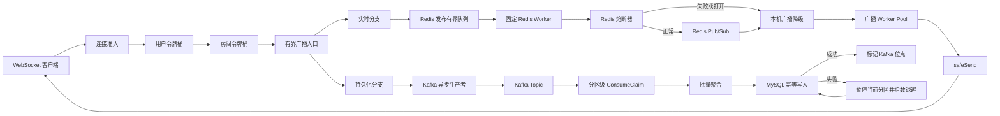
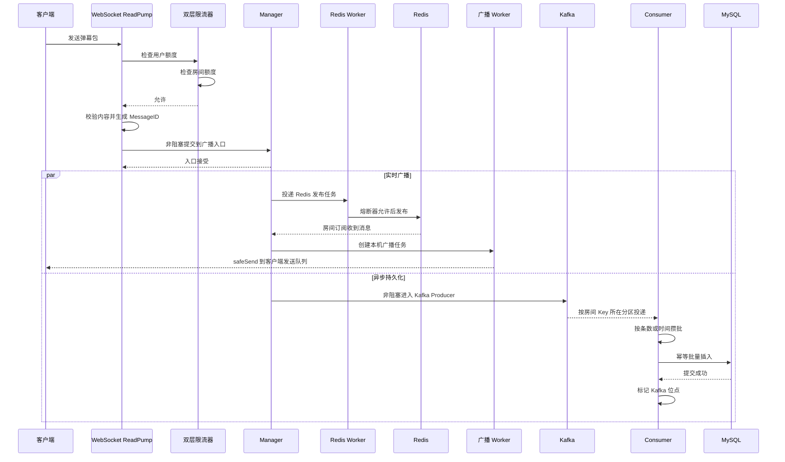
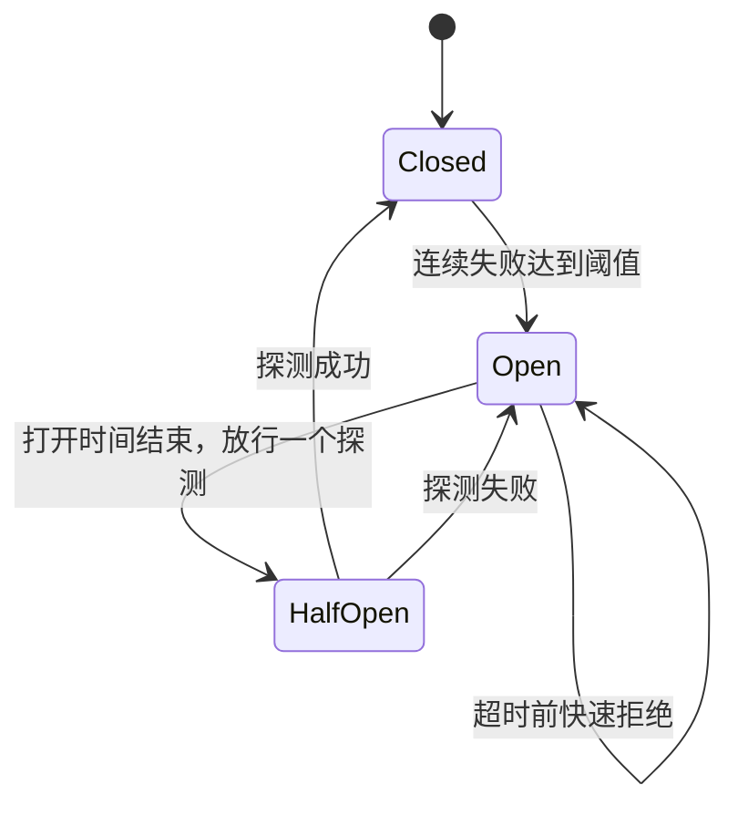

# V9：流量治理、故障隔离与服务降级版

V8 解决的是 Kafka 到 MySQL 的可靠落库问题：

```text
MySQL 成功后再标记 Kafka 位点
+ MessageID 唯一索引去重
+ 坏消息进入死信主题
```

V9 继续追问一个更接近生产环境的问题：

```text
流量突然超过服务能力，或者 Redis、Kafka、MySQL 中某一个发生故障时，
服务能否保护自己，并且让不同能力独立失败、独立恢复？
```

V9 的主题不是继续堆中间件，而是学习三类工程手段：

```text
限流：超出系统能力的请求在哪里被拒绝？
熔断：同步依赖持续失败时，如何停止无意义的等待？
降级：完整功能无法提供时，最重要的业务还能保留多少？
```

---

## 1. 一句话理解 V9

```text
V8：尽量保证已经进入 Kafka 的弹幕可靠落库。

V9：在 V8 基础上，把过载保护前移到入口，
把 Redis 慢故障隔离到固定 worker，
把 Kafka 和 MySQL 的故障转化为可观测、可恢复的状态。
```

V9 的核心原则是：

```text
先保护进程，再保护实时广播，最后根据业务等级处理跨节点同步与历史存储。
```

这不是说历史数据不重要，而是要求你先明确业务优先级。直播弹幕通常更看重实时互动；几秒后才看到的弹幕，即使最终落库，也已经失去大部分实时价值。

---

## 2. V8 与 V9 的差异

| 能力 | V8 | V9 |
|---|---|---|
| 连接保护 | 没有明确上限 | 进程总连接数和单 IP 连接数准入 |
| 用户发言保护 | 没有 | 单用户令牌桶 |
| 热门房间保护 | 没有 | 单房间共享令牌桶 |
| 点赞保护 | 只在内存聚合 | 用户与房间双层限流，单次点赞数量封顶 |
| 广播入口 | 满时可能阻塞客户端读取 goroutine | 有界队列满时立即拒绝并返回控制消息 |
| 字段长度 | 主要依赖 MySQL 报错 | 入口校验身份字段，Consumer 校验表结构边界 |
| Redis 发布 | Manager 主循环同步调用 | 有界队列 + 固定 worker 隔离 |
| Redis 连续失败 | 每条消息都可能等待超时 | 关闭、打开、半开三态熔断 |
| Redis 故障行为 | 单次失败回退本机广播 | 熔断期间快速回退本机广播 |
| Kafka 故障 | 只有错误和丢弃数量 | 增加健康、降级、恢复状态 |
| MySQL 故障 | 有限重试后退出当前消费 | 当前分区暂停，指数退避，恢复后继续 |
| 慢客户端 | 每条消息直接丢弃并打印日志 | 短暂丢包，连续 64 次后主动断开 |
| 可观测性 | 队列与吞吐指标 | 增加拒绝、熔断、降级、暂停和恢复指标 |

V9 保留 V8 的以下可靠性设计：

```text
全局 MessageID
Kafka 幂等生产者
同房间使用同一个 Kafka Key
MySQL 唯一索引幂等插入
MySQL 成功后才标记 Kafka 位点
坏消息先进入死信主题
数据库迁移使用独立命令
```

---

## 3. 学习 V9 前需要了解什么

### 3.1 必须先理解的 Go 语法

| 知识 | 在 V9 中的用途 |
|---|---|
| `struct` 与方法 | 限流器、熔断器、Manager、Consumer |
| 接口 | `RoomPublisher`、`DanmakuPersister`，方便替换真实依赖和测试假实现 |
| `goroutine` | 每个连接的读写循环、广播 worker、Redis worker、Kafka结果处理 |
| `channel` | 连接事件、广播入口、有界任务队列、客户端发送队列 |
| `select` | 非阻塞入队、慢客户端丢弃、定时刷新、上下文取消 |
| `sync.Mutex/RWMutex` | 保护连接计数、令牌桶、房间成员、熔断状态 |
| `sync.Once` | 连接容量只释放一次、WebSocket 只关闭一次 |
| `sync/atomic` | 高频指标与慢客户端连续丢弃计数 |
| `context.Context` | 消费会话取消、Redis 超时、MySQL 恢复等待中断 |
| `time.Timer/Ticker` | 令牌补充、批量刷新、指数退避、熔断恢复窗口 |
| `errors.Is` | 区分真实 Redis 错误与熔断器快速拒绝 |

### 3.2 需要理解的工程概念

```text
令牌桶：平均速率与突发容量
背压：下游处理不过来时，上游如何感知
舱壁隔离：用独立队列和固定并发隔离故障
熔断器：closed / open / half-open
指数退避：故障持续时逐步降低重试频率
至少一次：允许重复投递，但不能静默丢失
幂等：同一业务消息重复处理，最终结果仍只有一份
消费位点：Kafka 认为消费者处理到哪里
```

### 3.3 中间件学习要求

V9 没有新增中间件，仍然使用 Redis、Kafka、MySQL。

学习重点发生了变化：

```text
V8 重点：Kafka 与 MySQL 的一致性边界。
V9 重点：依赖故障后，业务怎样退化并恢复。
```

GORM 仍然只需要掌握连接池、模型、批量插入、唯一索引和冲突忽略。V9 的 MySQL 恢复逻辑位于 Consumer，不要求先深入 GORM 源码。

---

## 4. V9 目录结构

```text
v9/
├── cmd/
│   ├── server/       WebSocket 服务、限流配置、Redis/Kafka 初始化、指标接口
│   ├── consumer/     Kafka 消费、MySQL 批量落库、暂停与恢复
│   ├── migrate/      创建或升级 V9 数据表
│   ├── query/        查询指定房间最近弹幕
│   ├── client/       手动 WebSocket 客户端
│   └── benchmark/    小规模并发测试，统计限流与过载控制消息
├── internal/
│   ├── ratelimit/    连接准入、分片令牌桶、限流指标
│   ├── resilience/   并发安全的三态熔断器
│   ├── ws/           连接、房间、广播、Redis 发布隔离、慢客户端治理
│   ├── queue/        Kafka 发布、健康状态、死信发布
│   ├── consumer/     分区级批量落库、暂停与指数退避恢复
│   ├── infra/        Redis、Kafka、MySQL 客户端配置
│   ├── repo/         MySQL 幂等写入和查询
│   ├── model/        弹幕、点赞、统计、控制消息、死信模型
│   └── idgen/        并发安全的消息编号生成器
├── docker-compose.redis-kafka-mysql.yaml
├── IMPLEMENTATION_PLAN.md
└── README.md
```

新增的两个学习模块是：

```text
internal/ratelimit
internal/resilience
```

它们不依赖 WebSocket、Redis、Kafka 或 MySQL，因此可以先单独阅读和运行测试。

---

## 5. 整体架构图



图中最重要的四个边界：

```text
入口限流保护整个进程。
Redis 队列与 worker 保护 Manager 主循环。
Kafka 有界入口保护实时广播不被持久化拖住。
Kafka 本身作为 MySQL 故障期间的持久积压区。
```

---

## 6. 一条正常弹幕的完整链路



对应代码调用顺序：

```text
cmd/server/main.go
  -> ws.ServeWS
  -> Client.ReadPump
  -> Manager.AllowDanmaku
  -> Client.handleDanmaku
  -> Manager.SubmitDanmaku
  -> Manager.Run
  -> Manager.handleBroadcast
  -> redisPublishJobs
  -> Manager.redisPublishWorker
  -> CircuitBreaker.Execute
  -> Redis Publish 或 enqueueLocalBroadcast
  -> broadcastJobs
  -> Manager.broadcastWorker
  -> Manager.safeSend

同时：

Manager.SubmitDanmaku
  -> KafkaPublisher.Enqueue
  -> Kafka
  -> Handler.ConsumeClaim
  -> Handler.flushWithRecovery
  -> Handler.flushPending
  -> MessageRepo.CreateIdempotent
  -> MySQL 成功
  -> session.MarkMessage
```

---

## 7. 限流设计

### 7.1 为什么必须把保护前移

之前对 V7 的本机压测中，申请 5000 个连接时只有 4152 个成功，出现 848 个连接错误、128 个广播任务丢弃，并累计约 422 万次慢客户端消息丢弃。

这说明旧保护发生得太晚：

```text
连接已经建立
goroutine 已经创建
JSON 已经解析
广播任务已经生成
最后才在客户端发送队列处丢弃
```

系统已经付出了大部分成本。

V9 将保护顺序改为：

```text
连接升级前做准入
    ↓
解析业务内容前做用户限流
    ↓
进入房间广播前做房间限流
    ↓
广播入口队列满则立即拒绝
    ↓
最后才是慢客户端治理
```

### 7.2 四层流量预算

| 层级 | 默认值 | 防止的问题 |
|---|---:|---|
| 进程连接总量 | 5000 | 单实例文件描述符、内存和 goroutine 失控 |
| 单 IP 连接量 | 1000 | 单来源大量建立连接 |
| 单用户弹幕 | 5 条/秒，突发 10 条 | 单用户刷屏 |
| 单房间弹幕 | 500 条/秒，突发 1000 条 | 热门房间压垮广播与下游 |
| 单用户点赞事件 | 20 次/秒，突发 40 次 | 点赞接口刷量 |
| 单房间点赞事件 | 5000 次/秒，突发 10000 次 | 热门房间点赞洪峰 |

默认值只是学习和本机测试起点，不是生产结论。生产阈值应根据机器配置、延迟目标、房间规模和压测结果确定。

### 7.3 令牌桶怎么工作

可以把令牌桶理解为一个装令牌的容器：

```text
PerSecond：每秒放回多少令牌，决定长期平均速率。
Burst：桶最多能存多少令牌，决定短时间突发能力。
一次请求：消费一个令牌。
没有令牌：请求被拒绝。
```

补充令牌的核心计算：

```text
新令牌 = 距离上次补充的秒数 × 每秒速率
当前令牌 = min(突发容量, 原令牌 + 新令牌)
```

V9 不为每个用户创建一个定时器。请求到来时才根据时间差计算应补多少令牌，这叫惰性补充，可以避免海量用户对应海量 goroutine 或 ticker。

### 7.4 为什么用户和房间都要限流

只限制用户不够：

```text
一个用户每秒 5 条
一个热门房间有 10 万活跃用户
总输入仍然可能远超单房间广播能力
```

只限制房间也不够：

```text
一个恶意用户可以抢完整个房间额度
正常用户无法发言
```

所以 V9 使用两层预算：

```text
用户额度：保证单个用户不能刷屏。
房间额度：保证整个热点不能超过房间处理预算。
```

### 7.5 为什么令牌桶使用 64 个 mutex 分片

如果所有用户共用一把锁：

```text
room-A 的 user-1 检查令牌
会阻塞 room-Z 的 user-999 检查令牌
```

V9 根据 key 的哈希值将桶分配到 64 个分片：

```text
key -> hash -> shard[0..63] -> mutex + map
```

效果是：

```text
不同分片可以并发执行。
同一个用户一定进入同一个分片。
同一个热门房间会竞争同一个房间桶，这是业务上必须串行的共享预算。
```

每个分片还会顺手清理长期不活跃的桶，防止攻击者不断伪造用户编号导致 map 无限增长。

### 7.6 限流后的客户端反馈

V9 使用 `TypeControl=104` 返回控制消息：

```json
{
  "type": 104,
  "room_id": "room1",
  "data": {
    "code": "rate_limited",
    "action": "danmaku",
    "scope": "user",
    "retry_after_millis": 1000
  }
}
```

常见控制码：

| code | 含义 |
|---|---|
| `rate_limited` | 用户或房间令牌不足 |
| `server_overloaded` | 广播入口队列已满 |
| `content_too_long` | 弹幕超过 200 个字符 |

连接准入失败发生在 WebSocket 升级前，因此直接返回 HTTP `429` 和 `Retry-After: 1`。

### 7.7 为什么字段长度也要在入口校验

`uid`、`name`、`room` 最终对应 MySQL 的 `varchar(64)`。如果入口允许任意长度：

```text
攻击者可以制造大量超长限流 key，占用更多内存；
超长消息进入 Kafka 后，MySQL 会持续拒绝；
Consumer 可能把确定的数据错误误判成数据库故障并反复暂停。
```

V9 在占用连接额度前拒绝超过 64 个字符的身份字段；Consumer 还会根据表结构校验 MessageID、房间、用户、昵称、内容和时间范围。无法落表的业务数据进入死信主题，不进入 MySQL 恢复循环。

---

## 8. Redis 舱壁隔离与熔断

### 8.1 V8 的风险

V8 的 Manager 主循环直接同步发布 Redis：

```text
Manager 收到弹幕
    ↓
同步等待 Redis Publish
    ↓
失败最多等待 2 秒
    ↓
Manager 才继续处理注册、退房和下一条弹幕
```

Manager 是房间状态的核心 goroutine。一条 Redis 慢请求会让所有房间共享的事件循环停住。

### 8.2 V9 的舱壁隔离

V9 将 Redis 发布改成：

```text
Manager
  -> redisPublishJobs 有界 channel，容量 512
  -> 4 个 Redis worker
  -> Redis
```

Manager 只做一次非阻塞入队，不等待网络 I/O。

如果 Redis 发布队列满：

```text
不继续堆积内存
不阻塞 Manager
直接降级成本机广播
redis_queue_fallbacks + 1
```

这就是舱壁思想：Redis 只能占用固定数量的 worker 和固定容量的队列，不能把故障扩散到整个 Manager。

### 8.3 熔断器三种状态



默认参数：

```text
连续失败阈值：3
打开时间：5 秒
半开并发探测：1 个
```

状态含义：

```text
closed：正常调用 Redis，成功会清零连续失败。
open：不调用 Redis，立即返回 ErrCircuitOpen。
half_open：只允许一个请求探测，其他请求继续快速降级。
```

### 8.4 为什么熔断器需要 mutex 和代次编号

多个 Redis worker 会同时调用同一个熔断器，因此状态迁移必须加锁。

只有锁仍不够。可能出现：

```text
worker-1 和 worker-2 都在 closed 状态获得调用许可
worker-1 先失败，把状态改成 open
worker-2 后完成，它携带的是旧状态下的结果
```

如果直接处理 worker-2 的回调，可能重复累计打开次数；更危险的是，旧慢请求可能在 half-open 阶段完成，被误认为恢复探测结果。

V9 给每次许可附带 `generation`：

```text
熔断器每次打开，generation + 1
完成回调的 generation 与当前值不同，说明它是旧请求
旧请求结果被忽略，不再改变当前状态
```

这是 V9 功能测试真正发现并修复的一处并发问题。

### 8.5 Redis 故障时具体降级什么

| 能力 | Redis 正常 | Redis 故障或熔断打开 |
|---|---|---|
| 本机房间广播 | 正常 | 保留 |
| 跨实例房间广播 | 正常 | 暂时不可用 |
| 全局在线人数 | 多实例汇总 | 退化为本机人数 |
| 全局点赞数 | Redis 汇总 | 退化为本机累计值 |
| 历史弹幕 Kafka 链路 | 独立运行 | 不受影响 |

Redis 恢复后，下一次半开探测成功会关闭熔断器。熔断期间没有发到其他实例的实时弹幕不会自动补播，因为 Redis Pub/Sub 本身不保存历史消息。

---

## 9. Kafka 为什么没有照搬 Redis 熔断器

Redis Publish 位于实时同步调用路径，即使有 worker，持续超时仍会占住所有 worker，所以需要快速熔断。

Kafka Producer 已经具备：

```text
异步发送
内部缓冲
自动重试
幂等生产
成功与错误回调
V9 外层非阻塞入队
```

如果 Kafka 一报错就完全打开熔断并停止发送：

```text
没有新消息进入 Producer
也就没有成功回调
服务无法判断 Kafka 是否恢复
```

因此 V9 对 Kafka 采用“有界隔离 + 健康状态”，而不是硬熔断：

```text
连续 3 个异步写错误 -> status=degraded
任何一次 Kafka ACK -> status=healthy，recoveries + 1
Producer Input 满 -> 当前弹幕持久化分支丢弃，但实时广播继续
```

注意两个不同场景：

```text
Kafka 启动时不可连接：server 启动失败，让部署平台重启或告警。
Kafka 运行中断线：Producer 重试，状态进入 degraded，实时广播继续。
```

V9 仍然是“实时优先”策略。若业务要求历史弹幕绝对不能丢，下一步不能只加重试，而需要本地磁盘暂存、独立接入日志或让客户端收到明确失败并重试。

---

## 10. MySQL 为什么不使用普通熔断降级

### 10.1 错误做法

如果 MySQL 失败后直接跳过这一批并标记 Kafka 位点：

```text
MySQL 没有数据
Kafka 认为已经处理
消息永久丢失
```

如果消费者快速无限重试：

```text
大量失败 SQL
数据库连接池持续拥塞
故障中的 MySQL 更难恢复
日志和 CPU 也被重试占满
```

### 10.2 V9 的正确业务动作

```text
批量写 MySQL
    ↓ 失败
先执行有限次快速重试
    ↓ 仍失败
暂停当前 Kafka 分区
    ↓
1s、2s、4s、8s……最多 30s 指数退避
    ↓
再次写同一批消息
    ↓ 成功
标记 Kafka 位点并恢复消费
```

这里的“暂停”不是调用一个全局暂停开关，而是当前 `ConsumeClaim` 不再读取新的消息，停留在同一批数据上。

Kafka 仍然保存后续消息，所以积压发生在 Kafka，而不是无限堆到 Go 进程内存。

### 10.3 为什么只暂停当前分区

Sarama 为每个分区运行一个 `ConsumeClaim`。某个分区的 MySQL 写入失败时，该 claim 进入恢复等待；其他分区的 claim 仍可以继续处理。

这是一种天然的故障隔离：

```text
partition-0 暂停
partition-1 继续
partition-2 继续
```

实际 MySQL 整体故障时，所有分区最终都会暂停，但每个分区只保留自己的当前批次，不会再从 Kafka 拉取无限数据。

### 10.4 消费组重平衡时怎么办

恢复等待使用 `session.Context()`：

```text
消费者重平衡或进程退出
    ↓
session context 取消
    ↓
停止退避等待
    ↓
未成功写入的消息不标记位点
    ↓
新消费者重新收到这些消息
```

V8 的 MessageID 唯一索引继续解决数据库成功但位点未提交时的重复投递。

### 10.5 数据错误和依赖故障必须分开

下面两类错误的处理完全不同：

```text
MySQL 连接失败、超时：依赖故障，保留原消息并暂停重试。

字段超过 varchar 长度、时间超出 DATETIME 范围：数据错误，
写入死信主题后标记原位点，避免一条永远无法落表的数据卡住分区。
```

所以 Consumer 在调用仓库前执行 `ValidateDanmakuStorage`。这是一种很重要的故障分类：并不是所有 SQL 失败都应该进入同一种重试策略。

---

## 11. safeSend 与慢客户端降级

### 11.1 safeSend 为什么不能阻塞

广播 worker 会依次向多个客户端发送：

```go
select {
case client.Send <- payload:
    // 客户端队列还有容量
default:
    // 客户端太慢，不能阻塞整个房间
}
```

如果使用普通阻塞发送：

```text
一个手机网络很差的客户端
    ↓
它的 Send channel 已满
    ↓
广播 worker 卡住
    ↓
同一个任务中的其他正常客户端也收不到消息
```

### 11.2 为什么不能永远只丢消息

永远保留慢连接会带来：

```text
每条弹幕都执行一次失败发送
持续增加丢弃指标
过去逐条打印日志还会放大 I/O
连接与 goroutine 长期占用资源
```

V9 的策略：

```text
发送成功 -> 连续丢弃计数清零
发送失败 -> 当前消息丢弃，计数 + 1
连续 64 次失败 -> 主动关闭连接，只打印一次断开日志
```

关闭连接后，ReadPump 退出并向 Manager 注销客户端。

这是一种面向低优先级实时消息的降级：宁可让慢客户端重连，也不能让它拖住整个房间。

---

## 12. Go 并发设计详解

### 12.1 主要 goroutine

| goroutine | 数量 | 责任 |
|---|---:|---|
| `Manager.Run` | 1 | 串行处理注册、注销和广播入口 |
| `Client.ReadPump` | 每连接 1 个 | 读取、解析、限流、提交业务消息 |
| `Client.WritePump` | 每连接 1 个 | 将 Send channel 中的数据写入网络 |
| 广播 worker | 默认 16 个 | 将一个房间快照扇出到多个客户端 |
| Redis worker | 默认 4 个 | 执行可能超时的 Redis Publish |
| 房间 Redis 订阅 | 每个本机活跃房间 1 个 | 接收跨实例实时消息 |
| 房间统计刷新 | 最多 1 个 | 每 3 秒触发；上一轮未结束时跳过本轮 |
| Kafka 成功处理 | 1 个 | 持续排空 Producer Successes |
| Kafka 错误处理 | 1 个 | 持续排空 Producer Errors 并更新状态 |
| `ConsumeClaim` | 每个已分配分区 1 个 | 分区内解析、攒批、落库和位点标记 |

goroutine 不是越多越好。V9 将网络连接使用按连接 goroutine，将受控后台任务使用固定 worker，将分区持久化交给 Kafka claim 生命周期。

### 12.2 主要 channel

| channel | 是否有界 | 满时策略 |
|---|---|---|
| `Manager.Broadcast` | 512 | 拒绝当前弹幕，返回 `server_overloaded` |
| `redisPublishJobs` | 512 | 不等 Redis，直接本机广播 |
| `broadcastJobs` | 1024 | 丢弃整个广播任务并记录指标 |
| `Client.Send` | 128 | `safeSend` 丢当前消息，连续慢则断开 |
| Kafka Producer Input | 由 Sarama 配置 | V9 非阻塞入队失败，实时链路继续 |

有界 channel 的意义不是单纯提速，而是给内存增长设置硬上限。

### 12.3 mutex 分工

| 锁 | 保护的数据 | 为什么不能只用 atomic |
|---|---|---|
| `Manager.mu` | 房间 map、房间客户端集合、订阅取消函数 | map 和多步增删必须保持整体一致 |
| `likesMu` | 点赞增量与本机总数 map | 一个操作同时包含查找与累加 |
| 限流分片锁 | key 到 token bucket 的 map、令牌与时间 | 补充、判断、扣减必须是一个原子过程 |
| 连接准入锁 | 当前总连接和各 IP 连接数 | 两个约束必须在一次临界区内判断和增加 |
| 熔断器锁 | 状态、失败数、代次、半开探测 | 状态迁移包含多个关联字段 |
| Kafka 健康锁 | 状态、连续错误、恢复次数和时间 | 需要返回一致的状态快照 |

不要在持有这些 mutex 时执行 Redis、Kafka、MySQL 或 WebSocket 网络 I/O。V9 都是先取出必要状态或任务，再离开临界区调用外部依赖。

### 12.4 atomic 用在哪里

V9 使用原子变量保存：

```text
请求、拒绝、投递、丢弃、恢复等独立计数器
慢客户端连续丢弃次数
消息编号的进程内递增序号
```

适合 atomic 的条件：一个数值可以独立更新，不需要和多个字段组成不可分割的不变量。

房间 map、令牌桶、熔断状态不满足这个条件，所以仍然需要 mutex。

### 12.5 worker pool 的两个作用

广播 worker pool：

```text
将房间快照的扇出工作从 Manager 主循环移走
限制同时执行的广播任务数量
```

Redis worker pool：

```text
将外部网络超时从 Manager 主循环移走
限制 Redis 故障最多占住固定数量 goroutine
```

两者都使用有界任务队列，因此构成“固定并发 + 固定积压”的资源上限。

---

## 13. 故障策略矩阵

| 故障 | 限流 | 熔断 | 降级/恢复动作 | 数据影响 |
|---|---|---|---|---|
| 单用户刷屏 | 用户令牌桶 | 不需要 | 返回控制消息 | 被拒绝弹幕不广播、不入 Kafka |
| 热门房间洪峰 | 房间令牌桶 | 不需要 | 房间超额请求被拒绝 | 超额部分不进入系统 |
| 连接洪峰 | 总量和单 IP 准入 | 不需要 | WebSocket 升级前返回 429 | 未建立连接，无业务数据 |
| 广播入口满 | 有界 channel | 不需要 | 返回 `server_overloaded` | 当前弹幕整体拒绝 |
| Redis 超时 | 不适合限流 | 需要 | 本机广播，跨实例暂时失效 | Pub/Sub 消息不补播 |
| Redis 发布队列满 | 有界 channel | 熔断来不及处理此问题 | 立即本机广播 | 跨实例可能缺少当前消息 |
| Kafka 运行中故障 | Producer 有界入口 | 不做硬熔断 | 状态降级，Producer 重试，实时继续 | 队列满时历史可能缺失 |
| MySQL 运行中故障 | Kafka 控制输入速度 | 不应跳过数据 | 分区暂停，指数退避，Kafka 积压 | 位点不前移，可恢复 |
| 慢客户端 | 客户端有界队列 | 不需要 | 丢包，连续慢则断开 | 该客户端缺少实时消息 |

这张表体现了一个面试中的重要观点：

```text
限流、熔断、降级不是每个依赖都机械使用一遍。
必须先看调用方式、业务优先级和数据后果。
```

---

## 14. 默认配置

### 14.1 服务端关键参数

| 参数 | 默认值 | 说明 |
|---|---:|---|
| `-port` | `8080` | HTTP 与 WebSocket 端口 |
| `-workers` | `16` | 房间广播 worker 数量 |
| `-redis-workers` | `4` | Redis 发布 worker 数量 |
| `-max-connections` | `5000` | 单进程连接上限 |
| `-max-connections-per-ip` | `1000` | 单 IP 连接上限 |
| `-danmaku-user-rate` | `5` | 单用户每秒补充令牌 |
| `-danmaku-user-burst` | `10` | 单用户突发容量 |
| `-danmaku-room-rate` | `500` | 单房间每秒补充令牌 |
| `-danmaku-room-burst` | `1000` | 单房间突发容量 |
| `-redis-breaker-failures` | `3` | Redis 连续失败阈值 |
| `-redis-breaker-open` | `5s` | 熔断打开时间 |

### 14.2 消费端关键参数

| 参数 | 默认值 | 说明 |
|---|---:|---|
| `-batch` | `500` | MySQL 批次条数 |
| `-flush` | `200ms` | 未满批次的刷新周期 |
| `-max-retries` | `3` | 进入暂停前的快速重试次数 |
| `-recovery-min` | `1s` | 恢复退避起点 |
| `-recovery-max` | `30s` | 恢复退避上限 |

### 14.3 V9 独立端口和名称

```text
Redis：127.0.0.1:6383
Kafka：127.0.0.1:9098
MySQL：127.0.0.1:3312
数据库：danmaku_v9
表：v9_danmaku_messages
Kafka Topic：v9_danmaku_save_topic
Kafka Group：v9_danmaku_save_group
死信 Topic：v9_danmaku_save_dlq
```

---

## 15. 运行方式

所有命令都在项目根目录执行。

### 15.1 不使用任何中间件

先运行服务：

```bash
go run ./v9/cmd/server -redis=false -kafka=false
```

再运行一个客户端：

```bash
go run ./v9/cmd/client -uid=1001 -name=alice -room=room1
```

再开一个终端：

```bash
go run ./v9/cmd/client -uid=1002 -name=bob -room=room1
```

输入普通文本发送弹幕，输入 `/like` 点赞，输入 `/quit` 退出。

### 15.2 启动 Redis、Kafka、MySQL

```bash
docker compose -f v9/docker-compose.redis-kafka-mysql.yaml up -d
```

查看状态：

```bash
docker compose -f v9/docker-compose.redis-kafka-mysql.yaml ps
```

### 15.3 建表

```bash
go run ./v9/cmd/migrate
```

### 15.4 启动消费者

```bash
go run ./v9/cmd/consumer
```

### 15.5 启动服务

```bash
go run ./v9/cmd/server
```

### 15.6 查询历史弹幕

```bash
go run ./v9/cmd/query -room=room1 -limit=20
```

### 15.7 查看指标

```bash
curl http://127.0.0.1:8080/metrics
```

`/health` 是进程存活检查。Redis 或 Kafka 运行中降级时，进程仍然存活；依赖状态应通过 `/metrics` 判断。

---

## 16. 建议亲手完成的实验

### 实验一：观察用户限流

先启动无中间件服务：

```bash
go run ./v9/cmd/server -redis=false -kafka=false
```

高频发送：

```bash
go run ./v9/cmd/benchmark \
  -clients=5 \
  -room=flood-room \
  -active=1 \
  -interval=20ms \
  -duration=4s
```

重点观察：

```text
rate_limited 持续增加
overloaded 保持 0
danmaku_rejected_user 增加
ingress_dropped 保持 0
```

这证明请求在用户入口被挡住，没有拖到广播队列才丢弃。

### 实验二：观察房间限流

将房间速率调低：

```bash
go run ./v9/cmd/server \
  -redis=false \
  -kafka=false \
  -danmaku-user-rate=100 \
  -danmaku-user-burst=100 \
  -danmaku-room-rate=5 \
  -danmaku-room-burst=5
```

多个用户同时发送后，观察 `danmaku_rejected_room` 增加。

### 实验三：观察 Redis 熔断与本机降级

使用一个不可连接的 Redis 地址：

```bash
go run ./v9/cmd/server \
  -port=18093 \
  -kafka=false \
  -redis=true \
  -redis-addr=127.0.0.1:1 \
  -redis-workers=2 \
  -redis-breaker-failures=1 \
  -redis-breaker-open=10s
```

再运行：

```bash
go run ./v9/cmd/benchmark \
  -port=18093 \
  -clients=3 \
  -room=redis-failure-room \
  -active=0.34 \
  -interval=500ms \
  -duration=3s
```

你会看到：

```text
Redis 前几个在途调用失败
熔断器进入 open
后续消息快速回退本机广播
客户端仍能收到本机房间弹幕
```

### 实验四：观察 MySQL 暂停恢复

完整中间件运行时，先发送一些弹幕，再停止 MySQL：

```bash
docker stop danmaku_v9_mysql
```

观察消费者：

```text
failed_batches 增加
paused_partitions 大于 0
Kafka 位点不再前移
```

恢复 MySQL：

```bash
docker start danmaku_v9_mysql
```

观察：

```text
recoveries 增加
paused_partitions 回到 0
积压消息继续写入 MySQL
```

---

## 17. 本机功能测试结果

测试日期：2026-07-12。

### 17.1 无中间件正常广播

参数：

```text
20 个连接
25% 活跃发送者
平均发送间隔 300ms
持续 6 秒
Redis、Kafka 均关闭
```

结果：

```text
成功连接：20
发送：171
接收：3420
限流：0
过载拒绝：0
错误：0

3420 = 171 × 20
```

说明每条被接受的弹幕都广播给了同房间 20 个客户端。

### 17.2 高频发送触发用户限流

参数：

```text
5 个连接
100% 活跃发送者
平均发送间隔 20ms
持续 4 秒
使用默认用户限流 5 条/秒、突发 10 条
```

结果：

```text
发送尝试：980
用户限流拒绝：835
被接受：145
接收：725
广播入口过载：0
错误：0

145 = 980 - 835
725 = 145 × 5
```

说明拒绝发生在用户限流层，接受的消息仍完整广播，广播入口没有被打满。

### 17.3 Redis 故障与熔断降级

参数：

```text
Redis 地址指向不可连接端口
2 个 Redis worker
连续 1 次失败即打开
3 个客户端
```

结果：

```text
发送：7
接收：21 = 7 × 3
真实 Redis 发布错误：2
熔断快速回退：5
本机降级广播：7
熔断状态：open
opened 状态迁移：1
```

两个真实错误来自熔断打开前已经并发进入 Redis 的两个 worker；后续 5 次没有继续调用 Redis，直接本机广播。

### 17.4 本次未执行的测试

本次没有运行 Redis、Kafka、MySQL 全链路容器集成测试；此前本机 Docker 引擎不可用。本次已完成 Compose 配置解析、单元测试、竞态检测和无中间件/Redis 故障功能测试。

因此不能把本节结果表述为 Kafka 与 MySQL 真实容器链路已经验证。完整环境恢复后，应继续执行实验四。

---

## 18. 重要指标怎么看

### 18.1 入口与广播

| 指标 | 含义 | 异常解释 |
|---|---|---|
| `traffic.danmaku_rejected_user` | 用户限流拒绝 | 个别用户高频或阈值过低 |
| `traffic.danmaku_rejected_room` | 房间限流拒绝 | 热门房间达到输入预算 |
| `ingress_dropped` | 广播入口已满 | 限流仍不足或 worker 能力不够 |
| `dropped_jobs` | 广播任务队列满 | 扇出处理跟不上 |
| `dropped_messages` | 客户端发送队列满 | 慢客户端或客户端消费速度不足 |
| `slow_client_disconnects` | 连续慢客户端断开 | 网络差客户端较多或下行过载 |
| `stats_ticks_skipped` | 统计刷新重叠而跳过 | 房间太多或 Redis 统计操作变慢 |

### 18.2 Redis

| 指标 | 含义 |
|---|---|
| `redis_publish_errors` | 真正调用 Redis 后失败 |
| `redis_circuit_fallbacks` | 熔断器直接拒绝，未调用 Redis |
| `redis_queue_fallbacks` | Redis 发布任务队列已满 |
| `redis_degraded_broadcasts` | 因 Redis 问题改成本机广播 |
| `redis_circuit.state` | `closed/open/half_open` |
| `redis_circuit.opened` | 关闭到打开的状态迁移次数 |
| `redis_circuit.recoveries` | 半开探测成功次数 |

### 18.3 Kafka

| 指标 | 含义 |
|---|---|
| `enqueued` | 进入 Producer Input |
| `acked` | Kafka 已确认 |
| `dropped` | Producer Input 满，未入 Kafka |
| `errors` | 序列化或异步发送错误 |
| `status` | `healthy/degraded` |
| `consecutive_errors` | 连续异步发送错误 |
| `recoveries` | 降级后重新收到 ACK 的次数 |

### 18.4 Consumer 与 MySQL

| 指标 | 含义 |
|---|---|
| `failed_batches` | 完成一轮快速重试仍失败的批次 |
| `paused_partitions` | 当前等待 MySQL 恢复的分区数 |
| `pause_events` | 进入暂停的累计次数 |
| `recoveries` | 暂停后成功恢复次数 |
| `recovery_wait_ms` | 累计恢复等待时间 |
| `duplicates` | MySQL 唯一索引忽略的重复消息 |

指标必须组合分析。例如：

```text
用户拒绝高，入口丢弃为 0：限流有效。
入口丢弃高，用户/房间拒绝低：阈值过宽或广播能力下降。
Redis 错误少、熔断回退高：熔断正在减少无效调用。
Consumer paused 高、Kafka lag 增长：MySQL 是当前瓶颈。
```

---

## 19. 测试命令

运行 V9 全部测试：

```bash
go test -count=1 ./v9/...
```

运行并发竞态检测：

```bash
go test -race -count=1 ./v9/internal/...
```

运行静态检查：

```bash
go vet ./v9/...
```

检查容器配置：

```bash
docker compose -f v9/docker-compose.redis-kafka-mysql.yaml config --quiet
```

建议重点阅读这些测试：

```text
internal/ratelimit/controller_test.go
internal/resilience/breaker_test.go
internal/ws/manager_test.go
internal/queue/kafka_publisher_test.go
internal/consumer/handler_test.go
```

---

## 20. 推荐学习顺序

### 第一阶段：只学限流

```text
1. 阅读 ratelimit/controller_test.go
2. 阅读 tokenBucket 和 keyedLimiter
3. 手算 5 条/秒、Burst=10 的令牌变化
4. 理解 64 个分片为什么比一把全局锁好
5. 运行用户限流和房间限流实验
```

### 第二阶段：只学熔断

```text
1. 画出 closed/open/half-open 状态图
2. 阅读 breaker_test.go
3. 理解为什么 half-open 只允许一个探测
4. 理解 generation 如何忽略旧请求结果
5. 运行 Redis 故障实验
```

### 第三阶段：学习舱壁与 safeSend

```text
1. 找出 Broadcast、redisPublishJobs、broadcastJobs、Client.Send
2. 记录每个 channel 的容量
3. 记录每个 channel 满时的业务动作
4. 对比阻塞发送与 default 非阻塞发送
5. 理解慢客户端为什么最终要断开
```

### 第四阶段：学习异步链路恢复

```text
1. 复习 V8 的至少一次与幂等
2. 阅读 Kafka Publisher 健康状态
3. 阅读 flushWithRecovery
4. 跟踪 session.Context 取消后的行为
5. 解释为什么 MySQL 故障不能直接跳过消息
```

### 第五阶段：自己画完整链路

不要看本文，自己画出：

```text
正常弹幕链路
用户限流链路
Redis 熔断降级链路
Kafka 错误链路
MySQL 暂停恢复链路
慢客户端断开链路
```

能独立画出并解释数据后果，才算真正掌握 V9。

---

## 21. 面试官可能问的 10 个问题

### 1. 为什么同时做用户限流和房间限流？

用户限流防止单人刷屏，房间限流保护热点房间总预算。只做用户限流时，大量正常用户叠加仍可压垮一个热门房间；只做房间限流时，恶意用户可能抢完公共额度。

### 2. 为什么用令牌桶，不用固定窗口计数？

令牌桶同时表达长期平均速率和短期突发容量。固定窗口在窗口边界可能出现双倍突发，例如前一秒末尾和后一秒开头各发送一批。

### 3. 限流器为什么要分片加锁？

一把全局锁会让所有用户的高频请求互相阻塞。分片后，不同 key 多数落在不同 mutex 上；同一用户或同一房间仍被正确串行扣减令牌。

### 4. Redis 为什么既要 worker pool 又要熔断器？

worker pool 解决故障隔离，限制 Redis 最多占用固定 goroutine；熔断器解决持续失败，打开后避免每条消息都等待超时。两者解决的问题不同。

### 5. 熔断器为什么需要半开状态？

打开状态不能永远持续，必须探测依赖是否恢复。半开只放行一个请求，成功则关闭，失败则重新打开，避免恢复瞬间大量请求同时冲击 Redis。

### 6. Redis 熔断后会不会丢弹幕？

本实例内仍然广播，也仍可进入 Kafka；其他实例的实时客户端收不到熔断期间的消息，因为 Redis Pub/Sub 不保留历史。这是明确的跨实例实时能力降级。

### 7. 为什么 Kafka 没有使用相同的硬熔断器？

Kafka Producer 是异步、有缓冲且会重试。完全停止发送会失去恢复信号。V9 使用有界入口保护实时链路，用连续错误和 ACK 维护降级状态；更强可靠性需要磁盘暂存，不是简单加一个熔断器。

### 8. MySQL 故障时为什么暂停消费而不是返回错误不断重建消费者？

暂停当前 claim 能保留同一批消息，不标记位点，并通过退避减少数据库压力。Kafka 保存后续积压，内存只保留当前批次；会话取消时退出，消息由新消费者重新获取。

### 9. safeSend 为什么先丢消息，最后又断开客户端？

短暂网络抖动不应该立刻踢掉用户，所以允许有限连续丢包；持续慢消费会反复浪费每条广播的处理成本，因此达到阈值后断开，让客户端重连并保护其他正常用户。

### 10. 这个限流方案在多实例下准确吗？

不全局准确。每个实例有独立令牌桶，N 个实例理论上会放大到 N 倍额度。V9 先实现进程级硬保护；生产环境可在可信网关做第一层全局限流，实例内保留第二层本地保护，必要时使用 Redis Lua 做关键业务的分布式额度。

---

## 22. 项目讲述方式

面试时可以按“问题、证据、方案、取舍、结果”讲：

```text
问题：旧版本只在广播队列和客户端队列满时丢弃，保护发生太晚；
Redis 同步发布还可能阻塞房间 Manager，MySQL 故障后只有有限重试。

证据：5000 连接压测出现连接失败、广播任务丢弃和约 422 万次慢客户端丢弃。

方案：在连接、用户、房间三层前置流量预算；
Redis 使用有界队列、固定 worker 和三态熔断，本机广播兜底；
Kafka 使用异步健康状态；MySQL 失败时按分区暂停并指数退避。

取舍：Redis 降级时保留本机实时互动，但暂时失去跨实例广播；
Kafka 队列满时仍可能缺少历史数据，因为本版选择实时优先。

结果：20 客户端正常测试中 171 条发送得到 3420 条接收；
高频测试中 835 条请求在用户入口被拒绝，广播入口过载为 0；
Redis 故障时 7 条消息仍完成 21 次本机投递，后续 5 次调用被熔断快速回退。
```

这段故事的重点不是“使用了限流和熔断”，而是说明你知道保护放在哪里、为什么这样放、故障后牺牲什么，以及数据会发生什么。

---

## 23. V9 仍然存在的不足

### 23.1 限流是单进程的

多实例之间额度不共享。后续可采用：

```text
网关粗粒度限流
+ 实例内本地硬保护
+ 少数关键场景使用 Redis Lua 全局额度
```

不能把所有请求都同步访问 Redis 限流，否则 Redis 又会成为入口强依赖。

### 23.2 身份与房间编号来自客户端

用户可以更换 `uid` 或 `room` 绕过部分额度。真实项目需要鉴权、可信用户身份、房间存在性校验和网关传递的可信来源地址。

### 23.3 代理后的真实 IP 尚未处理

V9 使用 TCP `RemoteAddr`，不直接信任 `X-Forwarded-For`，避免伪造。部署在反向代理后，需要只信任指定代理，并由代理清洗和传递真实客户端 IP。

### 23.4 Redis Pub/Sub 没有重放能力

熔断期间跨实例消息不会补播。若业务要求恢复后补发，可评估 Redis Streams、Kafka 实时消费或独立房间路由，但复杂度和延迟都会增加。

此外，网络超时存在结果不确定窗口：Redis 可能已经完成 Publish，但服务端没有及时收到响应，于是又执行本机回退，同一实例可能短暂收到重复弹幕。客户端可根据 MessageID 去重；更严格的协议需要发布确认与去重状态，不能只靠一次超时判断。

### 23.5 Kafka 持久化仍是实时优先

Producer Input 满时会丢持久化分支。更高等级方案需要本地磁盘队列、独立接入日志服务或客户端重试协议。

### 23.6 热门房间仍可能成为单点热点

同一房间使用同一个 Kafka Key，保证分区内顺序，但超级房间会集中到一个 Kafka 分区。可以引入虚拟分片，但必须重新定义跨分片顺序。

### 23.7 指标还是 JSON，不是完整监控系统

生产环境需要 Prometheus 指标、Kafka Lag、告警规则、日志采样和链路追踪。尤其应告警：

```text
入口丢弃
房间限流持续升高
Redis 熔断打开
Kafka status=degraded
paused_partitions > 0
Kafka lag 持续增长
慢客户端断开异常升高
```

### 23.8 Manager 与后台 worker 缺少完整生命周期管理

当前学习版依赖进程退出结束 Manager 和 worker。下一版可让 `Run` 接收 context，并使用 WaitGroup 等待所有后台 goroutine 有序退出。

### 23.9 WebSocket 连接治理还不完整

当前版本没有实现 ping/pong 心跳、读写 deadline、鉴权和 Origin 白名单。生产环境需要及时清理半开连接，只允许可信来源升级，并让网关传入经过校验的用户身份。

---

## 24. 适合作为 V10 的方向

建议不要一次全部实现，可以选择一条深入：

```text
方向 A：动态流量治理
配置中心动态调整用户/房间阈值，增加白名单、主播等级和活动模式。

方向 B：高可靠接入日志
Kafka 不可用时写本地 WAL，恢复后补发，研究磁盘上限与重放幂等。

方向 C：可观测性
Prometheus + Grafana + Kafka Lag + pprof + 告警规则，建立容量模型。

方向 D：超级房间
房间虚拟分片、分区热点检测、顺序定义和跨分片聚合。

方向 E：优雅停机
context 驱动 Manager、停止接收新连接、排空队列、等待 Kafka ACK。
```

如果目标是应届后端面试，推荐先做方向 C。它能把“我写了并发代码”升级为“我能用指标定位瓶颈、定义容量并验证故障恢复”。

---

## 25. 最后总结

V9 最值得掌握的不是三个术语，而是三条判断：

```text
限流应该尽可能靠近入口，避免为最终要拒绝的请求支付全部成本。

熔断适合同步、持续失败且存在可接受降级路径的依赖，
不应该机械套在所有中间件上。

降级必须写清楚保留什么、牺牲什么、数据是否可恢复，
否则“服务还活着”不等于“业务是正确的”。
```

当你能从一条弹幕出发，解释每个 channel 满了怎么办、每把 mutex 保护什么、每个 goroutine 为什么存在、每个依赖故障后数据去哪里，你就已经从“会写 Go 语法”迈进了“能讨论并发系统工程取舍”的阶段。
